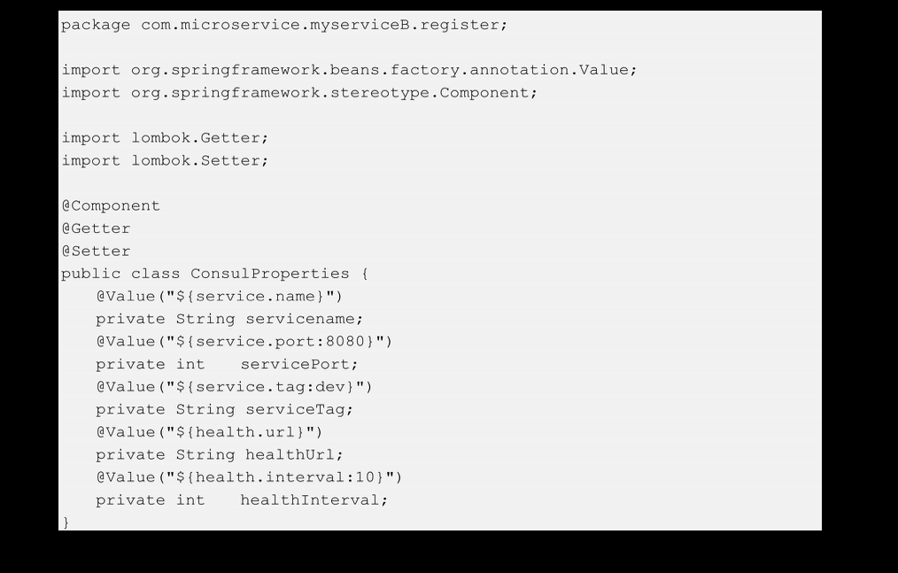

# [README](../README.md "回到 README")
# [目录](本书的组织结构.md "回到 目录")

## 7.1 初始Consul

**Consul是一个分布式、高可用、支持多数据中心的软件，主要用于服务注册、服务发现、key/value存储及健康检查等**。

在实际使用中，为了实现高可用，需要搭建Consul集群。在整个Consul集群中，所有的**Consul节点分为两种角色：serverAgent和clientAgent**。每个Consul集群中至少需要有一个serverAgent，官方推荐3或5台。**serverAgent会存储一些集群的状态信息，并响应集群中其他agent的相关操作**。通常在我们的应用服务器集群中的每一个节点上都会有一个clientAgent，通过该**agent将当前节点上的服务向Consul进行注册，该agent也负责该服务节点及其上的服务的健康检查**。Consul配合Spring Boot的Actuator可以非常简单地实现健康检查（只需要引入spring-boot-starter-actuator），所以可以很方便地找出健康的节点供调用方使用。**Consul的key/value存储功能也很重要，该功能可以用于动态配置、leader选举等**。Consul还提供了非常漂亮的UI，用来进行key/value、节点、服务及session（可以充当分布式锁）等的相关操作。

## 7.2 搭建Consul集群

在生产环境中，推荐Consul集群使用3台或5台serverAgent，笔者这里为了方便，只搭建了一台serverAgent，ip是10.211.55.12。此外，还搭建了两台clientAgent，ip分别是10.211.55.13和10.211.55.14。

### 7.2.1 安装Consul

第一步，在开发机下载Consul。

下载地址为：https://www.consul.io/downloads.html。笔者下载了Linux 64位的Consul。还可以直接在上边的三台centos上执行wget:https://releases.hashicorp.com/consul/0.7.2/consul_0.7.2_linux_amd64.zip-O consul.zip下载。但是，这种下载方式需要看网络速度。

第二种，将下载好的consul_0.7.2_linux_amd64.zip复制到三台centos机器上。

第三步，分别进入三台centos，解压缩。

之后将解压出来的二进制文件Consul移到到/usr/bin/下。

Cosul安装成功后，启动各个Consul节点。

### 7.2.2 启动Consul集群

第一步，在10.211.55.12处启动serverAgent。

说明：笔者将Consul以后台进程来运行，并且将相关日志写在nohup.out文件中，整条命令比较长，下面逐一介绍每个命令的选项。
* consul agent：表示该命令会启动一个consulAgent。
* -server：表示该agent是一个serverAgent，不添加这个选项的话，表示是一个clientAgent。
* -data-dir：表示相关数据存储的目录位置，在serverAgent上该目录下会存储一些集群的状态信息，而在clientAgent上主要存储在其上注册的服务信息以及这些服务的健康检查信息。
* -node：指定该agent节点的名称，该名称在集群中必须是唯一的（默认采用机器的host）。
* -bind：指定该agent的ip。
* -bootstrap-expect 1：该命令通知Consul我们现在准备加入的server节点个数，该参数是为了延迟日志复制的启动，直到指定数量的server节点成功加入后才启动。
* -client 0.0.0.0-ui：启动Consul-UI，如果不添加“-client 0.0.0.0”选项，则UI只能在当前机器上（即10.211.55.12）进行访问。
* -dc：指定该agent加入哪一个数据中心，默认是dc1。

第二步，在10.211.55.13和10.211.55.14处分别启动clientAgent并加入到集群中。
    在10.211.55.13上执行：

    在10.211.55.14上执行：

下面逐一介绍每个命令和选项。
* consul agent：同上；
* -data-dir：同上；
* -node：同上；
* -bind：同上；
* -join：将节点加入集群;
* -dc：同上。

这里启动的时候，我们没有指定-sever，默认以clientAgent来启动。

第三步，验证集群是否搭建成功。在三台机器的任意一台上执行：

该命令用于列出集群中的所有节点，执行之后，若结果如图7-1所示，表示搭建成功。

### 7.2.3 启动Consul-UI

在上一节中，在启动serverAgent时启动了Consul-Ui。下面，打开Consul-UI查看相关信息。
在浏览器中输入：http://10.211.55.12:8500,并单击其中的Nodes标签，结果如图7-2所示。

**Consul-UI中有5个导航按钮，其中SERVICES导航下包含所有注册到Consul上的服务；NODES导航下包含所有Consul集群中的节点机器；KEY/VALUE导航下包含所有服务的配置信息；ACL导航下包含权限控制信息；最后一个导航按钮用于选择数据中心**。

到此，Consul集群就搭建完成了。下面，我们来编写代码实现服务注册、发现与健康检查等功能。

## 7.3 使用Consul实现服务注册与服务发现

本节将搭建的集群架构如图7-3所示。

将创建两个服务：myserviceA和myserviceB，myserviceA将会以jar包的形式运行在10.211.55.13机器上，并通过其上的clientAgent注册到Consul集群中；myserviceB将会以jar包的形式运行在10.211.55.14机器上，同样通过其上的clientAgent注册到Consul集群中。最后，myserviceA实现发现myserviceB的功能。我们首先来开发myserviceB服务。

### 7.3.1 搭建项目框架

myserviceB服务的项目框架如图7-4所示。

其中，pom.xml文件内容如下：

在该pom.xml中，引入了spring-boot-starter-web、Lombok、consul-client、jersey-client及spring-boot-starter-actuator5个依赖。Consul官网给出了两种Java客户端：consul-client和consul-api，可以选择其一，这里，笔者使用consul-client。为了**使用consul-client，引入了consul-client和jersey-client两个依赖；为了实现健康检查，引入了spring-boot-starter-actuator依赖，该依赖是Spring Boot可用于生产级别的监控工具，包含进行健康检查以及收集JVM的相关统计数据的metrics**。在微服务计数监控系统中，可以通过对这些统计数据进行分析告警。

项目框架搭建完成之后，可以编写程序来实现服务注册功能。

### 7.3.2 配置服务注册信息

在实现服务注册之前，首先来配置服务注册信息。在application.properties中配置信息，内容如下：

service.name指定了服务名，我们通常使用服务的artifactId来命名；service.port指定服务将运行在哪一个端口；service.tag指定服务的标签，该选项主要用于区分环境，还是线上环境，通常使用dev表示开发环境prod表示线上环境；health.url是Consul进行健康检查的url，Consul会以一个指定的频率访问这个url，如果现实的是UP的值，则服务健康，否则，服务不健康；这个指定的频率就是health.interval的值。这里是10ms。这5个参数是服务向Consul注册服务的最基本的值。

配置好注册信息后，为了将这些零散的配置信息整顿起来方便后续使用，笔者编写了一个Bean来读取并封装这些参数。该Bean内容如下：

这样，使用这将该Bean注入其他类中直接使用即可。其中，如果service.port的值没有配置，则默认取8080；如果service.tag的值没有配置，则默认取dev。

配置好后，接下来实现本章最核心的第一个任务：服务启动注册！

### 7.3.3 实现服务启动注册

什么是服务注册？引用第1章中的一段话，“服务注册简单形象地来讲就是将服务的ip和port注册到注册中心，这里可以简单地将注册中心理解为一个Map，其中的key是服务的唯一标识（可以是serviceID，也可以是serviceName），而value是一个包含ipAndPort结构体的集合，例如是一个List集合，该List集合中存放了指定service所在的所有服务器。”
    
下面不仅仅要**实现服务注册功能，还要实现在服务启动时自动注册到Consul**。首先定义一个Consul单例Bean。代码如下：

通常显示创建Bean的类会起名为XxxConfig。为了实现服务启动时自动注册到Consul，我们需要清楚地知道Spring Boot的启动流程。下面先看一下代码，然后再做分析。代码如下：

**ConsulRegisterListener类实现了org.springframework.context.ApplicationListener<T>，并且将泛型T指定为ContextRefreshedEvent，这样该类就会监听容器刷新事件**。当Spring Boot发布该事件时，ConsulRegisterListener将会执行onApplicationEvent方法，在该方法内，调用Consul的AgentClient实现服务注册。在注册过程中，指定了服务端口、健康检查url、健康检查的时间间隔、服务名、服务ID及服务标签。其中，服务ID是在注册中心上识别服务的唯一标识，不能重复，这里将服务名作为了服务ID。

值得注意的是，我们**没有把ConsulRegisterListener这个类注册为Bean**，这里提供了一种在**非Bean类调用Bean的方法**：先想办法获取ApplicationContext，然后再使用其getBean方法获取Bean。

最后，将ConsulRegisterListener注册到SpringBoot的启动监听器列表中去，实现服务启动注册功能。该步骤在服务启动类中完成，代码如下：

之前说过，要实现服务启动时自动注册到Consul，我们需要清楚地知道SpringBoot的启动流程，这是很重要的。Spring Boot的启动流程可以参考第6章Spring Boot启动源码解析部分内容。

至此，服务启动注册功能就完成了。我们再来开发myserviceA服务，在myserviceA中实现服务发现功能。

### 7.3.4 实现服务发现

myserviceA项目结构如图7-5所示。

myserviceA要实现服务发现功能，通常也需要注册到Consul，注册代码与myserviceB几乎相同，这里不再赘述。本节只列出实现服务发现功能的代码。什么是服务发现？在第1章中曾解释过，服务发现简单来讲就是根据服务的唯一标识，从注册中心获取指定服务的服务器列表。
    
首先，定义一个服务器模型，代码如下：

Service类只包含host和port两个信息，为了后续使用方便，这里使用Lombok注解@AllArgsConstructor来生成全参构造器。

下面，实现第二个核心任务：服务发现。代码如下：

ServiceDisovery类的代码非常简单，通过Consul的HealthClient根据serviceName获取注册在Consul上的健康的服务列表。

## 7.4 服务部署测试

### 7.4.1 编写测试类

为了测试服务发现功能，在myserviceA服务中编写一个controller类，代码如下：

由于使用了Swagger，因此在myserviceA的pom.xml中需要引入Swagger的两个依赖：springfox-swagger2和springfox-swagger-ui，并且在启动类上添加@EnableSwagger2。Swagger的用法参考第3章相关内容。

一切就绪之后，开始部署服务！

### 7.4.2 服务打包部署

第一步，分别将myserviceA和myserviceB打成jar包。
分别在myserviceA和myserviceB的根目录，也就是根pom.xml存在的目录下执行mvn clean install。之后，在二者的target下看的myserviceA-1.0-SNAPSHOT.jar和myserviceB-1.0-SNAPSHOT.jar。

第二步，将myserviceB-1.0-SNAPSHOT.jar上传到10.211.55.13机器并启动，将myserviceA-1.0-SNAPSHOT.jar上传到10.211.55.14机器并启动。

之后在10.211.55.13机器上执行以下命令来启动myserviceB服务：

之后在10.211.55.14机器上执行以下命令来启动myserviceA服务：

值得注意的是，我们的服务需要的JDK版本至少是1.8，如果虚拟机上的JDK版本低于1.8，那么需要先把老的JDK卸载掉，再按装JDK1.8，之后再启动服务。这里，笔者简单地介绍一下，怎样卸载老的JDK并安装JDK1.8。以10.211.55.13为例，在其上执行：rpm-qa|grep java，然后将显示出来的东西全部卸载掉。

这样，就将原来的JDK 1.7卸载掉了。之后，安装JDK 1.8。

在本机下载好 jdk-8u102-linux-x64.tar.gz后，上传到10.211.55.13，之后解压，配置环境变量即可。

在/etc/profile中添加如下内容：

之后执行source/etc/profile使得/etc/profile文件在不重启服务器的情况下生效，然后使用java -version查看是否安装成功。

第三步，在本地的Consul-UI上查看服务注册情况，如图7-6所示。

由图7-6可见，myserviceA和myserviceB注册成功！

### 7.4.3 运行测试
在10.211.55.14上执行以下命令测试服务发现：

出现[{″ host″：″ 10. 211. 55. 13″，″ port″： 8080}]表明，服务发现功能正常运行！！！当然也可以通过Swagger进行访问。

在实际开发中，服务打包部署是不需要手动去操作的。只需要使用GitLab、Jenkins、Maven简单的Shell脚本以及webhook就可以实现服务自动化编译、打包、复制和部署。在第15章中，我们将会搭建这套服务部署系统。

## 7.5 使用Consul与Actuator实现健康检查

### 7.5.1健康检查机制
在myserviceA和myserviceB中，我们引入了spring-boot-starter-actuator依赖包，该依赖提供了基本的健康检查功能，引入该依赖后，通过访问“http://ip:port/health”这个url，可以查看部署在ip:port上的服务的健康状态。通常全部显示为“UP”就是健康的。

在服务注册的时候，Consul本身进行健康检查时所访问的url就是上边配置的这个url。这样就简单方便地实现了健康检查功能。

### 7.5.2 健康检查查错思路

在图7-6中，如果发现myserviceA或者myserviceB不是绿色passing的,而是黄色failing的，如图7-7所示，那么myserviceA服务就不健康，此时就需要看一下健康检查的信息了。**查看的基本思路是：首先查看是不是服务所在节点node跪了，如果节点node没有跪，那么再去检查服务为什么跪了**。

查看节点是否跪了有两种方式：第一种，直接通过Consul UI，单击myserviceA，如图7-8所示，其中，serf Health Status是绿的，证明节点没跪，如果是黄色，证明节点跪了。

第二种，在10.211.55.14上执行consul members看client agent是否是alive状态。

如果通过上述检查，发现节点没有跪，那么是服务跪了，通过执行curl-X GET"http://ip:port/health"，看一下那些组件的状态是DOWN而不是UP的。之后，去做相应的处理即可。如果访问链接之后发现干脆没有响应，那么看一下是不是没有引入Actuator包或者服务根本没有启动。

## 7.6 再学一招：Consul健康检查分类及原理

前边说过，consul agent的一个主要作用就是实现系统级别和应用级别的健康检查，也就是健康检查包含两部分：首先，会对agent所在节点的状态进行检查；其次，agent会对其上的应用服务的状态进行检查。**Consul的健康检查目前为止有5种实现方式：Script+Interval、HTTP+Interval、TCP+Interval、Time to Live（TTL）以及Docker+Interval**。其中，最常用最简单的方式就是第二种HTTP+Interval，这也是笔者所使用的方式。

HTTP+Interval的实现方式其实就是对一个指定的url每隔一定的时间执行一次GET请求。GET请求返回的httpCode是2xx，表示健康检查通过，服务健康（passing）；如果是429，表示请求数太多，服务警告（warning）。处理这两类httpCode之外，其他的都表示服务不健康（failure）。默认情况下，健康检查的http请求的超时时间与请求间隔时间是相等的，最大值是10s，当然我们也可以在健康检查定义中自己指定一个时间。看一下HTTP+Interval方法的健康检查定义格式：

该定义文件在服务启动之后，会在从其下启动consul agent命令的-data-dir目录下生成。

# [README](../README.md "回到 README")
# [目录](本书的组织结构.md "回到 目录")
