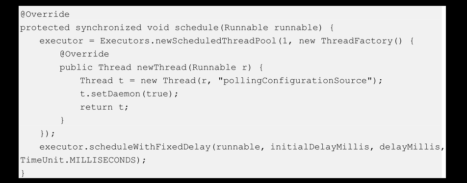

# [README](../README.md "回到 README")
# [目录](本书的组织结构.md "回到 目录")

## 8.1 初始Archaius

Archaius是Netflix开源技术栈中的一员，其提供了一系列与配置管理相关的API。

### 8.1.1 为什么要使用Archaius

在上一章中我们实现了服务注册与服务发现，发现了服务之后，就可以使用一定的服务路由技术，并通过一定的通信技术，进行服务之间的调用了。不过在做这些之前，笔者准备先解决一个问题，就是“配置问题”。就目前情况而言，假设现在需要修改myserviceA一个配置，我们需要怎么做呢？首先，在本机的myserviceA服务的application.properties文件中修改配置，之后需要先编译打包代码，再将jar包传到相关的服务器上，最后再启动服务。即使我们使用了持续集成与持续部署系统，这些操作也一定是要执行的，只不过由机器来执行而已，仍旧需要花费时间。这是一个很麻烦的事情！那么，有没有一种方式，当我们修改了配置文件后，不需要执行上边这个流程，就可以使修改后的配置直接生效呢？答案是肯定的。本章将会通过Netfix的Archaius和Consul-KV来实现这个功能。

### 8.1.2 Archaius原理

Archaius名字来源于变色龙的一个种类，所以也有入将其翻译成“变色龙”，取名为“变色龙”的原因是因为变色龙可以根据环境或情况的不同来动态地改变自己的颜色，而设计Archaius这个框架的目的就是想要不重启服务而获取修改后的配置信息。Archaius具体有如下关键的特征：
* 提供一个polling框架来实现“热配置”（即在不重启服务器的情况下获取修改后的配置信息）。
* 配置管理操作全部都是线程安全的。
* 可以自己提供配置源，即从哪里获取配置信息，如数据库、Consul-KV等。
* Archaius还支持多配置源，并且通过内部的一个层级结构来管理这些配置源。

## 8.2 使用Consul-KV实现配置集中管理

在上一章讲过，Consul有一个可用于管理配置文件的功能，叫做key/value store，简称为Consul-KV。Consul的UI界面提供了对Consul-KV的增删改查功能。这里通过Consul-UI创建了一个key为“service/config/dev”、value为“animal.name=pig”的key-value对。如图8-1所示。

接下来，编写代码来读取这个配置并且使用Archaius来实现动态配置。

## 8.3 使用Archaius实现动态获取配置

为了不让知识点耦合在一起，笔者在之后的每一章都会尽量新建一个微服务来完成当前章节所讲的知识（除非一定要用到之前所讲的技术），当看完整本书后，读者可以自己将这些知识点总结在一起，那么一个完整的微服务框架就形成了。

### 8.3.1 搭建项目框架

这里新建一个微服务config，项目结构如图8-2所示。

其中，pom.xml文件内容如下：

在该pom.xml中，引入了spring-boot-starter-web、consul-client、jersey-client、archaius-core、commons-configuration、commons-lang3以及spring-boot-starter-actuator 7个依赖。引入了consul-client和jersey-client，用于操作Consul，从Consul-KV中读取配置信息；引入了archaius-core和commons-configuration，用于实现配置信息的动态获取，其中Archaius是伟大的Netflix开源技术栈中的一员，专门用于动态读取配置信息，实现“热配置”功能。其底层使用的技术是Apache的commons-configuration；引入了commons-lang3，以便使用其包含的一系列方便的工具类。

项目框架搭建完成后，编写代码来实现服务“热配置”功能。

### 8.3.2 创建配置信息读取源

**首先，需要创建一个配置信息的读取源**，用于从Consul-KV上获取配置信息，然后将这些信息存入内存。在创建读取源之前，先定义两个常量，以方便从Consul-KV读取信息。常量类ServiceContants代码如下：

在该类中，定义了两个常量：一个是serviceName，该值通常与artifactId相同；另外一个是serviceTag，该值用于区分环境，通常**开发环境使用“dev”，线上环境使用“prod”**。使用该tag最大的好处是可以将dev和prod环境的配置分开，其实就是Consul-KV中的两个键。我们回到图8-1，看一下这个key-value对中的key的组成，其实就是“service/{serviceName}/{serviceTag}”。当然，在实际项目中，我们不会把serviceTag写死在代码中，因为这样在上线的时候还需要该tag，通常是在服务启动参数中进行制定，这里为了方便，笔者直接写死在了代码中。

准备工作做好之后，接下来创建配置信息读取源ConsulConfigurationSource。代码如下：

该类实现了com.netflix.config.PolledConfigurationSource接口，并且实现了其中的poll()方法，在该方法中，首先根据传入的keyName从Consul-KV中获取配置信息，获取出来的配置信息是一个字符串，之后通过props.load(new StringReader(kvStr))将该字符串转换成Properties，最后将该Properties中的key-value对组成的Map元素，并通过该Map构建出PollResult对象。

其中，keyName就是Consul-KV中的K，在下边的ConsulPropertySourceInitializer类中会做指定。

另外，需要注意一点，该poll()方法默认每60s执行一次，该值也可以由我们自己指定，同样在ConsulPropertySourceInitializer中指定。通过以固定的时间从Consul-KV中读取出配置信息来实现“热配置”（动态获取配置信息而不需要重启服务）。

当然，也可以从另外的配置中（例如，数据库）获取配置信息，只要重写这里的poll()方法即可。

### 8.3.3 实现服务启动时读取配置信息

为了实现服务启动时读取配置信息，我们需要清楚地知道Spring Boot的启动流程，先来看一下代码，然后再做分析。代码如下：

ConsulPropertySourceInitializer类实现了org.springframework.context.ApplicationContextInitializer接口，并重写了其initialize()方法，这样做的原因是指定该initialize方法在Spring Boot启动过程中的某个恰当时刻去执行，详细信息查看第6章相关内容。

在initialize()方法中，首先设置了ConsulConfigurationSource的poll()方法的执行间隔时间（即每隔多长时间从Consul拉取一次配置信息），这里设置为每个10s，“archaius.fixedDelayPollingScheduler.delayMills”的默认值为60000，即每隔60s拉取一次配置信息。之后，组装一个keyName，图8-1中所示的Consul-KV中的K的格式实际上就是在这里指定的。接着创建了配置信息的读取源实例configSource以及用于启动读取数据源后台线程的scheduler。然后，根据configSource和scheduler这两个信息来创建动态配置实例configuration。最后，将该configuration实例安装到ConfigurationManager管理器中。

再将ConsulPropertySourceInitializer注册到Spring Boot的启动初始化器列表中，实现服务启动时读取配置信息的功能。该步骤在服务启动类中完成，代码如下：

还是熟悉的启动类Application，只是在执行其run()方法之前，为其添加了一个initializer实例，即ConsulPropertySourceInitializer实例。
    
### 8.3.4 动态获取配置信息

当通过Archaius定期从Consul-KV将配置信息读取到内存中后，我们就可以通过Atchaius的相关API来获取配置信息了。获取配置信息的代码如下：

在TestController中使用如下代码：

获取“animal.name”的值，如果没有读取到该值，使用默认值“cat”。

代码编写完成后，将代码编译、打包、复制到服务器，启动服务，之后在服务器上执行curl-X GET “http://localhost:8080/archaius/test/getAnimalName”。

读取到配置文件后，再到Consul-KV上修改配置文件的值，再执行如上命令，看是否可以实现动态配置。

### 8.3.5 将配置信息动态加入Spring属性源的思路

在上一节中，通过Archaius的API实现了配置信息的动态获取，但是现在我们采用Spring的读取配置数据的方法，例如使用org.springframework.core.env.Environment读取配置信息已经不行了，因为配置信息只是存储到了Archaius的PollResult中，而没有存入Spring的PropertySource中。想解决这个问题其实很简单，具体实现思路是：CousulPropertySource类实现org.springframework.core.env.MapPropertySource，并将读取到的信息存储到MapPropertySource的顶级父接口org.springframework.core.env.PropertySource中的source变量中。最后，将ConsulPropertySource添加到MutablePropertySources的List<PropertySource<? >>中即可。笔者这里就不给出代码实现了。详细信息还是需要查看第6章相关内容，看完第6章的源码解析后，相信读者自己也可以实现将配置信息动态加入Spring属性源中。

## 8.4 再学一招：Archaius关键源码解析

Archaius的亮点就是配置信息的动态获取，或者称为“热配置”。下面就来看看**Archaius实现“热配置”的原理。分为两部分：构造属性源；动态获取属性**。

首先来看一下，构造属性源的正确方法：

首先设置archaius.fixedDelayPollingScheduler.delayMills的值为10000，其实就是指定后边的定时任务每隔10s执行一次；然后创建PolledConfigurationSource接口的实现类ConsulConfigurationSource的实例；再创建FixedDelayPollingScheduler实例，看一下源码：

该构造器为FixedDelayPollingScheduler的initialDelayMillis属性和delayMillis属性赋值。其中initialDelayMillis的默认值是30s，该值指定了定时任务创建完成30s后开始执行；delayMillis默认值是60s，但是我们在前边指定为10s，就是说每隔10s执行一次定时任务。执行完以上工作后，开始创建DynamicConfiguration实例，来看一下源码：

在DynamicConfiguration的构造器中调用了其startPolling方法，在该方法中调用了FixedDelayPollingScheduler的父类AbstractPollingScheduler的startPolling方法，源码如下：

在该方法中，AbstractPollingScheduler首先调用initialLoad方法，从Consul拉取配置信息并且将配置信息存储在了PollResult的父类WatchedUpdateResult的Map<String, Object>complete属性中。之后创建一个定时任务来执行一个线程任务。下面来一步步看下源码。首先看AbstractPollingScheduler的initialLoad方法。

这里拉取配置信息并且将这些key-value对存储在PollResult的Map<String，Objecrt> complete属性中，之后使用populateProperties方法将complete中的值添加或者更新到DynamicConfiguration的父类ConcurrenMapConfiguration的CocurrentHashMap<String, Object> map属性中。该map属性也是程序中读取配置信息的地方。propulateProperties方法占篇幅较大，不贴出来了。

再来看一下构造器的线程的getPollingRunnable方法：

该线程所做的工作其实与initialLoad方法几乎相同。

最后执行FixedDelayPollingScheduler的schedule方法，来看一下源代码：

该方法启动了定时任务，其中的任务线程就是上边的线程。每隔10s就会重新拉取配置信息，并且将其设置到ConcurrentHashMap<String,Object>map属性中，这样，程序获取配置信息时，获取的是新值。

这就是动态配置的原理！

### 8.4.2 动态获取属性

首先来看一下动态获取属性的正确方法：

该方法的实现源码比较曲折，代码线比较长，这里直接列出最后获取animal.name值的代码，即ConcurrentMapConfiguration类中的getProperty方法的代码。源码如下：

其中，map属性就是前面所讲的属性值最终存取的地方，并随着定时任务的执行，map中的值也在变。从而也就可以取出改变后的值，实现动态获取属性！

# [README](../README.md "回到 README")
# [目录](本书的组织结构.md "回到 目录")