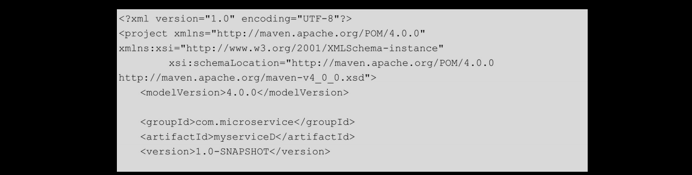

# [README](../README.md "回到 README")
# [目录](本书的组织结构.md "回到 目录")

## 9.1 常见的三种服务通信技术

常见的服务通信框架有很多，这里简单介绍三种：OkHttp、AsyncHttpClient和Retrofit。

**OkHttp是一种http客户端，其使用连接池技术来减少请求延迟，并且会对响应进行缓存以减少重复的网络请求，还无缝地支持GZIP以减少数据流量**。OkHttp的使用很简单，它的**请求和响应API都是采用流式的builder模式来设计的**；OkHttp同时支持**同步阻塞调用和异步调用（使用callback实现回调）**。使用Okhttp至少需要JDK1.7。
    
AsyncHttpClient也是一种http客户端，设计该框架的**目的是为了让Java应用可以很方便地执行http请求并且异步处理http相应**。AsyncHttpClient的底层是Netty框架（一个非常优秀的rpc框架），这就注定了它的效率是很高的，优于OkHttp。使用最新版本的AsyncHttpClient需要JDK 1.8。

**Retrofit和OkHttp师出同门，都是Square公司开源的项目，Retrofit实际上对OkHttp进行了封装**。与OkHttp不同的是，Retrofit将url（或者更确切地说是rest API）封装成了Java接口，在该接口上可以使用注解来指定一系列的相关信息，比如请求方式、请求参数等。我们不需要写该接口的实现类，Retrofit会帮我们搞定；此外，Retrofit还自己封装了Gson，实现了将返回的json串自动转换为POJO的功能，当然我们可以实现自己的转换器，例如使用Jackson，之后嵌入Retrofit中。在本章的“再学一招”部分，会对Retrofit的关键源码进行解析。

本章会设计两个微服务：myserviceC和myserviceD。其中myserviceD提供一个简单的http接口，myserviceC分别使用Okhttp、AsyncHttpClient和Retrofit来调用myserviceD提供的接口。下面首先开发myserviceD服务。

## 9.2 创建一个简单的被调用服务

### 9.2.1 搭建项目框架
myserviceD的项目结构如图9-1所示。

其中，pom.xml文件内容如下：

引入spring-boot-starter-web、springfox-swagger2、springfox-swagger-ui及Lombok4个依赖。项目搭建完成之后，编写一个简单的被调用接口。

### 9.2.2 实现一个简单的被调用接口

首先编写一个启动类，代码如下：

还是熟悉的服务启动类。
然后编写一个模型类作为接口返回值。模型类代码如下：

使用@Getter注解生成getter方法，在Jackson转换时需要用到它；使用@AllArgsConstructor注解加全参构造器，以便构造并初始化对象。
最后编写被调用接口，代码如下：

该类只提供了一个接口，其根据用户名返回不同的User对象实例。

myserviceD的代码很简单，就是一个简单的SpringBoot应用。之后，分别使用OkHttp、AsyncHttpClient和Retrofit进行服务调用。

## 9.3 使用OkHttp实现服务通信

### 9.3.1 搭建项目框架

myserviceC的项目结构如图9-2所示。

    
在其pom.xml文件中引入如下依赖：

引入OkHttp 2.7.5和fastjson，其他需要引入的依赖就是myserviceD引入的那些依赖，这里就不再赘述了。

项目搭建完成后，需要编写一个OkHttp调用实体类，为以后的服务通信做准备。

### 9.3.2 创建OkHttp调用实体类

首先，编写一个服务启动类，myserviceC的服务启动类与myserviceD的相同，不再赘述。下面创建一个调用实体类，代码如下：

在MyserviceCConfig类中，构造了一个com.squareup.okhttp.OkHttpClient单例，并指定连接超时时间是2s，读取超时时间是3s，下入超时时间是3s，在实际开发中，这些配置参数最好配置在配置中心中，方便后续修改。值得一提的是，官方推荐全局使用一个OkHttpClient，所以笔者在这里构建了一个单例Bean。

这里解释一下三个易混的超时概念。
* 连接超时：connectTimeout，**A服务建立和B服务的连接的时间。即完成三次握手的最大时间**。
* 读取超时：**A服务接收到下一个字节与上一个字节之间的最大时间**，即如果在接收到来自于B服务的上一个字节后，经过读取超时时间后，还没有接收到来自于B服务的下一个字节，则抛出超时异常。
* 写入超时：从A服务发出一个报文到接收到来自于B服务的ack消息的时间，通常不设置该参数。

创建好OkHttpClient实例之后，就可以使用该实例进行服务调用了。

### 9.3.3 实现服务通信功能

首先，创建一个模型类，接收myserviceD被调用接口的返回值，代码如下：

之后，编写服务调用代码。代码如下：

在getUserByOkHttp方法中，首先组装了访问myserviceD中的接口的url，然后构建了请求实例request，之后使用之前实例化好的okHttpClient执行调用并同步接收返回值，最后使用fastjson将返回值反序列化成User实例。最后的最后，一定要关闭body体！！！

下面，编写controller进行调用。代码如下：

运行服务，然后使用Swagger进行测试。至此，我们就完成了使用OkHttp实现服务通信的功能！

### 9.3.4 Spring Boot指定服务启动端口的三种方式

在实际开发中，同一个机器上如果部署两个服务，则常常会出现8080端口以及被其他服务占用的情况，这个时候，另一个服务就无法再使用8080端口了。例如这里的myserviceD已经占用了8080端口，myserviceC就需要使用其他端口。指定服务端口共有三种方式：
* 设置VM启动参数，如图9-3所示。

* 在配置文件中添加：server.port=8081。
* 第三种方式：启动类实现EmbeddedServletContainerCustomizer接口，重写其方法，添加container.setPort(8081)。

下面，我们来看一下使用AsyncHttpClient实现服务通信的代码实现。

## 9.4 使用AsyncHttpClient实现服务通信

我们在myserviceC的基础上完成代码开发。

### 9.4.1 搭建项目框架

在pom.xml文件中引入AsyncHttpClient的依赖，如下：

    
项目搭建完成后，需要编写一个AsyncHttpClient调用实体类，为以后的服务通信做准备。

### 9.4.2 创建AsyncHttpClient调用实体类

AsyncHttpClient调用实体类的关键代码如下：

该方法创建了一个com.ning.http.client.AsyncHttpClient实例，并指定了连接超时时间为2s，读取超时时间为3s,请求的超时时间为5s。

### 9.4.3 实现服务通信功能

创建好AsyncHttpClient实例后，就可以使用该实例进行服务调用了。服务调用代码如下：

在getUserByAsyncHttpClient方法中，首先组装了访问myserviceD中的接口的url，之后构建了请求实例request，然后使用之前实例化好的asyncHttpClient执行调用并使用java.util.concurrent.Future实现异步接收返回值，最后使用fastjson将返回值反序列化成User实例。这里有一个需要注意的地方，就是在实际开发中，对于异常，不要直接使用e.printStackTrace()，通常，可以将异常的堆栈信息放在日志中。

下面，编写controller进行调用。代码如下：

运行服务，进入Swagger进行测试。至此，我们就完成了使用AsyncHttpClient实现服务通信的功能！下面，我们来看一下使用Retrofit实现服务通信的代码实现。

## 9.5 使用Retrofit实现服务通信

还是在myserviceC的基础上完成代码开发。

### 9.5.1 搭建项目框架

在pom.xml文件中引入Retrofit的依赖，如下：

引入Retrofit1.9.0的jar包，这是目前常用的版本，Retrofit2.x做了很大的更新。

项目搭建完成后，编写使用Retrofit进行服务通信的代码。

### 9.5.2 创建调用接口并实例化接口

想要使用Retrofit进行服务通信，首先需要将被调用接口接口化。这里笔者将myserviceD的被调用接口接口化，代码如下：

该接口指定了调用远程服务myserviceD的方法getUser的基本路径uri、参数、返回值和请求方式，有以下几点需要注意：
1. 在调用时，该基本路径uri会与之后的RestAdapter的endpoint组成完整的访问路径以被调用者访问。
2. 请求方式比较常用的有：@GET、@POST、@PUT和@DELETE等，分别对应于restful风格中的查询、增加、修改和删除。
3. 入参使用@Query传递query域中的值，Spring MVC使用@RequestParam接受该域中的值；入参使用@Path传递path域中的值，Spring MVC使用@PathVariable接收该域中的值；入参使用@Header传递header域中的值，Spring MVC使用@RequestHeader接收该域中的值；入参使用@Body传递body域中的值（通常是一个pojo）对象，Spring MVC使用@RequestBody接受该域中的值。

将被调用接口接口化之后，还需要将该接口“实例化”，代码如下：

在**该方法中，首先创建了一个RestAdapter实例restAdapter，并指定了endpoint，最后使用restAdapter创建出一个MyserviceDApi实例（值得注意的是，为什么MyserviceDApi明明是一个接口，却可以构建实例？答案是动态代理，参考本章的“再学一招”部分），供调用方法使用。在创建RestAdapter实例时，我们可以自己指定json转换器，自己指定错误处理器（需要实现retrofit.ErrorHandler），自己指定Client（需要使用retrofit.client.Client）。在Retrofit发起调用时，可以将此调用委托给该Client，该Client再去进行真正的服务调用**。

### 9.5.3 实现服务通信功能

一切准备就绪之后，编写代码实现服务通信。代码如下：

这里实例了对远程方法的调用，调用远程方法就和调用本地方法一样简单，一样明了。

最后，编写controller。代码如下：

运行服务，使用Swagger进行测试。至此，我们就完成了使用Retrofit实现服务通信的功能！

最后说一句，虽然OkHttp使用起来比较简单，但是笔者使用较少，因为论性能，**AsyncHttpClient优于OkHttp，论设计，Retrofit优于OkHttp，所以笔者更推荐使用后两种技术**。**但是当引入服务路由之后，AsyncHttpClient使用起来依然简单，但是Retrofit就要使用自定义的retrofit.client.Client的实现类了**，当然编写实现类也很简单，完全可以模仿Retrofit源码中给出的一些样例。

## 9.6 再学一招：Retrofit源码解析

# [README](../README.md "回到 README")
# [目录](本书的组织结构.md "回到 目录")