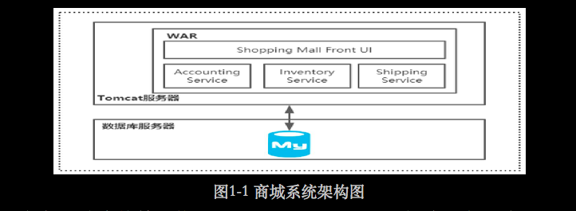
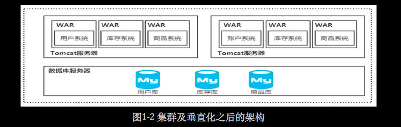
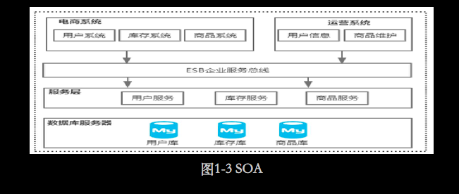
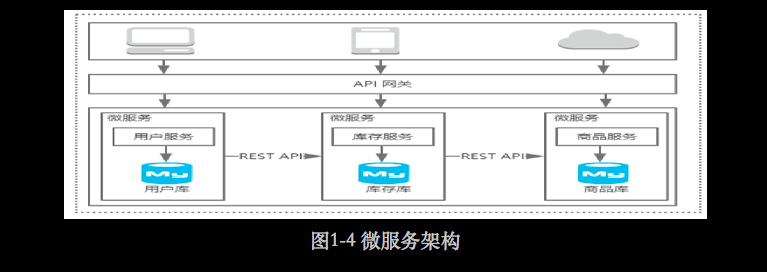
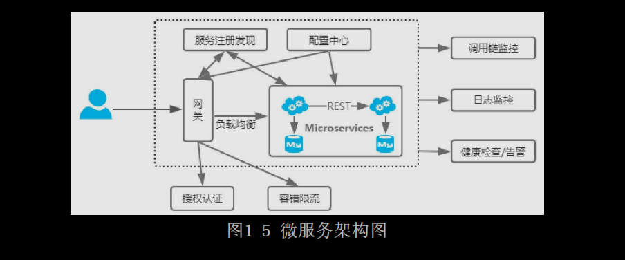

# [README](../README.md "回到 README")

# 第1章 微服务的发展史

技术作为业务的支撑，它永远是伴随着业务的发展而发展的，所以作为一名技术开发者，我们需要不断地学习新的技术去解决新的技术问题。但是随着年龄的增长，我们能够投入的时间和精力越来越少，掌握科学的学习方法并且让自己的思维方式和对技术的理解层次前置于新技术就显得很重要了。其实现在很多程序员是幸运的，他们进入Java开发这个领域，各个方面的技术体系都非常成熟，遇到任何问题都有非常成熟的解决方案，所以只需要了解并且会用这些技术就能够解决几乎所有的问题。但是他们也会因为缺少对于技术发展过程的了解，而导致对于技术解决方案的了解过于片面。我遇到的很多学员都问过我这样一个问题：“SOA和微服务有什么区别？”这个问题单纯靠网上各种文章去理解会比较困难，但是如果经理过SOA到微服务的发展过程，就很容易理解了。

我会从架构发展的角度来描述技术的发展过程，根据不同节点所面临的问题来推动架构的演变，从而更好地理解微服务的本质以及它所带来的好处。大家会发现很多书的第1章都**写一些基础性的或者架构演进的内容**，我也不例外，因为这块内容主要会通过架构的演进过程帮助大家建立一个整体意识，从而更好地掌握微服务体系。

## 1.1 从单体架构到分布式架构的演进

任何现在看起来非常复杂和庞大的架构，一定都是随着业务产品中用户量和数据量增长而不断演变来的。而**架构的发展可能都会经历单体架构、垂直化和集群、SOA（面向服务架构）、微服务架构等**。当然不是所有的公司都会严格按照这个架构的顺序演进，每个公司遇到的问题不一样，架构的发展过程也不一样。特别是互联网公司的架构，用户量大部分情况下属于爆发式的增长，那么后端架构所面临的挑战就会比较大，处理方式一定是先抗住流量然后在流量平稳之后再来优化架构。

### 1.1.1 单体架构

我是在2008年的时候开始学习Java的，那时候主要学习Spring、Struts、Hibernate、MySQL等技术。当时学完以后，开发了一个商城系统作为毕业项目，如图1-1所示。

整个系统的架构非常简单，使用Spring+Struts+Hibernate构建一个基础工程、MySQL数据库作为持久化存储，在这个工程中创建不同的Service实现商城中不同的业务场景，如账户、库存、商品等。最后把项目构建成一个war包部署在Tomcat容器上即可使用，这应该是很多学习Java开发的同学都有过的经历。

通常来说，如果一个war包或者jar包里面包含一个应用的所有功能，则我们称这种架构为单体架构。

很多传统互联网公司或者创业型公司早期基本都会采用这样的架构，因为这样的架构足够简单，能够快速开发和上线。而且对于项目初期用户量不大的情况，这样的架构足以支撑业务的正常运行。

### 1.1.2 集群及垂直化

假设在1.1.1节中提到的商城系统是某个创业公司早期的产品，我们知道技术只是业务的一个载体，它使得用户通过网页就能轻松实现线上购物，所以最终的核心还是产品的长期运营。作为公司，肯定希望这个产品被越来越多的人使用，这样才能创造更大的价值。如果这个希望变成了现实，那么对于整个技术架构来说，可能会面**临以下挑战**：
* 用户量越来越大，网站的**访问量不断增大，导致后端服务器的负载越来越高**。
* 用户量大了，产品需要满足不同用户的需求来留住用户，是的**业务场景越来越多并且越来越复杂**。

当服务器的负载越来越高的时候，如果不进行任何处理，用户在网站上操作的响应会越来越慢，甚至出现无法访问的情况，对于非常注重用户体验的互联网产品来说，这是无法容忍的。

业务场景越多越复杂，意味着war包中的代码量会持续上升，并且各个业务代码之间的耦合度也会越来越高，后期的代码维护和版本发布设计的测试和上线，也会很困难。举个最简单的例子，当你需要在库存模块里面添加一个方法时，带来的影响是需要把整个商城重新测试和部署，而当一个war包有几个GB的大小时，部署的过程也是相当痛苦的。

因此，我们可以从两个方面进行优化：
（1）通过**横向增加服务器，把单台机器变成多台机器的集群**。
（2）按照**业务的垂直领域进行拆分，减少业务的耦合度，以及降低单个war包带来的伸缩性困难**的问题。

如图1-2所示，我们把**商城系统按照业务维护进行了垂直拆分**：用户子系统、库存子系统、商品子系统，每个子系统由不同的业务团队负责维护并且独立部署。同时，我们针对**Tomcat服务器进行了集群部署**，也就是把多台Tomcat服务器通过网络进行连接组合，形成一个整体对外提供服务。这样做的好处是能够在改变应用本身的前提下，通过增加服务器来进行水平扩展从而提升整个系统的吞吐量。

需要注意的是，图1-2中针对数据库进行了垂直分库，主要考虑到Tomcat服务器能够承载的流量大了之后，如果流量都传导到数据库上，会给数据库造成比较大的压力。

总的来说，数据库层面的拆分思想和业务系统的拆分思想是一样的，都是采用分而治之的思想。

### 1.1.3 SOA

为了让大家更好地理解SOA，我们来看两个场景：
* 假设一个用户执行下单操作，系统的处理逻辑是先去库存子系统检查商品的库存，只有在库存足够的情况下才会提交订单，那么这个检查库存的逻辑是放在订单系统中还是库存子系统中呢？在整个系统中，一定会存在非常多类似的共享业务的场景，这些业务场景的逻辑肯定会被重复创建，从而产生非常多冗余的业务代码，这些冗余代码的维护成本会随着时间的推移越来越高，能不能把这些**共享业务逻辑抽离出来形成可重用的服务**呢？
* 在一个集团公司下有很多子公司，每个子公司都有自己的业务模式和信息沉淀，**各个子公司之间不进行交互和共享**。这个时候每个子公司虽然能够创造一定的价值，但是由于各个子公司之间信息不是互联互通的，彼此之间形成了**信息孤岛**，是的价值无法最大化。

基于这些问题，就引入了**SOA（Service-Oriented Architecture），也就是面向服务的架构**，从语义上说，它和面向过程、面向对象、面向组件的思想是一样的，都是一种软件组建及开发的方式。核心目标是把一些通用的、会被多个上层服务调用的共享业务提取成独立的基础服务，这些被提取出来的共享服务相对来说比较独立，并且可以重用。所以**在SOA中，服务是最核心的抽象手段，业务被划分为一些粗粒度的业务服务和业务流程**。

如图1-3所示，提取出了用户服务、库存服务、商品服务等多个共享服务。在SOA中会采用ESB（启用服务总线）来作为系统和服务之间的通信桥梁，ESB本身还提供服务地址的管理、不同系统之间的协议转化和数据格式转化等。调用端不需要关心目标服务的位置，从而使得服务之间的交互是动态的，这样做的好处是实现了服务的调用者和服务的提供者之间的高度解耦。总的来说，SOA主要解决的问题是：
* 信息孤岛。
* 共享业务的重用。

### 1.1.4 微服务架构

业务系统实施服务化改造之后，原本共享的业务被拆分形成可复用的服务，可以在最大程度上避免共享业务的重复建设、资源链接瓶颈等问题。那么**被拆分出来的服务是否也需要以业务功能为维度来进行拆分和独立部署，以减低业务的耦合度及提升容错性呢**？

微服务就是这样一种解决方案，从名字上看，面向服务（SOA）和微服务本质上都是服务化思想的一种体现。**如果SOA是面向服务开发思想的雏形，那么微服务就是针对可重用业务服务的更进一步优化**，我们**可以把SOA看出微服务的超集，也就是多个微服务可以组成一个SOA服务**。伴随着服务粒度的细化，会导致原本10个服务可能拆分成了100个微服务，一旦服务规模扩大就意味着服务的构建、发布、维护的复杂度也会成倍增加，所以实施微服务的前提是软件交付链路及基础设施的成熟化。因此微服务在我看来并不是一个新的概念，它本质上是服务化思想的最佳实践方向。

由于SOA和微服务两者的关注点不一样，造成了这两者有非常大的区别：
* **SOA关注的是服务的重用性及解决信息孤岛问题**。
* **微服务关注的是解耦**，虽然解耦和可重用性从特定角度来看是一样的，但本质上是有区别的，解耦是降低业务之间的耦合度，而重用性关注的是服务的复用。
* 微服务会**更多地关注在DevOps的持续交付上，因为微服务粒度细化之后使得开发运维变得更加重要，因此微服务与容器化技术的结合更加紧密**。

如图1-4所示，**将每个具体的业务服务构成可独立运行的微服务，每个微服务只关注某个特定的功能，服务之间采用轻量级通信机制REST API进行通信**。细心的读者会发现SOA中的服务和微服务架构中的服务粒度是一样的，不是说SOA是微服务的超集吗？其实我们可以把用户服务拆分的更细，比如用户注册服务、用户鉴权服务等。实际上，微服务到底要拆分到多大的粒度没有统一的标准，更多的时候是需要在粒度和团队之间找平衡的，微服务的粒度越小，服务的独立性带来的好处就越多，但是管理大量的微服务也会越复杂。

## 1.2 微服务架构带来的挑战
  
从单体架构到微服务架构，技术架构随着产品的复杂度和访问的压力增大不断地进行变化，最终的目的都是更好地服务业务，使得用户在使用产品时获得更好的体验。而微服务架构之所以能够被广泛地使用，自然有它的优势，先来简单分析一下微服务架构的优点。

### 1.2.1 微服务架构的优点

微服务架构有很多好处，下面简单罗列了几个比较突出的点。
* 复杂度可控：通过对共享业务更细粒度的拆分，**一个服务只需要关注一个特定的业务领域**，并通过定义良好的接口清晰表述服务边界。
* 技术选型更灵活：每个微服务都由不同的团队来维护，所有**可以结合业务特性自由选择技术栈**。
* 可扩展性更强：**可以根据每个微服务的性能要求和业务特点来对服务进行灵活扩展**，比如通过增加单个服务的集群规模，提升部署了该服务的节点的硬件配置。
* 独立部署：**由于每个微服务都是一个独立运行的进程，所以可以实现独立部署**。当某个微服务发送变更时不需要重新编译部署整个应用，并且单个微服务的代码量比较小，使得发布更加高效。
* 容错性：在微服务架构中，如果**某一个微服务发生故障，我们可以使故障隔离在单个服务中。其他服务可以通过重试、降级等机制实现应用层面的容错**。

### 1.2.2 微服务架构面临的挑战

微服务架构不是银弹，它并不能解决所有的架构问题。虽然它本身具备非常多的优势，但是也给我们的开发工作带来了非常大的挑战。在拥抱微服务架构的过程中，我们经常**会遇到数据库的拆分、API交互、大量的微服务开发和维护、运维等问题**。即便成功实现了微服务的主体，也还是面临下面这样一些挑战。
* 故障排查：一次请求可能会经历多个不同的微服务的多次交互，交互的链路可能会比较长，每个微服务会产生自己的日志，在这种情况下如果出现一个故障，开发人员定位问题的根源会比较困难。
* 服务监控：在一个单体架构中很容易实现服务的监控，因为所有的功能都在一个服务中。在微服务架构中，服务监控开销会非常大，可以想象一下，在几百个微服务组成的架构中，我们不仅要对整个链路进行监控，还要对每个微服务都实现一套类似单体架构的监控。
* 分布式架构的复杂性：微服务本身构建的是一个分布式系统，**分布式系统涉及服务之间的远程通信**，而网络通信中网络的延迟和网络故障时无法避免的，从而增加了应用程序的复杂度。
* 服务依赖：微服务数量增加之后，各个服务之间会存在更多的依赖关系，使得系统整体更为复杂。假设你在完成一个案例，需要修改服务A、B、C，而A依赖B，B依赖C。在单体式应用中，你只需要改变相关模块，整合变化，再部署就好了。对比之下，微服务架构模式就需要考虑相关改变对不同服务的影响。比如，你需要更新服务C，然后是B，最后才是A，幸运的是，许多改变一般只影响一个服务，需要协调多个服务的改变很少。
* 运维成本：在微服务中，需要保证几百个微服务的正常运行，对于运维的挑战是巨大的。比如单个服务流量激增时如何快速扩展、服务拆分之后导致故障点增多如何处理、如何快速部署和统一管理众多的服务等。

## 1.3 如何实现微服务架构

前面基于微服务架构的发展演进过程阐述了微服务架构的本质和优缺点，那么如何实现一个微服务架构呢？在我看来，不管是单体架构还是微服务架构，本质上都是为了更好地支撑业务的发展，就像建房子，2层楼和20层楼都是用来住人的，唯一的区别是建2层楼所需要的技术和建20层楼所需要的技术不一样，后者需要的技术更加复杂。

**架构的本质是对系统进行有序化重构，使系统不断进化**。在这个进化的过程中除了更好地支撑业务发展，也会带来非常多的挑战，譬如在1.2.2节中提到的微服务的挑战，为了解决这些问题就必须引入更多的技术，进而使得微服务架构的实现变得非常复杂。

### 1.3.1 微服务架构图

简单整理实现微服务架构需要考虑的功能，可以得到微服务架构图，如图1-5所示。

### 1.3.2 微服务架构下的技术挑战

微服务架构主要的目的是实现业务服务的解耦。随着公司业务的高速发展，微服务组件会越来越多，导致服务与服务之间的调用关系越来越复杂。同时，服务与服务之间的远程通信也会因为网络通信问题的存在变得更加复杂，比如需要考虑重试、容错、降级等情况。那么这个时候就需要进行服务治理，将服务之间的依赖转化为服务对中心的依赖。除此之外，还需要考虑：
* 分配式配置中心。
* 服务路由。
* 负载均衡。
* 熔断限流。
* 链路监控。

这些都需要对应的技术来实现，我们是自己研发还是选择市场上比较成熟的技术拿来就用呢？如果市场上有多种相同的解决方案，应该如何做好技术选型？以及每个技术解决方案中的底层实现原理是什么？读者可以带着这些疑问继续往下阅读，本书后续的章节中会做非常详细的讲解。

# [README](../README.md "回到 README")