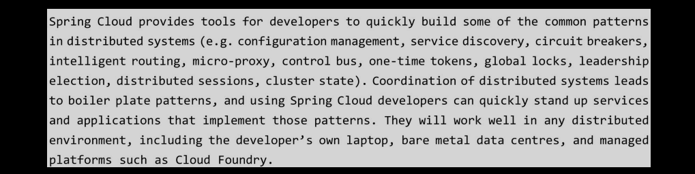
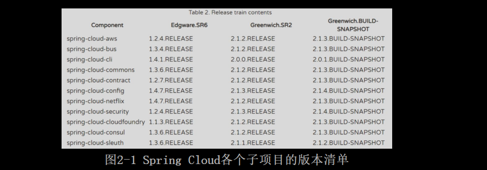
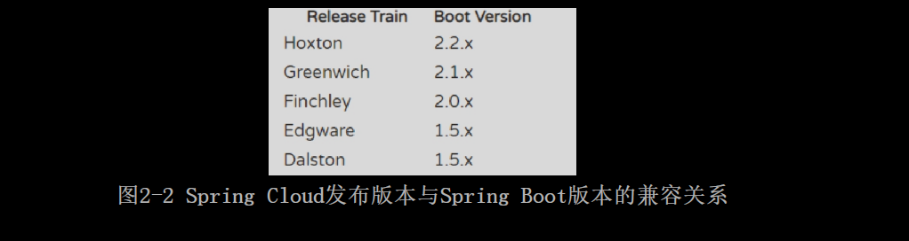
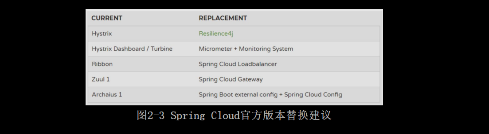

# [README](../README.md "回到 README")

# 第2章 微服务解决方案之Spring Cloud

尽管微服务架构为复杂业务提供了很好的解决方案，但是也给开发、测试、运维带来了非常大的挑战。站在开发人员的角度，首先，需要考虑各个微服务之间的远程通信，**市场上有非常多的开源RPC框架，比如Thrift、Dubbo、Motan、gRPC等**。其次，有了远程通信之后，还需要考虑**服务构成大规模集群之后如何做好服务的动态感知**，比如A服务要调用B服务，但是B服务部署了10个节点，那么A服务如何动态维护B服务的10个不同的地址信息呢？这就需要采用一些第三方组件来管理目标服务的地址。

在**微服务一体化解决方案出现之前**，各个公司在实现服务化的过程中都比较痛苦，不仅仅需要对各种开源技术进行横向对比整合，还需要针对公司内部业务的特性对这些开源组件进行包装和调优。笔者就经历了这样一个痛苦的过程，直到Spring Cloud出现。

Spring Cloud是Pivotal公司在2015年发布的一个项目，很多人可能不知道Pricotal公司，Spring就是Pricotal公司研发的。

本章会围绕业内比较流行的微服务解决方案进行分析，主要包括：
* Spring Cloud Netflix
* Spring Cloud Alibaba

## 2.1 什么是Spring Cloud

官网是这么描述Spring Cloud的：

简单来说，Spring Cloud**提供了一些可以让开发者快速构建微服务应用的工具**，比如配置管理、服务发现、熔断、智能路由等，这些服务可以在任何分布式环境下很好地工作。Spring Cloud主要致力于解决如下问题：
* Distributed/versioned configuration，分布式及版化配置。
* Service registration and discovery，服务注册与发现。
* Routing，服务路由。
* Service-to-service calls，服务调用。
* Load balancing，负载均衡。
* Circuit Breakers，断路器。
* Global locks，全局锁。
* Leandership election and cluster state,Leader选举及集群状态。
* Distributed messaging，分布式消息。

需要注意的是，Spring Cloud并不是Spring 团队全新研发的框架，它只是把一些比较优秀的解决微服务架构中常见问题的开源框架基于Spring Cloud规范进行了整合，通过Spring Boot这个框架进行再次封装后屏蔽掉了复杂的配置，给开发者提供良好的开箱即用的微服务开发体验。不难看出，Spring Cloud其实就是一套规范，而Spring Cloud Netflix、Spring Cloud Consul、Spring Cloud Alibaba才是Spring Cloud规范的实现。

## 2.2 Spring Cloud版本简介

前面我们讲过，Spring Cloud是一套整合了各大公司开源技术的规范，而这些开源技术的版本发布是由各个公司来维护的，每个子项目都维护了自己的发布版本号，所以它不像传统意义上的版本命名，而是**采用了伦敦地铁站的名字根据字母表的顺序结合对应版本的时间顺序来定义一个大版本**，Spring Cloud以往的版本发布顺序排列如下：
* Angel（最早的Release版本）
* Brixton
* Camden
* Dalston
* Edgware
* Finchley
* Greenwich
* Hoxton（最新的版本）

Spring Clooud的每一个大版本通过BOM（Bill of Materials）来管理每个子项目的版本清单，如图2-1所示是Spring Cloud官网提供的各个子项目的版本清单，**表头（Edgware,SE6、Greenwich.SR2）表示Spring Cloud的大版本好。表格中的内容是当前大版本号对应所有子项目的版本号。简单来说，如果我们引入Spring Cloud的版本是Edgware.SR6，那么依赖的Spring-Cloud-Aws的版本号为1.2.4.RELEASE，Spring-Cloud-Bus的版本号为1.3.4.RELEASE。细心的读者会发现Spring Cloud发版本后面多了一个.SR6/.SR2，Spring Cloud项目的发布内容积累到一个临界点或者解决一些严重的Bug后，会发布一个Service Release的版本，简称SRX，其中X是一个递增的数字**。

值得注意的是，**Spring Cloud中所有子项目都依赖Spring Boot框架**，所以Spring Boot框架的版本号和Spring Cloud的版本号之间也存在依赖及兼容的关系。如图2-2所示，是Spring Cloud官网提供的版本依赖关系。Edgware和Dalston这两个版本可以构建在Spring Boot 1.5.x版本上，但是不能兼容Spring Boot 2.0.x。并且，从Dinchley版本开始，Spring Boot版本必须在2.0.x之上，不支持Spring Boot 1.5.x。

## 2.3 Spring Cloud规范下的实现

在Spring Cloud这个规范下，有很多实现，比如：
* Spring-Cloud-Bus
* Spring-Cloud-Netflix
* Spring-Cloud-Zookeeper
* Spring-Cloud-Gateway

在这些实现中，绝大部分组件都使用“别人已经造好的轮子”，然后基于Spring Cloud规范进行整合，使用者只需要使用非常简单的配置即可完成微服务架构下复杂的需求。

这也是Spring团队最厉害的地方，他们很少重复造轮子。大家会想一下，最早的Spring Framework，它只提供了IoC和AOP两个核心功能，对于ORM、MVC等其他的功能，Spring都提供非常好的兼容性，比如Hibernate、MyBatis、Struts2。

只有在别人提供的东西不够好的情况下，Spring团队才会考虑自己研发。比如Struts2经常有安全漏洞，所以Spring团队自己研发了Spring MVC框架，并且成了现在非常主流的MVC框架。再比如**Spring Cloud Netflix中的Zuul网关，因为性能及版本迭代较慢，所以Spring团队团队孵化了一个Spring Cloud Gateway来取代Zuul**。

另外，Spring团队一直在不断地为开发者解决一些技术复杂度高的问题，使开发者能够更高效地专注于业务开发的工作。从Spring Framework到Spring Boot，再到Spring Cloud，都是如此。

**Spring Cloud生态下服务治理的解决方案主要有两个：Spring Cloud Netflix和Spring Cloud Alibaba**。这两个解决方案分别是针对Netflix OSS及Alibaba的服务治理体系基于Spring Cloud规范做的整合，本书中主要基于Spring Cloud Alibaba生态进行详细的讲解。

## 2.4 Spring Cloud Netflix

Spring Cloud Netflix主要为微服务架构下的服务治理提供解决方案，包括以下组件：
* Eureka，服务注册与发现。
* Zuul，服务网关。
* Ribbon，负载均衡。
* Feign，远程服务的客户端代理。
* Hystrix，断路器，提供服务熔断和限流功能。
* Hystrix Dashboard，监控面板。
* Turbine，将各个服务实例上的Hystrix监控信息进行统一聚合。

Spring Cloud Netflix是Spring Boot和Netflix OSS在Spring Cloud规范下的集成。其中，Netflix OSS（Netflix Open Source Software）是由Netflix公司开发的一套开源框架和组件库，Eureka、Zuul等都是Netflix OSS的开源组件。而Spring Cloud只是把这些组件进行了整合，使得使用者可以更快速、更简单地构建微服务，以及解决微服务下的服务治理等难题。

Netflix OSS本身是一套非常好的组件，由于Netflix对Zull 1、Ribbon、Archaius等组件的维护不利，Spring Cloud决定在Greenwich中将如下项目都改为“维护模式”（进入维护模式意味着这些组件以后不会有大的功能更新，只会修改Block级别的Bug及安全问题）。当然，这些组件短期来说仍然可以继续使用，但是长期来看显然是不合适的。
* Spring-Cloud-Netflix-Hystrix
* Spring-Cloud-Netflix-Ribbon
* Spring-Cloud-Netflix-Zuul

Spring Cloud Netflix在很多公司都有大规模使用，一旦停止新的功能更新，短期来看影响不大，但是长期来看显然是不合适的，怎么办呢？别慌，Spring官方提供了替换的建议，如图2-3所示。当然，除Spring Cloud Netflix外，在服务治理的解决方案上，还会有很多的选择，而新发布的Spring Cloud Alibaba就是一个不错的方向。

## 2.5 Spring Cloud Alibaba

# [README](../README.md "回到 README")