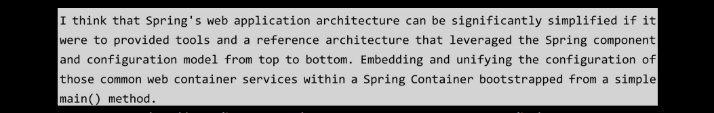
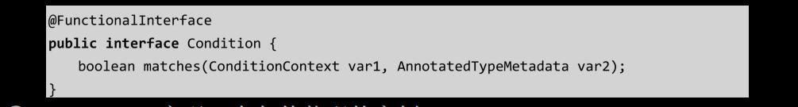
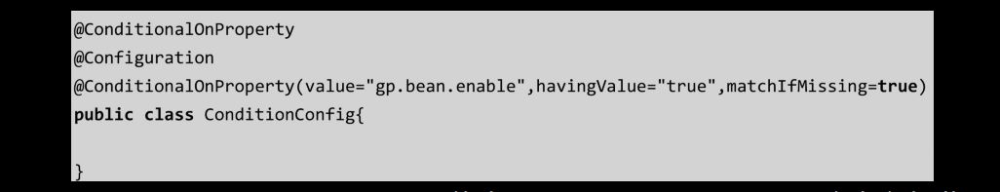

# [README](../README.md "回到 README")

# 第3章 Spring Cloud的核心之Spring Boot

**Spring Cloud是基于Spring Boot提供的一套微服务解决方案，配置中心、服务注册和负载均衡等，都是在Spring Boot这个框架上来构建的，所以Spring Boot其实是构建Spring Cloud生态的基石**，那么到底什么是Spring Boot呢？简单来说，**Spring Boot是帮助开发者快速构建一个基于Spring Framework及Spring生态体系的应用解决方案，也是Spring Framework对于“约定优于配置（Convention over Configuration）”理念的最佳实践**。如果想更加深入地了解Spring Boot，有必要花一点时间了解一下Spring的起源。

## 3.1 重新认识Spring Boot

Spring Framework的起源需要追溯到2002年，当时很多知名公司都用Java EE标准及EJB容器作为主要的软件解决方案，其中EJB是J2EE规范的核心内容，也与我们要说的Spring Framework的诞生密切相关。
    
EJB提供了一种组件模式，使得开发人员只需要关注业务开发，不需要关心底层的实现机制，比如远程调用、事务管理等，所以很多大公司都纷纷采用EJB来部署自己的系统，但是在使用**EJB之后各种问题接踵而至，比如配置太过烦琐、臃肿、低效等**。

2002年，Rod Johnson撰写了一本名为Expert one on one J2EE design and development的书，在书中指出了Java EE和EJB容器中存在的一些缺陷，并提出了更加简捷的实现方案。之后该书的作者基于书中的理念推出了最初版本的Spring，经过10多年的发展，目前Spring的版本已经升级到了5.0。

**Spring是一个轻量级框架，它的主要目的是简化JavaEE的企业级应用开发，而达到这个目的的两个关键手段是IoC/DI和AOP。除此之外，Spring就像一个万能胶，对Java开发中的常用技术进行合理的封装和设计，使之能够快速方便地集成和开发，比如Spring集成MyBatis、Spring集成Struts等**。Spring的出现给Java EE规范统治下的黑暗时代带来了春天，很快人们就抛弃了繁重的EJB标准，Spring逐步成了现实中的Java EE开发的标准。

本书不是专门介绍Spring的，就不过多展示Spring的内容，但是Spring中的IoC与Spring Boot的核心有比较大的关系，所以有必要再多说一下。

### 3.1.1 Spring IoC/DI

IoC（Inversion of Control）和DI（Dependency Injection）的全称分别是控制反转和依赖注入。如何理解这两个概念呢？

**IoC（控制反转）实际上就是把对象的生命周期托管到Spring容器中，而反转是指对象的获取方式被反转了**，这个概念可能不是很好理解，咱们通过两张图来了解一下IoC的作用。图3-1表示的是传统意义上对象的创建方式，客户端类如果需要用到User及UserDetail，需要通过new来构建，这种方式会使代码直接的耦合度非常高。

 
当使用Spring IoC容器之后，客户端类不需要再通过new来创建这些对象，如图3-2所示，在图3-1的基础上增**加了IoC容器后，客户端类获取User及UserDetail对象实例时，不再通过new来构建，而是直接从IoC容器中获得**。那么Spring IoC容器中的对象是什么时候构建的呢？在早期的Spring中，主要通过XML的方式来定义Bean，Spring会解析XML文件，把定义的Bean装载到IoC容器中。

DI
**DI（Dependency Inject），也就是依赖注入，简单理解就是IoC容器在运行期间，动态地把某种依赖关系注入组件中**。为了彻底搞明白DI的概念，我们继续看一下图3-2。在Spring配置文件中描述了两个Bean，分别是User和UserDetail，这两个对象从配置文件上来看是没有任何关系的，但实际上从类的关系图来看，它们之间**存在聚合关系**。如果我们希望这个聚合关系在IoC容器中自动完成注入，也就像这段代码一样，通过user.getUserDetail来获得UserDetail实例，该怎么做呢？

其实很简单，我们只需要在Spring的配置文件中描述Bean之间的依赖关系，IoC容器在解析该配置文件的时候，会依据Bean的依赖关系进行注入，这个过程就是依赖注入。

**实现依赖注入的方法有三种，分别是接口注入、构造方法注入和setter方法注入**。不过现在基本上都基于注解的方式来描述Bean之间的依赖关系，比如@Autowired、@Inject和@Resource。但是不管形式怎么变化，本质上还是一样的。

### 3.1.2 Bean装配方式的升级

基于XML配置的方式很好地完成了对象声明周期的描述和管理，但是**随着项目规模不断扩大，XML的配置也逐渐增多，使得配置文件难以管理。另一方面，项目中依赖关系越来越复杂，配置文件变得难以理解**。这个时候迫切需要一种方式来解决这类问题。
    
随着JDK 1.5带来的注解支持，Spring从2.x开始，**可以使用注解的方式来对Bean进行声明和注入**，大大减少了XML的配置量。笔者记得当时饱受争议的话题是：Spring采用注解配置和XML配置那个更好？
        
**Spring升级到3.x后，提供了JavaConfig的能力，它可以完全取代XML，通过Java代码的方式来完成Bean的注入**。所以，现在我们使用的Spring Framework或者Spring Boot，已经看不到XML配置的存在了。

JavaConfig的出现给开发者带来了很多的变化。
* XML配置形式的变化
在早期的Spring中，我们会基于XML配置文件来描述Bean即Bean的依赖关系：

使用JavaConfig形式之后，只需要使用@Configuration注解即可，它等同于XML的配置形式：

* Bean装载方式的变化
基于XML形式的装载方式：

基于JavaConfig的配置形式，可以**通过@Bean注解来将一个对象注入IoC容器中，默认情况下采用方法名称作为该Bean的id**。

* 依赖注入的变化
在XML形式中，可以通过三种方式来完成依赖注入，比如setter方式注入：

在JavaConfig中，可以这样来表述：

* 其他配置的变化   
除了前面说的几种配置，还有其他常见的配置，比如：
    * @ComponentScan对应XML形式的<context: component-scan base-package=""/>，它会扫描指定包路径下带有@Service、@Reponsitory、@Controller、@Component等注解的类，将这些类装载到IoC容器。
	* @Import对应XML形式的<import resource="" />，导入其他的配置文件。

虽然通过注解的方式来装配Bean，可以在一定程度上减少XML配置带来的问题，但是在笔者看来，从某一方面来说它只是换汤不换药，本质问题仍然没有解决，比如：
* 依赖过多。Spring可以整合几乎所有常用的技术框架，比如JSON、MyBatis、Redis、Log等，不同依赖包的版本很容易导致版本兼容的问题。
* 配置太多。以Spring使用JavaConfig方式整合MyBatis为例，需要配置注解驱动、配置数据源、配置MyBatis、配置事务管理器等，这些只是集成一个技术组件需要的基础配置，在一个项目中这类配置很多，开发者需要做很多类似的重复工作。
* 运行和部署很烦琐。需要先把项目打包，再部署到容器上。

如何让开发者不再需要关注这些问题，而专注于业务呢？好在，Spring Boot诞生了。

### 3.1.3 Spring Boot的价值

Spring Boot诞生的一个原因是Mike Youngstrom在Spring jira中提出的一个需求：**在Spring框架中支持无容器Web应用程序体系结构**，以下是原文：

这个需求促使了Spring Boot项目的研发。2014年，Spring boot 1.0.0发布。

Spring Boot并不是一个新的技术框架，其**主要作用就是简化Spring应用的开发，开发者只需要通过少量的代码就可以创建一个产品级的Spring应用，而达到这一目的最核心的思想就是“约定优于配置（Convention over Configuration）”**。

如何理解约定优于配置
约定优于配置（Convention Over Configuration）是一种软件设计范式，目的在于减少配置的数量或者降低理解难度，从而提升开发效率。需要注意的是，它并不是一种新的思想，实际上从我们开始接触Java依赖，就会发现很多地方都有这种思想的体现。比如，**数据库中表名的设计对应到Java中实体类的名字，就是一种约定**，我们可以从这个实体类的名字知道它对应数据库中那张表。再比如，每个公司都会有自己的开发规范，开发者按照开发规范可以在一定程度上减少Bug的数量，增加可读性和可维护性。

在Spring Boot中，约定优于配置的思想主要体现在以下方面（包括但不限于）：
* Maven目录结构的约定。
* Spring Boot默认的配置文件及配置文件中配置属性的约定。
* 对于Spring MVC的依赖，自动依赖内置的Tomcat容器。
* 对于Starter组件自动完成装配。

Spring Boot的核心
Spring Boot是基于Spring Framework体系来构建的，所以它并没有什么新的东西，但是要想学好Spring Boot，必须知道它的核心：
* Starter组件，提供开箱即用的组件。
* 自动装配，自动根据上下文完成Bean的装配。
* Actuator，Spring Boot应用的监控。
* Spring Boot CLI，基于命令行工具快速构建Spring Boot应用。

其中，最核心的部分应用是**自动装配，Starter组件和核心部分也是基于自动装配来实现的**。由于本书并不是专门写Spring Boot的，所以笔者在后续章节中只会重点分析自动装配的原理。

在本节中，Spring的起源，到Spring XML配置文件时代的问题，接着引出JavaConfig的方式实现无配置化注入的解决方案。可以看到，在整个发展过程中，Bean的装载方式在形式上发生了变化，但是本质问题仍然没有解决，直到Spring Boot出现。然后我们简单分析了Spring Boot的优势及核心。之所以花这么多笔墨去串联整个过程，是因为在笔者看来，比使用技术更重要的是了解技术的产生背景，这将有助于提高和改变技术人的思维方式。

## 3.2 快速构建Spring Boot应用

一个Spring Boot的应用应该是什么样子，或者Spring Boot的优势在哪里呢？接下来演示基于Spring boot构建一个Web项目的例子。

构建Spring Boot应用的方式有很多，比如在https://start.spring.io网站上可以通过图形界面来完成创建。如果大家使用IntelliJ IDEA这个开发工具，就可以直接在这个工具上创建Spring Boot项目，默认也是使用https:/start.spring.io来构建的。

构建完成后会包含以下核心配置和类。
* Spring Boot的启动类SpringBootDemoApplication：

* resource目录，包含static和templates目录，分别存放静态资源及前端模板，以及application.properties配置文件。
* Web项目的starter依赖包：

在不做任何改动的情况下，可以直接运行SpringBootDempApplication中的main方法来启动Spring Boot项目。当然，由于默认情况下没有任何URI映射，所以看不出效果，我们可以增加一个Controller来发布Restful接口，代码如下：

接着，直接运行SpringBootDemoApplication类，服务启动成功后再浏览器中输入http://localhost:8080/hell0，即可访问刚刚发布的Restful接口。

以往我们使用Spring MVC来构建一个Web项目需要很多基础操作：添加很多的Jar包依赖、在web.xml中配置控制器、配置Spring的XML文件或者JavaConfig等。而Spring Boot帮开发者省略了这些烦琐的基础性工作，使得开发者只需要关注业务本身，基础性的装配工作是由Starter组件及自动装配来完成的。

## 3.3 Spring Boot自动装配的原理

在Spring Boot中，不得不说的一个点是自动装配，它是Starter的基础，也是Spring Boot的核心，那么什么叫自动装配呢？或者说什么叫装配呢？

简单来说，就是自动将Bean装配到IoC容器中，接下来，我们通过一个Spring Boot整合Redis的例子来了解一下自动装配。
* 添加Starter依赖：

* 在application.properties中配置Redis的数据源：

* 在HelloController中使用RedisTemplate实现Redis的操作：

在这个案例中，我们并没有通过XML形式或者注解形式把RedisTemplate注入IoC容器中，但是在HelloController中却可以直接使用@Autowired来注入redisTemplate实例，这就说明，IoC容器中已经存在RedisTemplate。这就是Spring Boot的自动装配机制。

在往下探究其原理前，可以大胆猜测一下，如何只添加一个Starter依赖，就能完成该依赖组件相关Bean的自动注入？不难猜出，这个机制的实现一定基于某种约定或者规范，只要Starter组件符合Spring Boot中自动装配约定的规范，就能实现自动装配。

### 3.3.1 自动装配的实现

自动装配在Spring Boot中是通过@EnableAutoConfiguration注解来开启的，这个注解的声明在启动类注解@SpringBootApplication内。

进入@SpringBootApplication注解，可以看到@EnableAutoConfiguration注解的声明。

这里简单和大家讲解一下@Enable注解。其实Spring 3.1版本就已经支持**@Enable注解了，它的主要作用是把相关组件的Bean装配到IoC容器中**。@Enable注解对JavaConfig的进一步完善，为使用Spring Framework的开发者减少了配置代码量，降低了使用的难度。比如常见的@Enable注解有@EnableWebMvc、@EnableScheduling等。

在前面的章节中讲过，**如果基于JavaConfig的形式来完成Bean的装载，则必须要使用@Configuration注解及@Bean注解。而@Enable本质上就是针对这两个注解的封装**，所以大家如果仔细关注过这些注解，就不难发现这些注解中都会携带一个@Import注解，比如@EnableScheduling：

因此，使用@Enable注解后，Spring会解析到@Import导入的配置类，从而根据这个配置类中的描述来实现Bean的装配。大家思考一下，@EnableAutoConfiguration的实现原理是不是也一样呢？

### 3.3.2 EnableAutoConfiguration
进入@EnableAutoConfiguration注解里，可以看到除@Import注解之外，还多了一个**@AutoConfigurationPackage注解（它的作用是把使用了该注解的类所在的包及子包下所有组件扫描到Spring IoC容器中）**。并且，@Import注解中导入的并不是一个Configuration的配置类，而是一个AutoConfigurationImportSelector类。从这一点来看，它就和其他的@Enable注解有很大的不同。

不过，不管**AutoConfigurationImportSelector是什么，它一定会实现配置类的导入**，至于导入的方式和普通的@Configuration有什么区别，这就是我们需要去分析的。

### 3.3.3 AutoConfigurationImporSelector

AutoConfigurationImportSelector**实现了ImportSelector，它只有一个SelectImports抽象方法，并且返回一个String数组，在这个数组中可以指定需要装配到IoC容器的类，当在@Import中导入一个ImportSelector的实现类之后，会把该实现类中返回的Class名称都装载到IoC容器中**。

和@Configuration不同的是，**ImportSelector可以实现批量装**配，并且还可以通过逻辑处理来实现Bean的选择性装配，也就是可以根据上下文来决定哪些类能够被IoC容器初始化。接下来通过一个简单的例子带大家了解ImportSelector的使用。
* 首先创建两个类，我们需要把这两个类装配到IoC容器中。

* 创建一个ImportSelector的实现类，在实现类中把定义的两个Bean加入String数组，这意味着这两个Bean会装配到IoC容器中。

* 为了模拟EnableAutoConfiguration，我们可以自定义一个类似的注解，通过@Import导入GpImportSelector。

* 创建一个启动类，在启动类上使用@EnableAutoImport注解后，即可通过ca.getBean从IoC容器中得到FirstClass对象实例。

这种实现方式相比@Import（*Configuration.class）的好处在于装配的灵活性，还可以实现批量。比如GpImportSelector还可以直接在String数组中定义多个@Configuration类，**由于一个配置类代表的是某一个技术组件中批量Bean声明，所以在自动装配这个过程中只需要扫描到指定路径下对应的配置类即可**。

### 3.3.4 自动装配原理分析

基于前面章节的分析可以猜想到，**自动装配的核心是扫描约定目录下的文件进行解析，解析完成之后把得到的Configuration配置类通过ImportSelector进行导入，从而完成Bean的自动装配过程**。那么接下来我们通过分析AutoConfigurationImportSelector的实现来求证这个猜想是否正确。

定位到AutoConfigurationImportSelector中的selectImports方法，它是ImportSelector接口的实现，这个方法中主要有两个功能：
* AutoConfigurationMetadataLoader.loadMetadata从META-INF/spring-autoconfigure-metadata.properties中加载自动装配的条件元数据，简单来说就是只有满足条件的Bean才能够进行装配。
* 收集所有符合条件的配置类autoConfigurationEntry.getConfigurations()，完成自动装配。

需要注意的是，**在AutoConfigurationImportSelector中不执行selectImports方法，而是通过ConfigurationClassPostProcessor中的processConfigBeanDefinitions方法来扫描和注册所有配置类的Bean，最终还是会调用getAutoConfigurationEntry方法获得所有需要自动装配的配置类**。

我们重点分析一下**配置类的收集方法getAutoConfigurationEntry**，结合之前Starter的作用不难猜测到，这个方法应该会扫描指定路径下的文件解析得到需要装配的配置类，而这里**用到了SpringFactoriesLoader**，这块内容后续随着代码的展开再来讲解。简单分析一下这段代码，它主要做几件事情：
* getAttributes获得@EnableAutoConfiguration注解中的属性exclude、excludeName等。
* getCandidateConfigurations获得所有自动装配的配置类，后续会重点分析。
* removeDuplicates去除重复的配置项。
* getExclusions根据@EnableAutoConfiguration注解中配置的exclude等属性，把不需要自动装配的配置类移除。
* fireAutoConfigurationImportEvents广播事件。
* 最后返回经过多层判断和过滤之后的配置类集合。

总的来说，**它先获得所有的配置类，通过去重、exclude排除等操作，得到最终需要实现自动装配的配置类**。**这里需要重点关注的是getCandidateConfigurations**，它是获得配置类最核心的方法。

**这里用到了SpringFactoriesLoader，它是Spring内部提供的一种约定俗成的加载方式，类似于Java中的SPI。简单来说，它会扫描classpath下的META-INF/spring.factories文件**，spring.factories文件中的数据以Key=Value形式存储，而SpringFactoriesLoader.loadFactoryNames会根据Key得到对应的value值。因此，在这个场景中，Key对应为EnableAutoConfiguration，Value是多个配置类，也就是getCandidateConfigurations方法所返回的值。

打开RabbitAutoConfiguration，可以看到，它就是一个基于JavaConfig形式的配置类。

除了基本的@Configuration注解，还有一个**@ConditionalOnClass注解，这个条件控制机制在这里的用途是，判断classpath下是否存在RabbitTemplate和Channel这两个类，如果是，则把当前配置类注册到IoC容器**。另外，@EnableConfigurationProperties是属性配置，也就是说我们可以按照约定在application.properties中配置RabbitMQ的参数，而这些配置会加载到RabbitProperties中。实际上，这些东西都是Spring本身就有的功能。

至此，自动装配的原理基本上就分析完了，简单来说总结一下核心过程：
* 通过@Import（AutoConfigurationImportSelector）实现配置类的导入，但是这里并不是传统意义上的单个配置类装配。
* AutoConfigurationImportSelectory类实现了ImportSelector接口，重写了方法selectImports，它用于实现选择性批量配置类的装配。
* 通过Spring提供的SpringFactoriesLoader机制，扫描classpath路径下的META-INF/spring.factories，读取需要实现自动装配的配置类。
* 通过条件筛选的方式，把不符合条件的配置类移除，最终完成自动装配。

### 3.3.5 @Conditional条件装配

@Conditional是Spring Framework提供的一个核心注解，这个**注解的作用是提供自动装配的条件约束**，一般与@Configuration和@Bean配合使用。

简单来说，Spring在解析@Configuration配置类时，如果该配置类增加**@Conditional注解，那么会根据该注解配置的条件来决定是否要实现Bean的装配**。

### 3.3.5.1 @Conditional的使用

@Conditional的注解类声明代码如下，该注解可以接收一个Condition的数组。

Condition是一个函数式接口，提供了matches方法，它主要提供一个条件匹配规则，返回true表示可以注入Bean，反之则不注入。

我们接下来基于@Conditional实现一个条件装配的案例。
* 自定义一个Condition，逻辑很简单，如果当操作系统是Windows，则返回true，否则返回false。

* 创建一个配置类，装载一个BeanClass（自定义的一个类）。

在BeanClass的bean声明方法中增加@Conditional（GpCondition.class），其中具体的条件是我们自定义的GpCondition类。
    
上述代码所表达的意思是，如果GpCondition类中的matchs返回true，则将BeanClass装载到Spring IoC容器中。
* 运行测试方法。

在Windows环境中运行，将会输出BeanClass这个对象实例。在Linux环境中，会出现如下错误。

以上就是@Conditional注解的使用方法，为Bean的装载提供了上下文的判断。

### 3.3.5.2 Spring Boot中的@Conditional

在Spring Boot中，针对@Conditional做了扩展，提供了更简单的使用形式，扩展注解如下：
* ConditionalOnBean/ConditionalOnMissingBean：容器中存在某个类或者不存在某个Bean时进行Bean装载。
* ConditionalOnClass/ConditionalOnMissingClass：classpath下存在指定类或者不存在指定类时进行Bean装载。
* ConditionalOnCloudPlatform：只有运行在指定的云平台上才加载指定的Bean。
* ConditionalOnExpression：基于SpEl表达式的条件判断。
* ConditionalOnJava：只有运行指定版本的Java才会加载Bean。
* ConditionalOnJndi：只有指定的资源通过JNDI加载后才加载Bean。
* ConditionalOnWebApplication/ConditionalOnNotWebApplication：如果是Web应用或者不是Web应用，才加载指定的Bean。
* ConditionalOnProperty：系统中指定的对应的属性是否有对应的值。
* ConditionalOnResource：要加载的Bean依赖指定资源是否存在于classpath中。
* ConditionalOnSingleCandidate：只有在确定了给定Bean类的单个候选项时才会加载Bean。

这些注解只需要添加到@Configuration配置类的类级别或者方法级别，然后根据每个注解的作用来传参就行。下面演示几种注解类的使用。

在application.properties或application.yml文件中当gp.bean.enable=true时才会加载ConditionConfig这个Bean，如果没有匹配上也会加载，因为matchIfMissing=true，默认值是false。

当Spring IoC容器中存在GpBean时，才会加载ConditionConfig。

在classpath中如果存在gp.properties，则会加载ConditionConfig。

这些条件配置在Spring Boot的自动装配配置类中出现的频率非常高，它能够很好地为自动装配提供上下文条件判断，来让Spring决定是否装载该配置类。

### 3.3.6 Spring-autoconfigure-metadata

除了@Conditional注解类，在Spring Boot中还提供了spring-autoconfigure-metadata.properties文件来实现批量自动装配条件配置。

它的作用和@Conditional是一样的，只是将这些条件配置放在了配置文件中。下面这段配置来自spring-boot-autoconfigure.jar包中的/META-INF/spring-autoconfigure-metadata.properties文件。

同样，这种形式也是“约定优于配置”的体现，**通过这种配置化的方式来实现条件过滤必须要遵循两个条件**：
* 配置文件的路径和名称必须是/META-INF/spring-autoconfigure-metadata.properties。
* 配置文件中key的配置格式：自动配置类的全路径名.条件=值。

这种配置方法的好处在于，它可以**有效地降低Spring Boot的启动时间**，通过这种过滤方式可以**减少配置类的加载数量**，因为**这个过滤发生在配置类的装载之前**，所以它可以减低Spring Boot启动时装载Bean的耗时。

## 3.4 手写实现一个Starter

对于自动装配的原理进行分析之后，我们可以基于这个机制来实现一个Starter组件，以便加深大家对自动装配及Starter组件的理解。同时，Spring Boot官方提供的Starter并不能囊括所有的技术组件，在工作中，如果自己的项目需要支持Spring Boot，也需要开始Starter组件。
从Spring Boot官方提供的Starter的作用来看，Staeter组件主要有三个功能：
* 涉及相关组件的Jar包依赖。
* 自动实现Bean的装配。
* 自动声明并加载application.properties文件中的属性配置。

下面我们先来了解一下Starter组件的命名规范。

### 3.4.1 Starter的命名规范
Starter的命名主要分为两类，一类是官方命名，另一类是自定义组件命名。这种命名格式并不是强制性的，也是一种约定俗成的方式，可以让开发者更容易识别。
* 官方命名的格式为：spring-boot-starter-模块名称，比如spring-boot-starter-web。
* 自定义命名格式为：模块名称-spring-boot-starter，比如mybatis-spring-boot-starter。

简单来说，官方命名中模块名放在最后，而自定义组件中模块名放在最前面。

### 3.4.2 实现基于Redis的Starter

虽然Spring Boot官方提供了spring-boot-starter-data-redis组件来实现RedisTemplate的自动装配，但是我们仍然基于前面的思想实现一个基于Redis简化版本的Starter组件。
* 创建一个工程，命名为redis-spring-boot-starter。
* 添加Jar包依赖，Redisson提供了在Java中操作Redis的功能，并且基于Redis的特性封装了很多可直接使用的场景，比如分布式锁。

* 定义属性类，实现在application.properties中配置Redis的连接参数，由于只是一个简单版本的Demo，所以只简单定义了一些必要参数。另外**@ConfigurationProperties这个注解的作用是把当前类中的属性和配置文件（properties/yml）中的配置进行绑定，并且前缀是gp.redisson**。

* 定义需要自动装配的配置类，主要就是把RedissonClient装配到IoC容器，值得注意的是@**ConditionalOnClass，它表示一个条件，在当前场景中表示的是：在classpath下存在Redisson这个类的时候，RedissonAutoConfiguration才会实现自动装配**。另外，这里只演示了一种单机的配置模式，除此之外，Redisson还支持集群、主从、哨兵等模式的配置，大家有兴趣的话可以基于当前案例去扩展，建议使用config.fromYAML方式，直接加载配置完成不同模式的初始化，这会比根据不同模式的判断来实现配置化的方式更加简单。

* 在resources下创建META-INF/spring.factories文件，**是的Spring Boot程序可以扫描到该文件完成自动装配**，key和value对应如下：

* 最后一步，使用阶段只需要做两个步骤：添加Starter依赖、设置属性配置：

在application.properties中配置host和port，这个属性会自动绑定到RedissonProperties中定义的属性上。

至此，一个非常简易的手写Starter就完成了，建议大家看完这段内容之后，基于对这块内容的理解尝试自己写一个Starter组件，以便真正掌握它的原理。

## 3.5 本章小结

本章主要分析了Spring Boot中的自动装配的基本原理，并且通过实现一个自定义的Starter的方式加深了大家对于自动装配的理解。由于Spring Cloud生态中的组件，都是基于Spring Boot框架来实现的，了解Spring Boot的基本原理将有助于大家对后续内容的理解，磨刀不误砍柴工，笔者还是那句话，比了解技术的基本使用方法更重要的是了解技术产生的背景及核心原理。

# [README](../README.md "回到 README")