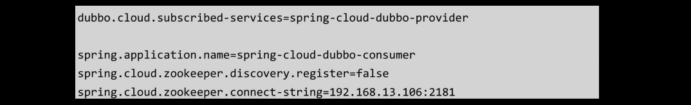

# [README](../README.md "回到 README")

# 第4章 微服务架构下的服务治理

众所周知，服务与服务之间的远程通信是分布式架构最基本的组成部分，传统意义上的远程通信，更多的时候是解决信息孤岛及数据互联互通问题的，它主要**关注的是数据的共享**。随着SOA生态的不断完善以及微服务架构思想的落地，**服务与服务之间的远程通信需求更多来自于服务的解耦**。同时，业务规模的不断增长会使得微服务数量增加，那么问题也就随之产生了，比如：
* 如何协调线上运行的服务，以及保障服务的高可用性。
* 如何根据不同服务的访问情况来合理地调控服务器资源，提高机器的利用率。
* 线上出现故障时，如何动态地对故障业务做降级、流量控制等。
* 如何动态地更新服务中的配置信息，比如限流阈值、降级开关等。
* 如何实现大规模服务机器所带来的服务地址的管理和服务上下线的动态感知。

为了解决这些问题，就需要一个统一的服务治理框架对服务进行统一、有效的管控，从而保障服务的高效、健康运行，而Dubbo就是一个这样的框架。

**Dubbo是阿里巴巴内部使用的一个分布式服务治理框架**，与2012年开源。由于Dubbo在服务治理这一领域的优势，以及它本身在阿里巴巴经过大规模的业务验证，所以在很短的时间内，Dubbo就被很多互联网公司采用，笔者就是在2013年的时候开始接触Dubbo的，当时在公司内部把Webservice切换到Dubbo框架。

由于某些原因Dubbo在2014年停止了维护，所以那些使用Dubbo框架的公司开始自己维护，比较知名的是当当网开源的DubboX。值得高兴的是，2017年9月，阿里巴巴重启了Dubbo的维护并且做好了长期投入的准备，也对Dubbo的未来做了很多的规划。2018年2月份，Dubbo进入了Apache孵化，这意味着它将不只是阿里巴巴的Dubbo，而是属于开源社区的，也意味着会有更多的开源贡献者参与到Dubbo的开发中来。

2019年5月，Apache Dubbo正式从孵化器中毕业，代表着Apache Dubbo正式成为Apache的顶级项目。笔者在写这本书的时候，Apache Dubbo的最新版本是2.7.5。

本章主要围绕Apcahe Dubbo框架的基本解决方案，以及它背后的一些实现原理和设计思想进行展开，帮助大家更好地了解Apache Dubbo。

## 4.1 如何理解Apache Dubbo

Apache Dubbo是一个分布式服务框架，主要实现多个系统之间的高性能、透明化调用，简单来说它就是一个RPC框架，但是和普通RPC框架不同的是，它提供了服务治理功能，比如服务注册、监控、路由、容错等。
    
促使Apcahe Dubbo框架产生的原因有两个：
* 在大规模服务化之后，服务越来越多，服务消费者在调用服务提供者的服务时，需要在配置文件中维护服务提供者的URL地址，**当服务提供者出现故障或者动态扩容时，所有相关的服务消费者都需要更新本地配置的URL地址，这种维护成本非常高**。这个时候，实现服务的上下动态线感知及服务地址的动态维护就显得非常重要了。
* 随着用户的访问量增大，**后端服务为了支撑更大的访问量，会通过增加服务器来扩容。但是，哪些服务要扩容，哪些服务要缩容，需要一个判断依据，也就是说需要指定每个服务的调用量及响应时间，这个时候，就需要有一种监控手段**，使用监控的数据作为容量规划的参考值，从而实现根据不同服务的访问情况来合理地调控服务器资源，提供机器的利用率。

从如图4-1所示的Apache Dubbo架构图也能够很清晰地看出，除了基本的RPC框架的职能，它的核心功能便是监控及服务注册。

## 4.2 Apache Dubbo实现远程通信

创建两个普通的Maven工程，分别为order-service和user-service，代表订单服务和用户服务，这两个服务之间在实际业务场景中会存在相互依赖的情况，比如订单服务中的某个功能可能需要查询用户信息时，就需要调用用户服务指定的接口来完成。    user-service的实现流程
* 在user-service服务中定义了两个模块，分别为user-api和user-provider，前者用来定义当前服务对外提供的接口，这个模块会部署到Maven的远程私服上，便于服务调用者依赖；后者是针对这个接口的实现，该实现会独立部署在服务器上。

* 在user-api中定义一个接口，执行mvn install将其打包成Jar包安装到本地仓库，本地环境的其他项目就可以找到该依赖，当然，如果自己搭建了私服，可以通过mvn deloy发布。

* 在user-provider中编写实现，这里需要注意的是，user-provider中需要用到user-api中定义的IUserService接口，所以需要先添加user-api的maven dependency依赖。

* 添加Dubbo的依赖。

* 创建配置文件resources/META-INF/spring/user-provider.xml，把服务发布到网络上，让其他进程可以访问。因为Dubbo采用了Spring配置的扩展来实现透明的服务发布和服务消费，所以它的配置基本上和以往通过XML形式描述的Bean差不多。
    * dubbo:application用来描述提供方的应用信息，比如应用名称、维护人、版本等，其中应用名称是必填项。开发者或者运维人员可以通过监控平台查看这些信息来更快速地定位和解决问题。
    * dubbo:registry配置注册中心的地址，如果不需要注册中心，可以设置为N/A。Dubbo支持多种注册中心，比如ZooKeeper、Nacos等。
    * dubbo:protocol配置服务提供者的协议信息，Dubbo支持多种协议来发布服务，默认采用Dubbo协议，可选的协议有很多，比如Hessian、Webservice、Thrift等。这意味着如果公司之前采用的协议是Webservice，想切换到Dubbo上来，几乎没有太大的迁移成本。
    * dubbo:service描述需要发布的服务接口，也就是这个接口可供本网络上的其他进程访问。interface表示定义的接口，ref表示这个接口的实现。

* 加载Spring的XML文件，可以通过ClassPathXmlApplicationContext来完成加载启动的过程，也可以通过Main.main(args)来启动。两者在本质上没有区别，只是Dubbo做了一层封装，简化了开发者的使用。

* 启动之后，可以在控制台的日志中看到如下信息，说明服务已经发布成功，而且还打印了Dubbo发布的地址dubbo://192.168.13.1:20880/com.gupaoedu.book.dubbo.IUserService，这个地址是一个远程通信地址，服务调用者可以基于该地址来访问该服务完成远程通信的流程。

order-service的实现流程    
order-service的实现流程比较简单，大部分配置是相同的。
* 添加user-api和Dubbo的Maven依赖，前者是用户访问IUserService接口的方法，后者通过远程代理完成远程通信过程。

* 在resources/META-INF/spring/consumer.xml中配置远程服务的引用，主要关注一下dubbo：reference这个配置，它会生成一个针对当前interface的远程服务的代理，指向的远程服务地址是user-service发布的Dubbo协议的URL地址。

* 加载Spring配置文件，使用方式和本地Bean一样，通过从IoC容器中获取一个实例对象进行调用，需要注意的是，这里的IUserService返回的是一个代理对象，它的底层会基于网络通信来实现远程服务的调用。

上述案例中，演示的仅仅是点对点的通信形式。整体来看，由于Dubbo天然地集成了Spring，并且在此基础上做了标签的扩展，所以整体的配置方式和Spring相差不大，开发者在使用Dubbo的时候几乎没有太多的学习成本。基于XML形式的服务发布和服务消费的方式还是比较繁琐的，而且在发布的服务接口比较多的情况下，配置会非常复杂，所以Apache Dubbo也提供了对注解的支持，在接下来的案例中，笔者会简单演示基于Spring Boot集成Apache Dubbo来实现零配置的服务注册与发布。

## 4.3 Spring Boot集成Apache Dubbo

Apache Dubbo不需要依赖Spring Boot也是可以实现微服务的，集成到Spring Boot的好处是可以享受到Spring Boot生态的框架和技术支持，也就是**基于Spring Boot实现了标准化，并统一了开发、部署、运维的形态**。在2015年的时候，笔者所在公司就开始以Spring Boot集成Dubbo来实现微服务，不过，那时候整个生态没有现在这么成熟。现在，咱们可以使用Dubbo Spring Boot组件轻松集成，它整合了Spring Boot的自动装配、健康检查、外部化配置等功能。接下来通过一个案例来简单演示基于Spring Boot构建的Dubbo使用过程。

服务提供者开发流程
* 创建一个普通的Maven工程springboot-provider，并创建两个模块：sample-api和sample-provider，其中sample-provider模块是一个Spring Boot工程。
* 在sample-api模块中定义了一个接口，并通过mvn install安装到本地服务。

* 在sample-provider中引入以下依赖，其中dubbo-spring-boot-starter是Apche Dubbo官方提供的开箱即用的组件。

* 在sample-provider中实现IHelloService，并且使用Dubbo中提供的@Service注解发布服务。

* 在application.properties文件中添加Dubbo服务的配置信息，配置元素在前面的章节中讲过，只是换了一种配置形式。

* 启动Spring Boot，需要注意的是，需要在启动方法上添加@DubboComponentScan注解，它的作用和Spring Framework提供的@ComponetScan一样，只不过这里扫描的是Dubbo中提供的@Service注解。

服务调用者的开发流程
服务调用者的开发流程相对来说也很简单。
* 创建一个Spring Boot项目spring-consumer，添加Jar包依赖。

* 在application.properties中配置项目名称。

* 在Spring Boot启动类中，使用Dubbo提供的@Reference注解来获得一个远程代理对象。

相比基于XML的形式来说，**基于Dubbo-Spring-Boot-Starter组件来使用Dubbo完成服务发布和服务消费会使得开发更加简单**。另外，**官方还提供了Dubbo-Spring-Boot-Actuator模块，可以实现针对Dubbo服务的健康检查**；**还可以通过Endpoints实现Dubbo服务信息的查询和控制等，为生产环境中对Dubbo服务的监控提供了很好的支持**。

前面的两个案例中，主要还是使用Dubbo以点对点的形式来实现服务之间的通信，Dubbo可以很好地集成注册中心来实现服务地址的统一管理。**早期大部分公司采用的是ZooKeeper来实现注册**，接下来将带大家了解一下ZooKeeper，然后基于前面演示的案例整合ZooKeeper实现服务的注册和发现。

## 4.4 快速上手ZooKeeper

ZooKeeper**是一个高性能的分布式协调中间件**，所谓的分布式协调中间件的作用类似于多线程环境中通过并发工具包来协调线程的访问控制，只是分布式协调中间件主要解决分布式环境中各个服务进程的访问控制问题，比如访问顺序控制。所以，在这里需要强调的是，**ZooKeeper并不是注册中心，只是基于ZooKeeper本身的特性可以实现注册中心这个场景而已**。

### 4.4.1 ZooKeeper的安装
ZooKeeper的安装非常简单，需要注意的是，由于ZooKeeper是使用Java编写的，所以在安装之前必须要安装Java运行环境。另外，ZooKeeper支持单机部署和集群部署，由于本书并不是专门讲解ZooKeeper的，所以只会简单演示单机环境的安装过程，便于完成Dubbo和ZooKeeper的集成，安装步骤如下：
* 在Apache官网上下载ZooKeeper，笔者写作本书的时候最新版本为3.5.6。
* 将下载好的安装包解压到指定目录，解压后可以看到ZooKeeper包含很多目录，其中conf是存放配置文件的目录，bin是ZooKeeper提供的可执行脚本的目录。
* ${Zookeeper_Home}\conf目录下提供了ZooKeeper核心配置的样例文件zoo_sample.cfg，如果要将ZooKeeper运行起来，需要将其名称修改为zoo.cfg，内容可以暂时不用修改。
* 在${ZOOKEEPER_HOME}\bin路径下，执行sh zkServer.sh start，启动服务。
* 启动服务之后，就可以通过默认发布的2181端口来访问。如果在同一台机器上访问，通过sh zkCli.sh即可连接到ZooKeeper服务器。如果要连接到不同机器上的ZooKeeper服务，需要增加-server参数，即sh zkCli.sh-server target-server-ip：2181。

### 4.4.2 ZooKeeper的数据结构

ZooKeeper的数据模型和分布式文件系统类似，**是一种层次化的属性结构**，如图4-2所示。和文件系统不同的是，**ZooKeeper的数据是结构化存储的，并没有在物理上体系出文件和目录**。

**ZooKeeper树中的每个节点被称为ZNode，Znode维护了一个stat状态信息，其中包含数据变化的时间和版本等**。并且每个Znode可以设置一个value值，**ZooKeeper并不用于通用的数据库或者大容量的对象存储，它只是关联和协调有关的数据**，所以value的数据大小不建议设置的非常大，较大的数据会带来更大的网络开销。

**ZooKeeper上的每个节点的数据都是允许读和写的，读表示获得指定Znode上的value数据，写表示修改指定Znode上的value数据**。另外，**节点的创建规则和文件系统中文件的创建规则类似，必须要按照层级创建**。举个简单的例子，如果需要创建/node/node1/node1-1，那么必须先创建/node/node1这两个层次节点。

### 4.4.3 ZooKeeper的特性

ZooKeeper中的Znode在被创建的时候，需要指定节点的类型，节点类型分为：
* 持久化节点，节点的数据会持久化到磁盘。
* 临时节点，节点的生命周期和创建该节点的客户端的生命周期保持一致，一旦该客户端的会话结束，则该客户端所创建的临时节点会被自动删除。
* 有序节点，在创建的节点后面会增加一个递增的序列，该序列在同一级父节点之下是唯一的。需要注意的是，持久化节点或者临时节点也是可以设置为有序节点的，也就是持久化有序节点或者临时有序节点。

 在3.5.3版本之后，又增加了两种节点类型，分别是：
* 容器节点，当容器节点下的最后一个子节点被删除时，容器节点就会被自动删除。
* TTL节点，针对持久化节点或者持久化有序节点，我们可以设置一个存活时间，如果在存活时间之内该节点没有任何修改并且没有任何子节点，它就会被自动删除。

需要注意的是，在同一层级目录下，节点的名称必须是唯一的，就像我们在同一个目录下不能创建两个有相同名字的文件夹一样。

### 4.4.4 Watcher机制

ZooKeeper提供了一种针对Znode的订阅/通知机制，**也就是当Znode节点状态发生变化时或者ZooKeeper客户端连接状态发生变化时，会触发事件通知**。**这个机制在服务注册与发现时，针对服务调用者及时感知到服务提供者的变化提供了非常好的解决方案**。
    
在ZooKeeper提供的Java API中，提供了三种机制来针对Znode进行注册监听，分别是：
* getData()，用于获取指定节点的value信息，并且可以注册监听，当监听的节点进行创建、修改、删除操作时，会触发相应的事件通知。
* getChildren()，用于获取指定节点的所有子节点，并且允许注册监听，当监听节点的子节点进行创建、修改、删除操作时，触发相应的事件通知。
* exists()，用于判断指定节点是否存在，同样可以注册针对指定节点的监听，监听的时间类型和getData()相同。

Watcher事件的触发都是一次性的，比如客户端通过getData（'/node',true）注册监听，如果/node节点发生数据修改，那么该客户端会收到一个修改事件通知，但是/node再次发生变化时，客户端无法收到Watcher事件，为了解决这个问题，客户端必须在收到的事件回调中再次注册事件。

### 4.4.5 常见应用场景分析

基于ZooKeeper中节点的特性，可以为多种应用场景提供解决方案。

分布式锁
用过多线程的读者应该都知道锁，比如Synchronized或者Lock，他们主要用于解决多线程环境下共享资源访问的数据安全性问题，但是他们所处理的范围是线程级别的。在分布式架构中，多线程对同一个共享资源的访问，也存在数据安全性问题，因此也需要使用锁的形式来解决这类问题，而解决分布式环境下对于共享资源的访问带来的安全性问题的方案就是使用分布式锁。锁的本质是排他性的，也就是避免在同一时刻多个进程同时访问某一个共享资源。

如果使用ZooKeeper实现分布式锁达到排他的目的，只需要用到节点的特性：临时节点，以及同级节点的唯一性。
* 获得锁的过程
在获得排他锁时，所有客户端可以去ZooKeeper服务器上/Exclusive_Locks节点下创建一个临时节点/lock。ZooKeeper基于同级节点的唯一性，会保证所有客户端中只有一个客户端能创建成功，创建成功的客户端获得了排他锁，没有获得锁的客户端就需要通过Watcher机制监听/Exclusive_Locks节点下子节点的变更事件，用于实时监听/lock节点的变化情况以做出反应。

* 释放锁的过程
在获得锁的过程中，我们定义的锁节点/lock为临时节点，那么在以下两种情况下会触发锁的释放。
    * 获得锁的客户端因为异常断开了和服务端的连接，基于临时节点的特性，/lock节点会被自动删除。
    * 获得锁的客户端执行完业务逻辑之后，主动删除了创建的/lock节点。
当/lock节点被删除之后，ZooKeeper服务器会通知所有监听了/Exclusive_Locks子节点变化的客户端。这些客户端收到通知后，再次发起创建/lock节点的操作来获得排他锁。

Master选举
Master选举是分布式系统中非常常见的场景，在分布式架构中，为了保证服务的可用性，通常会采用集群模式，也就是当其中一个机器宕机后，集群中的其他节点会接替节点继续工作。这种工作模式有点类似于公司中某些重要的A/B角，当A请假之后，B可以接替A继续工作。在这种场景中，就需要从集群中选举一个节点作为Master节点，剩下的节点都作为备份节点随时待命。当原有的Master节点出现故障之后，还需要从集群中的其他备份节点中选举一个节点作为Master节点继续提供服务。

ZooKeeper就可以帮助集群中的节点实现Master选举。具体而言，ZooKeeper中有两种方式来实现Master选举这一场景：
* **同一级节点不能重复创建一个已经存在的节点，这个有点类似于分布式锁的实现场景，其实Master选举的场景也是如此**。假设集群中有3个节点，需要选举出Master，那么这三个节点同时去ZooKeeper服务器上创建一个临时节点/master-election，由于节点的特性，只会有一个客户端创建成功，创建成功的客户端所在的集群就成了Master。同时，其他没有创建成功的客户端，针对该节点注册Warcher事件，用于监控当前的Master机器是否存活，一旦发现Master“挂了”，也就是/master-election节点被删除了，那么其他的客户端将会重新发起Master选举操作。
* **利用临时有序节点的特性来实现。所有参与选举的客户端在ZooKeeper服务器的/master节点下创建一个临时有序节点，编号最小的节点表示Master，后续的节点可以监听前一个节点的删除事件，用于触发重新选举，如图4-3所示，client01、client02、client03三个节点去ZooKeeper Service的/master节点下创建临时有序节点，编号最小的节点client01表示Master节点，client02和client03会分别通过Watcher集群监听比自己编号小的一个节点，比如client03会监听client01-0000000001节点的删除事件、client02会监听client-03-0000000002节点的删除事件，一旦最小的节点被删除，那么在图4-3这个场景中，client-03就会被选举为Master**。

## 4.5 Apache Dubbo集成ZooKeeper实现服务注册

大规模服务化之后，在远程RPC通信过程中，会遇到两个比较尖锐的问题：
* 服务动态上下线感知。
* 负载均衡。

服务动态上下线感知，就是服务调用者要感知到服务提供者上下线的变化。按照以往传统的形式，服务调用者如果要调用服务提供者，必须要知道服务提供者的地址信息及映射参数。以Webservice为例，服务调用者需要在配置文件中维护一个http://ip:port/service?wsdl地址，但如果服务提供者是一个集群节点，那么服务调用者需要维护多个这样的地址。问题来了，一旦服务提供者的IP故障或者集群中某个节点下线了，服务调用者需要同步更新这些地址，但是这个操作如果人工来做是不现实的，所以**需要一个第三方软件来统一管理服务提供者的URL地址，服务调用者可以从这个软件中获得目标服务的相关地址，并且第三方软件需要动态感知服务提供者状态的变化来维护所管理的URL，进而使得服务调用者能够及时感知到变化而做出相应的处理**。
    
负载均衡这个概念大家都熟悉，就是当服务提供者是由多个节点组成的集群环境时，服务调用者需要通过负载均衡算法来动态选择一台目标服务器进行远程通信。**负载均衡的主要目的是通过多个节点的集群来均衡服务器的访问压力，提升整体性能**。实现负载均衡的前提是，要得到目标服务集群的所在地址，在服务调用者端进行计算，而地址的获取也同样依赖于第三方软件。

第三方软件的**主要功能其实就是服务注册和发现**，如图4-4所示，可以看到引入服务注册中心后服务调用者和服务提供者之间的访问变化。**Apache Dubbo支持多种注册中，比如ZooKeeper、Nacos、Redis等**。在开源版本中，**官方推荐使用的注册中心是ZooKeeper**，所以使用Apache Dubbo的公司大部分都用ZooKeeper来实现服务注册和发现，在本节中会简单介绍ZooKeeper，后续章节会详细分析Nacos。

### 4.5.1 Apache Dubbo集成ZooKeeper实现服务注册的步骤

由于Dubbo的关系，大家最早认识的ZooKeeper用于实现服务的注册和发现。在初步了解了ZooKeeper的特性之后，我们就可以将ZooKeeper集成进来实现Dubbo服务的注册和动态感知。还是以Spring boot集成Apache Dubbo的案例作为演示，完整代码请去笔者提供的GitHub地址下载。
    
在这个案例中，只需要非常简单的几个步骤就能完成服务注册的功能。
* 在springboot-provider项目的sample-provider模块中添加ZooKeeper相关依赖，其中curator-framework和curator-recipes是ZooKeeper的开源客户端。

* 修改application.properties文件，修改dubbo.registry.address的地址为ZooKeeper服务器的地址，表示当前Dubbo服务需要注册到ZooKeeper上。

* 服务调用方只需要修改application.properties，设置Dubbo服务注册中心的地址即可，当Dubbo调用方发起远程调用时，会去注册中心获取目标服务的URL地址以完成最终通信。

### 4.5.2 ZooKeeper注册中心的实现原理

Dubbo服务注册到ZooKeeper上之后，可以在ZooKeeper服务器上看到如图4-5所示的树形结构。

当Dubbo服务启动时，会去Zookeeper服务器上的/dubbo/com.gupaoedu.book.dubbo.IHellService/providers目录下创建当前服务的URL，其中com.gupanedu.book.dubbo.IHelloService是发布服务的接口的全路径名称，providers表示服务提供者的类型，dubbo://ip:port表示该服务发布的协议类型及访问地址。其中，URL是临时节点，其他皆为持久化节点。在这里使用临时节点的好处在于，如果注册该节点的服务器下线了，那么这个服务器的URL地址就会从ZooKeeper服务器上被移除。

**当Dubbo服务消费者启动时，会对/dubbo/com.gupaoedu.book.dubbo.IHelloService/providers节点下的子节点注册Watcher监听，这样便可以感知到服务提供方节点的上下线变化，从而防止请求发送到已经下线的服务器造成访问失败**。同时，**服务消费者会在dubbo/com.gupaoedu.book.dubbo.IHelloService/consumers下写入自己的URL，这样做的目的是可以在监控平台上看到某个Dubbo服务正在被哪些服务调用**。最重要的是，Dubbo服务的消费者如果需要调用IHelloService服务，那么它会先去/dubbo/com.gupaoedu.book.dubbo.IHelloService/providers路径下获得所有该服务的提供方URL列表，然后通过负载均衡算法计算出一个地址进行远程访问。

整体来看，**服务注册和动态感知的功能用到了ZooKeeper中的临时节点、持久化节点、Watcher等**，回过头看前面分析的ZooKeeper的应用场景可以发现，几乎所有的场景都是基于这些来完成的。另外，不得不提的是，**Dubbo还可以针对不同的情况来实现以下功能**。
* 基于临时节点的特性，当服务提供者宕机或者下线时，注册中心会自动删除该服务提供者的信息。
* 注册中心重启时，Dubbo能够自动恢复注册数据及订阅请求。
* 为了保证节点操作的安全性，ZooKeeper提供了ACL权限控制，在Dubbo中可以通过dubbo.registry.username/dubbo.registry.password设置节点的验证信息。
* 注册中心默认的根节点是/dubbo，如果需要针对不同环境设置不同的根节点，可以使用dubbo.registry.group修改跟节点名称。

## 4.6 实战Dubbo Spring Cloud

Spring Cloud为Java环境中解决微服务问题提供了非常完整的方案，所以在最近几年时间，Spring Cloud成了很多公司首选的技术方案。但是随着运用规模的扩大，Spring Cloud在服务治理领域的局限性逐步显露出来。相对来说，在服务治理方面，Apache Dubbo有着非常大的优势，并且在Spring Cloud出现之前，它就已经被很多公司作为服务治理及微服务基础设施的首选框架。Dubbo Spring Cloud的出现，是的Dubbo既能够完全整合到Spring Cloud的技术栈中，享受Spring Cloud生态中的技术支持和标准化输出，又能够弥补Spring Cloud中服务治理这方面的短板。

**Dubbo Spring Cloud是Spring Cloud Alibaba的核心组件，它构建在原生的Spring Cloud标准之上，不仅覆盖了Spring Cloud原生特性，还提供了更加稳定和成熟的实现**。接下来，我们就通过一个案例来了解Dubbo Spring Cloud。

### 4.6.1 实现Dubbo服务提供方

创建一个普通的Maven工程，并在该工程中创建两个模块：spring-cloud-dubbo-sample-api、spring-cloud-dubbo-sample-provider。其中spring-cloud-dubbo-sample-api是一个普通的Maven工程，spring-cloud-dubbo-sample-provider是一个Spring Boot工程。细心的读者应该会发现，**对于服务提供者而言，都会存在一个API声明，因为服务的调用者需要访问服务提供者声明的接口，为了确保契约的一致性，Dubbo官方推荐的做法是把服务接口打成Jar包发布到仓库上。服务调用者可以依赖该Jar包，通过接口调用方式完成远程通信。对于服务提供者来说，也需要依赖该Jar包完成接口的实现**。

注意：当前案例中使用的Spring Cloud版本为Greenwich.SR2，Spring Cloud Alibaba的版本为2.2.2.RELEASE，Spring Boot的版本为2.1.11.RELEASE。

* 在spring-cloud-dubbo-sample-api中声明接口，并执行mvn install将Jar包安装到本地仓库。

* 在spring-cloud-dubbo-sample-provider中添加依赖。

依赖说明如下。
    * spring-cloud-starter：Spring Cloud核心包。
	* spring-cloud-dubbo-sample-api：API接口声明。
	* spring-cloud-starter-dubbo：引入Spring Cloud Alibaba Dubbo。
	* spring-cloud-starter-zookeeper-discovery：基于ZooKeeper实现服务注册发现的artifactId。

需要注意的是，上述依赖的aritifact没有指定版本，所以需要在父pom中显示声明dependencyManagement。

* 在spring-cloud-dubbo-sample-provider中创建接口的实现类HelloServiceImpl，其中@Service是Dubbo服务的注解，表示当前服务会发布为一个远程服务。

* 在application.properties中配置Dubbo相关的信息。

其中**spring.cloud.zookeeper.discovery.register=true表示服务是否需要注册到注册中心**。spring.cloud.zookeeper.connect.connect-string表示ZooKeeper的连接字符串。
* 在启动类中声明@DubboComponentScan注解，并启动服务。

@DubboComponentScan扫描当前注解所在的包路径下的@org.apache.dubbo.config.annotation.Service注解，实现服务的发布。发布完成之后，就可以在ZooKeeper服务器上看一下/servicers/${project-name}节点，这个节点中保存了服务提供方相关的地址信息。

### 4.6.2 实现Dubbo服务调用方

Dubbo服务提供方spring-cloud-dubbo-sample已经准备完毕，只需要创建一个名为spring-cloud-dubbo-consumer的Spring Boot项目，就可以实现Dubbo服务调用了。

* 创建一个名为spring-cloud-dubbo-consumer的Spring Boot工程，添加如下依赖，与服务提供方所依赖的配置没什么区别。为了演示需要，增加了spring-boot-starter-web组件，表示这是一个Web项目。

* 在application.properties文件中添加Dubbo相关配置信息。

配置信息和spring-cloud-dubbo-sample项目的配置信息差不多，有两个配置需要单独说明一下：
    * **spring.cloud.zookeeper.discovery.register=false表示当前服务不需要注册到ZooKeeper上，默认为true**。
    * **dubbo.cloud-subscribed-services表示服务调用者订阅的服务提供方的应用名称列表，如果有多个应用名称，可以通过“，”分割开，默认值为“*”，不推荐使用默认值**。当dubbo.cloud.subscribed-services为默认值时，控制台的日志中会输入一段警告信息。

* 创建HelloController类，暴露一个/say服务，来消费Dubbo服务提供者的IHelloService服务。

* 启动Spring Boot服务。

通过curl命令执行HTTP GET方法：

至此，基于Spring Cloud生态下的Dubbo服务的发布和调用的完整案例就编写完了，如果需要完整源码，请去笔者提供的GitHub仓库中下载。

## 4.7 Apache Dubbo的高级应用

在前面的章节中，我们只是**了解了Apache Dubbo作为RPC通信框架的使用方法，以及服务注册中心的应用及原理，这仅仅是它的冰山一角**。其实，**Apache Dubbo更像一个生态，它提供了很多比较主流框架的集成**，比如：
* 支持多种协议的服务发布，默认是dubbo://，还可以支持rest://、webservice://、thrift://等。
* 支持多种不同的注册中心，如Nacos、ZooKeeper、Redis，未来还将会支持Consul、Eureka、Etcd等。
* 支持多种序列化技术，如avro、fst、fastjson、hessian2、kryo等。

**除此之外，Apache Dubbo在服务治理方面的功能非常完善，比如集群容错、服务路由、负载均衡、服务降级、服务限流、服务监控、安全验证等**。接下来带着大家分析一些常用的功能配置，更多的功能可以关注Apache Dubbo官网，相比国外的官方资料来说，它最大的优势是支持中文，所以对读者来说也能很好地理解。

### 4.7.1 集群容错

在分布式架构的网络通信中，容错能力是必须要具备的。什么叫容错呢？从字面来看，就是服务容忍错误的能力。我们都知道网络通信中会存在很多不确定的因素导致请求失败，比如网络延迟、网络中断、服务异常等。当服务调用者（消费者）调用服务提供者的接口时如果因为上述原因出现请求失败，那对于服务调用者来说，需要一种机制来应对。Dubbo中提供了集群容错的机制来优雅地处理这种错误。

容错模式
Dubbo默认提供了6种容错模式，默认为Failover Cluster。如果这6中容错模式不能满足你的实际需求，还可以自行扩展。这也是Dubbo的强大之处，几乎所有的功能都提供了插拔式的扩展。
* Failover Cluster，失败自动切换。当服务调用失败后，会切换到集群中的其他机器进行重试，默认重试次数为2，通过属性retries=2可以修改次数，但是重试次数增加会带来更长的响应延迟。这种容错模式通常用于读操作，因为事务型操作会带来数据重复问题。
* Failfast Cluster，快速失败，当服务调用失败后，立即报错，也就是只发起一次调用。通常用于一些幂等的写操作，比如新增数据，因为当服务调用失败时，很可能这个请求已经在服务器端处理成功，只是因为网络延迟导致响应失败，为了避免在结果不确定的情况下导致数据重复插入的问题，可以使用这种容错机制。
* Failsafe Cluster，失败安全。也就是出现异常时，直接忽略异常。
* Failback Cluster，失败后自动回复。服务调用出现异常时，在后台记录这条失败的请求定时重发。这种模式适合用于消息通知操作，保证这个请求一定发送成功。
* forking Cluster，并行调用集群中的多个服务，只要其中一个成功就返回。可以通过forks=2来设置最大并行数。
* Broadcast Cluster，广播调用所有的服务提供者，任意一个服务报错则表示服务调用失败。这种机制通常用于通知所有的服务提供者更新缓存或者本地资源信息。

配置方式
配置方式非常简单，**只需要在指定服务的@Service注解上增加一个参数即可**。注意，在没有特殊说明的情况下，后续代码都是在基于前面的Dubbo Spring Cloud的代码进行改造的。在@Service注解中增加cluster="failfast"参数，表示当前服务的容错方式为快速失败。

在实际应用中，查询语句容错策略建议使用默认的Failover Cluster，而增删改操作建议使用Failfast Cluster或者使用Failover Cluster（retries="0"）策略，防止出现数据重复添加等其他问题！建议在设计接口的时候把查询接口方法单独做成一个接口提供查询。

### 4.7.2 负载均衡

负载均衡应该不是一个陌生的概念，在访问量较大的情况下，我们会通过水平扩容的方式增加多个节点来平衡请求的流量，从而提升服务的整体性能。简单来说，如果一个服务节点的TPS是100,那么如果增加到5个节点的集群，意味着整个集群的TPS可以达到500。

当服务调用者面对5个节点组成的服务提供方集群时，请求应该分发到集群中的那个节点，取决于负载均衡算法，通过该算法可以让每个服务节点获得适合自己处理能力的负载。**负载均衡可以分为硬件负载均衡和软件负载均衡，硬件负载均衡比较常见的就是F5，软件负载均衡目前比较主流的是Nginx**。

在Dubbo中提供了4中负载均衡策略，默认负载均衡策略是random。同样，如果这4中策略不能满足实际需求，我们可以基于Dubbo中SPI机制来扩展。
* Random LoadBalance，随机算法。可以针对性能较好的服务器设置较大的权重值，权重值越大，随机的概率也会越大。
* RoundRobin LoadBalance，轮询。按照公约后的权重设置轮询比例。
* LeastActive LoadBalance，最少活跃调用书。处理较慢的节点将会收到更少的请求。
* ConsistentHash LoadBalance，一致性Hash。相同参数的请求总是发送到同一个服务提供者。

配置方式
在@Service注解上增加loadbalance参数：

### 4.7.3 服务降级

服务降级是一种系统保护策略，当服务器访问压力较大时，可以根据当前业务情况对不重要的服务进行降级，以保证核心服务的正常运行。所谓的降级，就是把一些非必要的功能在流量较大的时间段暂时关闭，比如在双11大促销时，淘宝会把查看历史订单、商品评论等功能关闭，从而释放更多的资源来保障大部分用户能够完成交易。    
降级有多个层面的分类：
* 按照是否自动化可以分为自动降级和人工降级。
* 按照功能可分为读服务降级和写服务降级。

人工降级一般具有一定的前置性，比如在电商大促之前，暂时关闭某些非核心服务，如评价、推荐等。而自动降级更多的来自于系统 出现某些异常的时候自动触发“兜底的流畅”，比如：
	* 故障降级，调用的远程服务“挂了”，网络故障或者RPC服务返回异常。这类情况在业务允许的情况下可以通过设置兜底数据响应给客户端。
	* 限流降级，不管是什么类型的系统，它所支撑的流量是有限的，为了保护系统不被压垮，在系统中会针对核心业务进行限流。当请求流量达到阈值时，后续的请求会被拦截，这类请求可以进入排队系统，比如12306。也可以直接返回降级页面，比如返回“活动太火爆，请稍后再来”页面。

Dubbo提供了一种Mock配置来实现服务降级，也就是说当服务提供方出现网络异常无法访问时，客户端不抛出异常，而是通过降级配置返回兜底数据，操作步骤如下：
* **在spring-cloud-dubbo-consumer项目中创建MockHelloService类，这个类只需要实现自动降级的接口即可，然后重写接口中的抽象方法实现本地数据的返回**。

* 在HelloController类中修改@Reference注解增加Mock参数。其中设置了属性cluster="failfast"，因为默认的容错策略会发起两次重试，等待的时间较长。

* 在不启动Dubbo服务端或服务端的返回值超过默认的超时时间时，访问/say接口得到的结构就是MockHelloService中返回的数据。

### 4.7.4 主机绑定规则

主机绑定表示的是Dubbo服务对外发布的IP地址，默认情况下Dubbo会按照以下顺序来查找并绑定主机IP地址：
* 查找环境变量中DUBBO_IP_TO_BIND属性配置的IP地址。
* 查找dubbo.protocol.host属性配置的IP地址，默认是空，如果没有配置或者IP地址不合法，则继续往下查找。
* 通过LocalHost.getHostAddress获取本机IP地址，如果失败，则继续往下查找。
* 如果配置了注册中心的地址，则使用Socket通信连接到注册中心的地址后，使用for循环通过socker.getLocalAddress().getHostAddress()扫描各个网卡获取网卡IP地址。

上述过程中，任意一个步骤检测到合法的IP地址，便会将其返回作为对外暴露的服务IP地址。需要注意的是，获取的IP地址并不是写入注册中心的地址，**默认情况下，写入注册中心的IP地址优先选择环境变量中BUBBO_IP_TO_REGISTRY属性配置的IP地址**。在这个属性没有配置的情况下，才会选取前面获得的IP地址并写入注册中心。

使用默认的主机绑定规则，可能会存在获取的IP地址不正确的情况，导致服务消费者与注册中心上拿到的URL地址进行通信。**因为Dubbo检测本地IP地址的策略是先调用LocalHost.getHostAddress，这个方法的原理是通过获取本机的hostname映射IP地址，如果它指向的是一个错误的IP地址，那么这个错误的地址将会作为服务发布的地址注册到ZooKeeper节点上**，虽然Dubbo服务能够正常启动，但是服务消费者却无法正常调用。按照Dubbo中IP地址的查找规则，如果遇到这种情况，可以使用很多种方式来解决：
* 在/etc/hosts中配置机器名对应正确的IP地址映射。
* 在环境变量中添加DUBBO_IP_TOBIND或者DUBBO_IP_TO_REGISTRY属性，Value值为绑定的主机地址。
* 通过dubbo.protocol.host设置主机地址。

除获取绑定主机IP地址外，对外发布的端口也是需要注意的，Dubbo框架中针对不同的协议都提供了默认的端口号：
* Dubbo协议的默认端口号是20880。
* Webservice协议的默认端口号是80。

在实际使用过程中，建议指定一个端口号，避免和其他Dubbo服务的端口产生冲突。

## 4.8 Apache Dubbo核心源码分析

突然跳跃到Dubbo的源码分析，显得有点突兀。Apache Dubbo是一个非常成熟的RPC框架，对于开发者来说，即便是第一次接触，也能够很快上手。之所以要单独写一节来分析源码，主要还是因为Dubbo中有很多有意思的设计值得学习和借鉴。

Apache Dubbo的源码相对来说还是比较容易理解的，只需要理解几个点：
* SPI机制。
* 自适应扩展点。
* IoC和AOP。
* Dubbo如何与Spring集成。

当然Dubbo里面还有很多值得分析的设计，在本书中就不全部展开了，大家如果有兴趣可以自己花时间以Debug的形式看一遍源码。

### 4.8.1 源码构建

源码下载

在编写本书时，Dubbo的最新版本是2.7.5，所以我们分析的源码以这个版本作为基础。下载地址：https://github.com/apache/dubbo/releases。

源码构建
Dubbo源码构建依赖于Maven及JDK，Maven版本要求2.2.1以上、JDK版本要求1.5以上。进入Dubbo源码根目录下，执行mvn install-Dmaven.test.skip命令来做一次构建。

IDE支持
针对不同的开发工具，可以通过以下命令来生成IDE工程。
* IntelliJ IDEA:mvn idea:idea.
* Eclipse:mvn eclipse:eclipse.

笔者采用的是IntelliJ IDE开发工具，所以执行完上述代码之后，直接导入IDEA中即可。

### 4.8.2 Dubbo的核心之SPI

在Dubbo的源码中，很多地方会存下面这样三种代码，**分别是自适应扩展点、指定名称的扩展点、激活扩展点**：

这种扩展点实际上就是Dubbo中的SPI机制。关于SPI，不知道大家是否还有印象，我们在分析Spring Boot自动装配的时候提到过SpringFactoriesLoader，它也是一种SPI机制。实际上，这两者的实现思想是类似的。

#### 4.8.2.1 Java SPI扩展点实现

**SPI全称是Service Provider Interface，原本是JDK内置的一种服务提供发现机制，它主要用来做服务的扩展实现**。SPI机制在很多场景中都有运用，比如数据库连接，JDK提供了java.sql.Driver接口，这个驱动类在JDK中并没有实现，而是由不同的数据库厂商来实现，比如Oracle、MySQL这些数据库驱动包都会实现这个接口，然后JDK利用SPI机制从classpath下找到相应的驱动来获得指定数据库的连接。这种**插拔式的扩展加载方式，也同样遵循一定的协议约定。比如所有的扩展点必须要放在resources/META-INF/services目录下，SPI机制会默认扫描这个路径下的属性文件以完成加载**。

* 创建一个普通的Maven工程Driver，定义一个接口。这个接口只是一个规范，并没有实现，由第三方厂商来提供实现。

* 创建另一个普通的Maven工程Mysql-Driver，添加Driver的Maven依赖。

* 创建MysqlDriver，实现Driver接口，这个接口表示一个第三方的扩展实现。

* 在resources/META-INF/services目录下创建一个Driver接口全路径名命名的文件com.gupaoedu.book.spi.Driver，在里面填写这个Driver的实现类扩展。

* 创建一个测试类，使用ServiceLoader加载对应的扩展点。从结果来看，MysqlDriver这个扩展点被加载并且输出了相应的内容。

#### 4.8.2.2 Dubbo自定义协议扩展点

Dubbo或者SpringFactoriesLoader并没有使用JDK内置的SPI机制，只是利用了SPI的思想根据实际情况做了一些优化和调整。Dubbo SPI的相关逻辑被封装在了ExtensionLoader类中，通过ExtensionLoader我们可以加载指定的实现类。

Dubbo的SPI扩展有两个规则：
* 和JDK内置的SPI一样，需要**在resources目录下创建任一目录结构**：META-INF/dubbo、META-INF/dubbo/internal、META-INF/services，在对应的目录下创建以接口全路径名命名的文件，Dubbo会去这三个目录下加载相应扩展点。
* **文件内容和JDK内置的SPI不一样，内容是一种Key和Value形式的数据。Key是一个字符串，Value是一个对应扩展点的实现**，这样的方式可以按照需要加载指定的实现类。

实现步骤如下：
* 在一个依赖了Dubbo框架的工程中，创建一个扩展点及一个实现。其中，扩展点需要声明@SPI注解。

* 在resources/META-INF/dubbo目录下创建以SPI接口命名的文件com.gupaoedu.book.dubbo.spi.Driver。

* 创建测试类，使用ExtensionLoader.getExtensionLoader.getExtension（“mysqlDriver”）获得指定名称的扩展点实现。

#### 4.8.2.3 Dubbo SPI扩展点源码分析

前面我们用ExtensionLoader.getExtensionLoader.getExtension()来演示了Dubbo中SPI的用法，下面我们基于这个方法来分析Dubbo源码中是如何实现SPI的。

这段代码分为两部分：首先我们通过ExtensionLoader.getExtensionLoader来获得一个ExtensionLoader实例，然后通过getExtension()方法获得指定名称的扩展点。先来分析第一部分。
    ExtensionLoader.getExtensionLoader
    这个方法用于返回一个ExtensionLoader实例，主要逻辑如下：
	* 
先从缓存中获取与扩展类对应的ExtensionLoader。
	* 
如果缓存未命中，则创建一个新的实例，保存到EXTENSION_LOADERS集合中缓存起来。
	* 
在ExtensionLoader构造方法中，初始化一个objectFactory，后续会用到，暂时先不管。

    getExtension()
    这个方法用于根据指定名称获得对应的扩展点并返回。在前面的演示案例中，如果name是mysqlDriver，那么返回的实现类应该是MySQLDriver。
	* 
name用于参数的判断，其中，如果name="true"，则返回一个默认的扩展实现。
	* 
创建一个Holder对象，用户缓存该扩展点的实例。
	* 
如果缓存中不存在，则通过createExtension(name)创建一个扩展点。

    上面这段代码非常简单，无非就是先查缓存，缓存未命中，则创建一个扩展对象。不难猜出，createExtension()应该就是去指定的路径下查找name对应的扩展点的实现，并且实例化之后返回。
	* 
通过getExtensionClasses().get(name)获得一个扩展类。
	* 
通过反射实例化之后缓存到EXTENSION_INSTANCES集合中。
	* 
injectExtension实现依赖注入，后面会单独讲解。
	* 
把扩展类对象通过Wrapper进行包装。

    在上述的代码中，第一部分是加载扩展类的关键实现，其他部分是辅助性的功能，其中依赖注入和Wrapper会单独来分析。我们继续来分析getExtensionClasses().get(name)这部分代码，核心是getExtensionClasses，返回一个Map集合，Key和Value分别对应配置文件中的Key和Value。
	* 
从缓存中获取已经被加载的扩展类。
	* 
如果未命中缓存，则调用loadExtensionClasses加载扩展类。

    Dubbo中的代码实现套路基本都差不多，先访问缓存，缓存未命中再通过loadExtensionClasses加载扩展类，这个方法主要做两件事：
	* 
通过cacheDefaultExtensionName方法获得当前扩展接口的默认扩展对象，并且缓存。
	* 
调用loadDirectory方法加载指定文件目录下的配置文件。

    loadDirectory方法的逻辑比较简单，无非就是从指定的目录下，根据传入的type全路径名找到对应的文件，解析内容后加载保存到extensionClasses集合中。cacheDefaultExtensionName方法也比较简单，但是它和业务有一定的关系，所以单独再分析一下。
	* 
获得指定扩展接口的@SPI注解。
	* 
得到@SPI注解中的名字，保存到cachedDefaultName属性中。

    以Dubbo中org.apache.dubbo.rpc.Protocol接口为例，在@SPI注解中有一个默认值dubbo，这意味着如果没有显示地指定协议类型，默认采用Dubbo协议来发布服务。

    这便是Dubbo中指定名称的扩展类加载的流程，其实并不是很复杂。

    在分析createExtension方法时，如下代码片段没有分析，这段代码的主要作用是针对扩展类进行包装。

    这里其实用到的是装饰器模式，通过装饰器来增强扩展类的功能。在分析它的源码实现之前，简单了解一下装饰器的作用。
    
    在Dubbo源码包中的META-INF/dubbo/internal目录下，找到org.apache.dubbo.rpc.Protocol文件，内容如下：

    除了基本的以Protocol结尾的扩展类，有两个扩展类是比较特殊的，分别是ProtocolFilterWrapper和ProtocolListenerWrapper，从名字来看像装饰类。可以猜测到，他们会对当前扩展点中原有的扩展类进行包装，假设当前的扩展点是DubboProtocol，那么实际返回的扩展类对象可能为ProtocolFilterWrapper（ProtocolListenerWrapper（DubboProtocol））。这个功能的实现代码如下：

    cachedWrapperClasses集合就是当前扩展点中配置的Wrapper类，它是在loadDirectory方法中初始化的，代码路径是loadDirectory → loadResource → loadClass。

    isWrapperClass是判断方法，如果为true，表示当前的class是一个修饰器类。这个判断逻辑很简单，就是判断class类中是否存在一个带有扩展类的构造函数，比如ProtocolListenerWrapper类，就有一个带有扩展类Protocol参数的构造函数。

    得到这些装饰器类后保存到cachedWrapperClasses集合，然后遍历集合，通过wrapperClass.getConstructor(type).newInstance(instance)进行实例化。

    至此，Dubbo SPI中的大部分实现原理已经清晰了，希望读者后续看到getExtension(name)这样的代码时，一眼就能知道它是什么，以及它的实现原理。

# [README](../README.md "回到 README")

