# [README](../README.md "回到 README")

# 第5章 服务注册与发现

随着业务的发展，用户量和业务复杂度逐渐增加，系统为了支撑更大的流量需要做很多优化，比如升级服务配置提升性能。在软件方面，我们会采用微服务架构、对业务服务进行微服务化拆分、 水平扩容等来提升系统性能，以及解决业务的复杂性问题。

在微服务架构下，一个业务服务会被拆分成多个微服务，各个服务之间相互通信完成整体的功能。另外，为了避免单点故障，微服务都会采用集群方式的高可用部署，集群规模越大，性能也会越高，如图5-1所示。

服务消费者要去调用多个服务提供者组成的集群。首先，服务消费者需要在本地配置文件中维护服务提供者集群的某个节点的请求地址。其次，服务提供者集群中如果某个节点下线或者宕机，服务消费者的本地配置中需要同步删除这个节点的请求地址，**防止请求发送到已宕机的节点上造成请求失败**。为了解决这类的问题，就需要引入服务注册中，它主要有以下功能：
* 服务地址的管理。
* 服务注册。
* 服务动态感知。

能够实现这类功能的组件很多，比如ZooKeeper、Eureka、Consul、Etcd、Nacos等。ZooKeeper在第4章中介绍过，在这一章中主要介绍Alibaba的Nacos。

## 5.1 什么是Alibab Nacos

Nacos致力于解决微服务中的统一配置、服务注册与发现等问题。它提供了一组简单易用的特性集，帮助开发者快速实现动态服务发现、服务配置、服务元数据及流量管理。
    
Nacos的关键特性如下。
    
    
服务发现和服务健康监测

Nacos支持基于DNS和基于RPC的服务发现。服务提供者使用原生SDK、OpenAPI或一个独立的Agent TODO注册Service后，服务消费者可以使用DNS或HTTP&API查找和发现服务。

Nacos提供对服务的实时的健康检查，阻止向不健康的主机或服务实例发送请求。**Nacos支持传输层（PING或TCP）和应用层（如HTTP、MySQL、用户自定义）的健康检查**。对于复杂的云环境和网络拓扑环境中（如VPC、边缘网络等）服务的健康检查，Nacos**提供了agent上报和服务端主动检测两种健康检查模式**。Nacos还提供了统一的健康检查仪表盘，帮助用户根据健康状态管理服务的可用性及流量。

动态配置服务

业务服务一般都会维护一个本地配置文件，然后把一些常量配置到这个文件中。这种方式在某些场景中会存在问题，比如配置需要变更时需要重新部署应用。而动态配置服务可以以中心化、外部化和动态化的方式管理所有环节的应用配置和服务配置，可以使配置管理变得更加高效和敏捷。**配置中心化管理让实现无状态服务变得更简单，让服务按需弹性扩展变得更容易**。

另外，Nacos提供了一个简洁易用的UI（控制台样例Demo）帮助用户管理所有服务和应用配置。Nacos还提供了**包括配置版本跟踪、金丝雀发布、一键回滚配置及客户端配置更新状态跟踪**在内的一系列开箱即用的配置管理特性，帮助用户更安全地在生产环境中管理配置变更，降低配置变更带来的风险。

动态DNS服务

动态DNS服务支持权重路由，让**开发者更容易地实现中间层负载均衡、更灵活的路由策略、流量控制，以及数据中心内网的简单DNS解析服务**。

服务及其元数据管理

Nacos可以使开发者从微服务平台建设的视角管理数据中心的所有服务及元数据，**包括管理服务的描述、生命周期、服务的静态依赖分析、服务的健康状态、服务的流量管理、路由及安全策略、服务的SLA及最重要的metrics统计数据**。
    
本书主要围绕Nacos中注册中心的特性及动态配置服务的特性进行展开讲解。

## 5.2 Nacos的基本使用

下面我们来初步了解Nacos的基本使用。

### 5.2.1 Nacos的安装

Nacos支持三种部署模式，分别是单机、集群和多集群。需要注意的是，Nacos依赖Java环境，并且要求使用JDK 1.8以上版本。

Nacos的安装方式有两种，一种是源码安装，另一种直接是使用以及编译好的安装包。由于后续需要分析Nacos源码，所以选择第一种安装方式。
* 在https://github.com/alibaba/nacos/releases上下载当前Nacos的最新版本（1.1.4）。
* 解压进入根目录，执行mvn-Prelease-nacos clean install-U构建，构建之后会创建一个distribution目录。
* 执行cd distribution/target/nacos-server-$version/nacos/bin。
* 执行sh startup.sh-m standalone，启动服务。
* 服务启动之后，可以通过http://127.0.0.1:8848/nacos访问Nacos的控制台。**控制台主要用于增强对服务列表、健康状态管理、服务治理、分布式配置管理等方面的管控能力**，可以进一步帮助开发者降低管理微服务应用架构的成本。

### 5.2.2 Nacos服务注册发现相关API说明

Nacos提供了SDK及Open API的方式来完成服务注册与发现等操作，由于**服务端只提供了REST接口，所以SDK本质上是对HTTP请求的封装**。下面简单列一下服务注册相关的核心接口。
    
注册实例
将服务地址信息注册到Nacos Server：
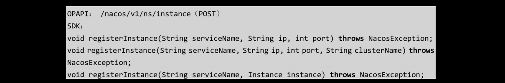
参数说明如下。
* serviceName：服务名称。
* ip：服务实例IP。
* port：服务实例Port。
* clusterName：集群名称，表示该服务实例属于哪个集群。
* instance：实例属性，实际上就是把上面这些参数封装成一个对象。

调用方式：

获取全部实例
根据服务名称从Nacos Server上获取所有服务实例：

参数说明如下。
* serviceName：服务名称。
* cluster：集群列表，可以传递多个值。

调用方式：

监听服务
监听服务是指监听指定服务下的实例变化。在前面的分析中我们知道，客户端从Nacos Service上获取的实例必须是健康的，否则会造成客户端请求失败。监听服务机制可以让客户端及时感知服务提供者实例的变化。

参数说明如下。
* EventListener：当服务提供者实例发生上、下线时，会触发一个事件回调。

需要注意的是，监听服务的Open API也访问/nacos/v1/ns/instance/list，具体的原理会在源码分析中讲解。
    
服务监听有两种方式：
* 第一种是客户端调用/nacos/v1/ns/instance/list定时轮询。
* 第二种是基于DatagramSocket的UDP协议，实现服务端的主动推送。

### 5.2.3 Nocas集成Spring Boot实现服务注册与发现

本节通过Spring Boot集成Nacos实现一个简单的服务注册与发现功能。
* 创建一个Spring Boot工程spring-boot-nacos-discovery。
* 添加Maven依赖。

* 创建DiscoveryController类，通过@NacosInjected注入Nacos的NamingService，并提供discovery方法，可以根据服务名称获得注册到Nacos上的服务地址。
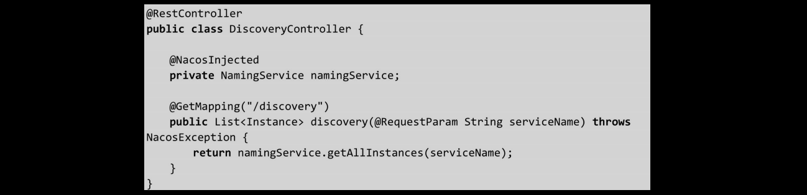

* 在application.properties中添加Nacos服务地址的配置。

* 启动SpringBootNacosDiscoveryApplication，调用curl http://127.0.0.1:8080/discovery?serviceName=example去Nacos服务器上查询服务名称example所对应的地址信息，此时由于Nacos Service并没有example的服务实例，返回一个空的JSON数组[]。
* 接着，通过Nacos提供的Open API，向Nacos Servier注册一个名字为example的服务。

> curl -X PUT  'http://127.0.0.1:8848/nacos/v1/ns/instance?serviceName=example&ip=127.0.0.1&port=8080'
* 再次访问curl  http://127.0.0.1:8080/discovery?serviceName=example，将返回以下信息。
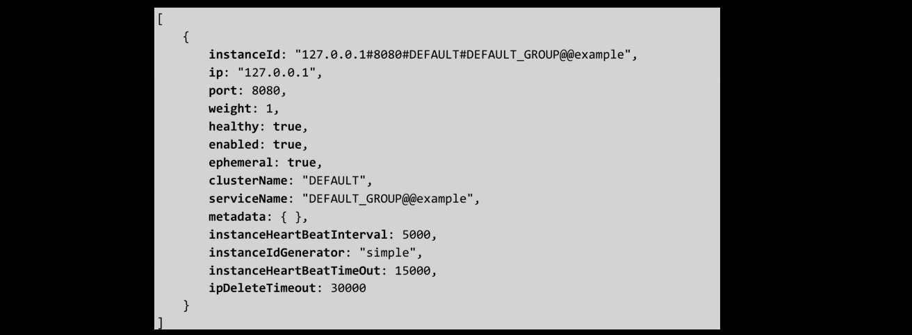

通过Spring Boot集成Nacos实现服务注册与发现的案例，相信大家对Nacos已经有了一个初步的认识。

## 5.3 Nacos的高可用部署

在分布式架构中，任何中间件或者应用都不允许单点存在，所以开源组件一般都会自己支持高可用集群解决方案。如图5-2所示，Nacos提供了类似于ZooKeeper的集群架构，包括一个Leader节点和多个Follower节点。和ZooKeeper不同的是**，它的数据一致性算法采用的是Raft**，通用采用了该算法的中间件有Redis Sentinel的Leader选举、Etcd等。
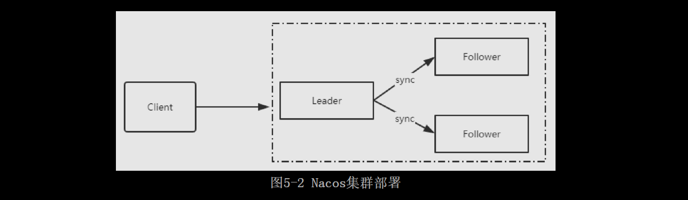

### 5.3.1 安装环境要求

请确保在环境中安装使用：
* 64 bit OS Linux/Unix/Mac，推荐使用Linux系统。
* 64 bit JDK 1.8及以上，下载并配置。
* Maven 3.2.x及以上，下载并配置。
* 3个或3个以上的Nacos节点才能构成集群。
* MySQL数据库。

### 5.3.2 安装包及环境准备
准备3台服务器，笔者采用的是Centos7.x系统。
* 下载安装包，分别进行解压：tar -zxvf nacos-service-1.1.4.tar.gz或者unzip nacos-server-1.1.4.zip。
* 解压后得到5个文件夹：bin（服务启动/停止脚本）、conf（配置文件）、logs（日志）、data（derby数据库存储）、target（编译打包后的文件）。

### 5.3.3 集群配置

在conf目录下包含以下文件。
	* application.properties：Spring Boot项目默认的配置文件。
	* cluster.conf.example：集群配置样例文件。
	* nacos-mysql.sql：MySQL数据库脚本。Nacos支持Derby和MySQL两种持久化机制，默认采用Derby数据库。如果采用MySQL，需要运行该脚本创建数据库和表。
	* nacos-logback.xml：Nacos日志配置文件。

配置Nacos集群需要用到cluster.conf文件，我们可以直接重命名提供的example文件，修改该配置信息如下：    

这3台机器中的cluster.conf配置保持一致。由于这3台机器之间需要彼此通信，所以在部署的时候需要防火墙对外开放8848端口。

### 5.3.4 配置MySQL数据库

Derby数据库是一种文件类型的数据库，在使用时会存在一定的局限性。比如它无法支持多用户同时操作，在数据量大、连接数多的情况下，会产生大量连接的积压。所以在生成环境中，可以用MySQL替换。
* 执行nacos-mysql.sql初始化。
* 分别修改3台机器中${NACOS_HOM}\conf下的application.properties文件，增加MySQL的配置。

### 5.3.5 启动Nacos服务

分别进入3台机器的bin目录，执行sh startup.sh或者startup.cmd-m cluster命令启动服务。服务启动成功之后，在${NACOS_HOME}\logs\start.out下可以获得如下日志，表示服务启动成功。

通过http://$NACOS_CLUSTER_IP:8848/nacos访问Nacos控制台，在“节点列表”下可以看到如图5-3所示的信息，表示当前集群由那些节点组成及节点的状态。

## 5.4 Dubbo使用Nacos实现注册中心

Dubbo可以支持多种注册中心，比如在前面章节中讲的ZooKeeper，以及Consul、Nacos等。本节主要讲解如何使用Nacos作为Dubbo服务的注册中心，为Dubbo提供服务注册与发现的功能，实现步骤如下。
* 创建一个普通Maven项目spring-boot-dubbo-nacos-sample，**添加两个模块：nacos-sample-api和nacos-sample-provider**。其中，nacos-sample-provider是一个Spring Boot工程。
* 在nacos-sample_api中声明接口。

* 在nacos-sample-provider中添加依赖。
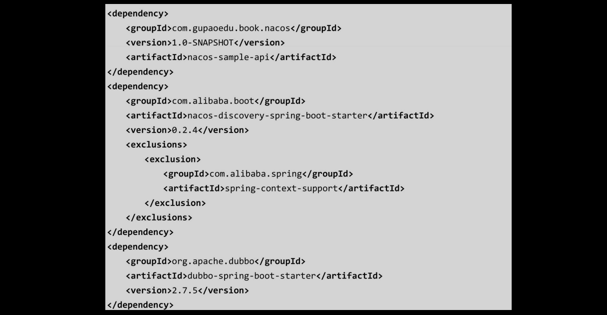

上述依赖包的简单说明如下：   
> * dubbo-spring-boot-starter，Dubbo的Starter组件，添加Dubbo依赖。
> * nacos-discovery-spring-boot-starter，Nacos的Starter组件。
> * nacos-sample-api，接口定义类的依赖。

* 创建HellpServiceImpl类，实现IHelloService接口。

* 修改application.properties配置。仅将dubbo.registry.address中配置的协议改成了nacos://127.0.0.1:8804，基于Nacos协议。

* 运行Spring Boot启动类，注意需要声明DubboComponentScan。
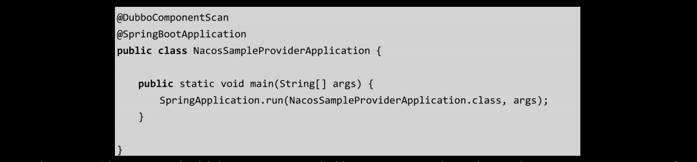
服务启动成功之后，访问Nacos控制台，进入“服务管理” →“ 服务列表”，如图5- 4所示，可以看到所有注册在Nacos上的服务。
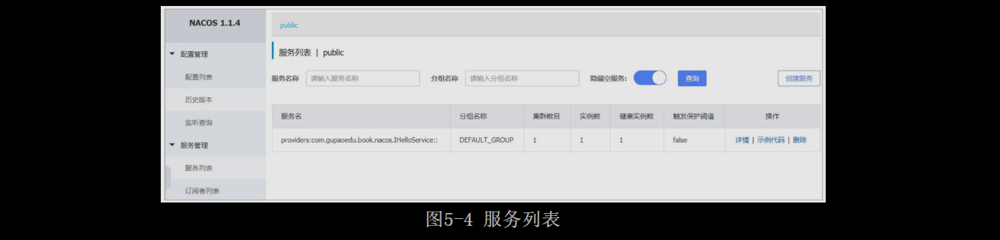
在图5-4所示界面中，在“操作”列表单击“详情”，可以看到IHelloService下所有服务提供者的实例元数据，如图5-5所示。
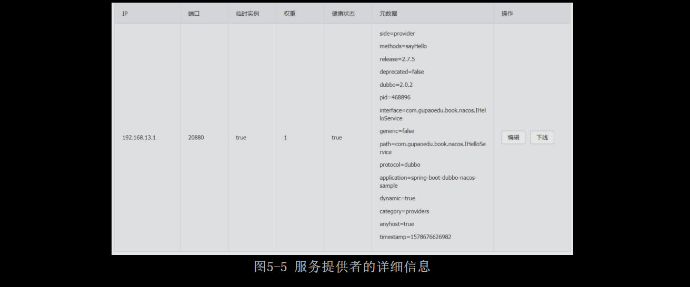
服务的消费过程和第4章中演示的例子没有太大的区别，不再重复讲解，大家可以基于前面的代码进行改造。

## 5.5 Spring Cloud Alibaba Nacos Discovery

Nacos作为Spring Cloud Alibaba中服务注册与发现的核心组件，可以很好地帮助开发者将服务自动注册到Nacos服务端，并且能够动态感知和刷新某个服务实例的服务列表。使用Spring Cloud Alibaba Nocos Discovery可以基于Spring Cloud规范快速接入Nacos，实现服务注册与发现功能。

在本节中，我们通过将Spring Cloud Alibaba Nacos Discovery集成到Spring Cloud Alibaba Dubbo，完成服务注册与发现的功能。

### 5.5.1 服务端开发

创建一个普通的Maven项目spring-cloud-nacos-sample，在项目中添加两个模块：
* spring-cloud-nocos-sample-api，暴露服务接口，作为服务提供者及服务消费者的接口契约。
* spring-cloud-nacos-sample-provider，项目类型为Spring Cloud，它是接口的实现。

项目的创建方式和类型与前面所演示的步骤一样。为了避免大家在实践的时候出现错误，笔者会将完整的过程再讲一遍，服务提供方的操作步骤如下。
* 在spring-cloud-nacold-nacos-sample-api项目中定义了一个接口IHelloService。

* 在spring-cloud-nacos-sample-sample-provier项目的pom.xml文件中添加相关依赖包。

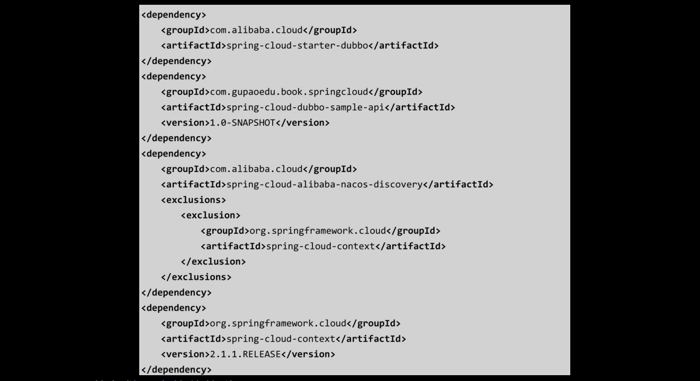
下面对上述依赖包做一个简单的说明。
> * spring-cloud-starter：Spring Cloud核心包。
> * spring-cloud-starter-dubb：引入Spring Cloud Alibaba Dubbo。
> * spring-cloud-dubbo-sample-api：API的接口声明。
> * spring-cloud-alibaba-nacos-discovery：基于Nacos的服务注册与发现。

需要注意的是，在笔者所使用的版本中，spring-cloud-starter传递依赖的spring-cloud-context版本为2.2.1.RELEASE。这个版本的包存在兼容问题，会导致如下错误：

所以我们通过exclusion排除了依赖，并且引入了2.1.1.RELEASE版本来解决。

需要注意的是，上述依赖的artifact没有指定版本，所以需要在父pom中显示地声明<dependencyManagement: >
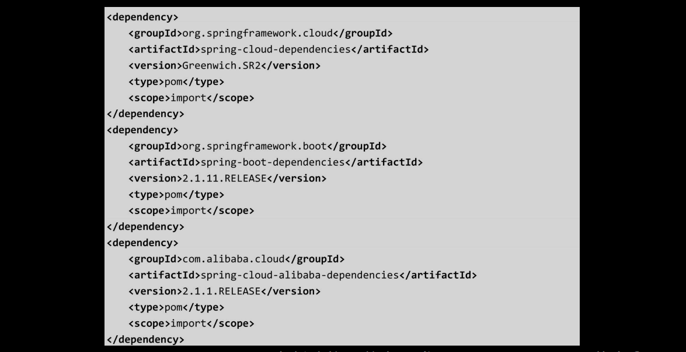
* 在spring-cloud-nacos-sample-provider中创建接口的实现类HelloServiceImpl，其中@Service是Dubbo服务的注解，表示当前服务会发布成一个远程服务。

* 在application.properties中提供Dubbo及Nacos的配置，用于声明Dubbo服务暴露的网络端口和协议，以及服务注册的地址信息，完整的配置如下。

以上配置的简单说明如下。
> * dubbo.scan.base-packages：功能等同于@DubboComponentScan，指定Dubbofu服务实现类的扫描包路径。
> * dubbo.registry.address：Dubbo服务注册中心的配置地址，它的值spring-cloud://localhost表示挂载到Spring Cloud注册中心。不配置的话会提示没有配置注册中心的错误。
> * spring.cloud.nacos.discovery.server-addr：Nacos服务注册中心的地址。

* 启动服务。

按照以上步骤开发完成之后，进入Nacos控制台的“服务管理”→“ 服务列表”，如果看到如图5-6所示的界面，说明服务已经发布成功了。
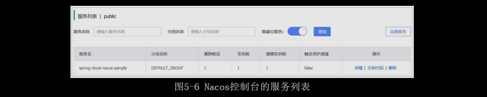

单击“详情”，会看到如图5-7所示的信息。
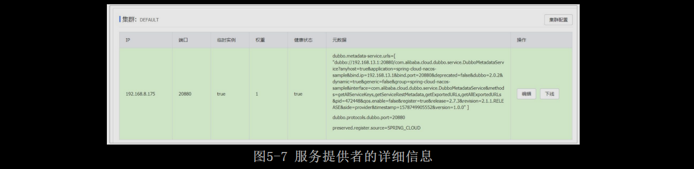

细心的读者会发现，基于Spring Cloud Alibaba Nacos Discovery实现服务注册时，**元数据中发布的服务接口是com.alibaba.cloud.dubbo.service.DubboMetadataService。那么消费者要怎么去找到IHelloService呢？别急，进入Nacos控制台的“配置列表”，可以看到如图5-8所示的配置信息。实际上这里把发布的接口信息存储到了配置中，并且建立了映射关系，从而使得消费者在访问服务的时候能够找到目标接口进行调用**。至此，服务端便全部开发完了，接下来我们开始消费端的开发。

### 5.5.2 消费端开发

消费端开发很简单，操作步骤如下：
* 创建一个Spring Boot项目spring-cloud-nacos-consumer。
* 添加相关Maven依赖。
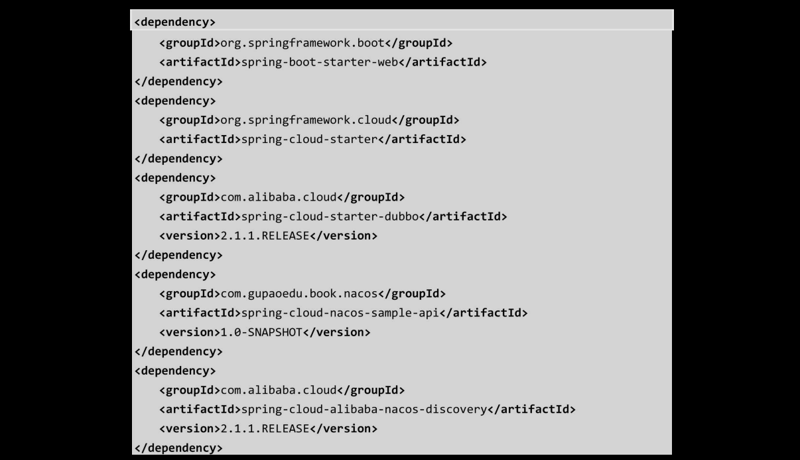
上述依赖包和服务提供者的没什么区别，为了演示效果需要，增加了spring-boot-starter-web依赖。

* 在application.properties中添加配置信息。

这些配置前面都讲过，就不重复解释了。

* 定义HelloController，用于测试Dubbo服务的访问。

* 启动服务。

通过curl命令执行HTTP GET方法：

响应结果为：

与第4章Dubbo Spring Cloud的代码相比，除了注册中心从ZooKeeper变成Nacos，其他基本没什么变化，因为这两者都是基于Spring Cloud标准实现的，而这些标准化的定义都抽象到了Spring-Cloud-Common包中。在后续的组件集成过程中，会以本书中创建的项目进行集成，希望各位读者读到这一节的时候，把前面的代码都梳理一遍。

   
## 5.6 Nacos实现原理分析

到目前为止，大家对Nacos应该有了一定的认识。在本节中，我们主要通过Nacos的架构及实现注册中心的原理来进一步进行了解。

### 5.6.1 Nacos架构图

图5-9是Nacos官方提供的架构图，我们简单来分析一下它的模块组成。
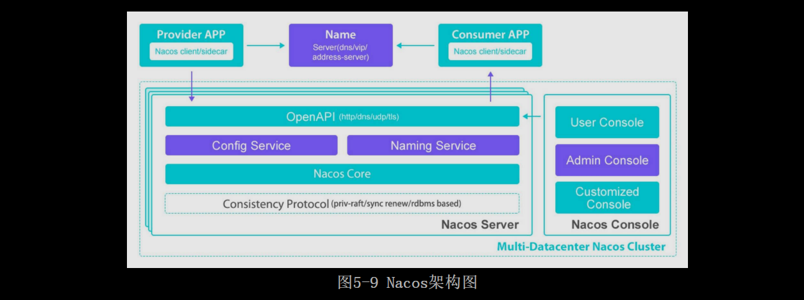
* Provider APP：服务提供者。
* Consumer APP：服务消费者。
* Name Server：通过VIP（Virtual IP）或者DNS的方式实现Nacos高可用集群的服务路由。
* Nacos Server：Nacos服务提供者，里面包含的Open API是功能访问入口，Config Service、Naming Service是Nacos提供的配置服务、名字服务模块。Consistency Protocol是一致性协议，用来实现Nacos集群节点的数据同步，这里使用的是Raft算法（使用类似算法的中间件还有Etcd、Redis哨兵选举）。
* Nacos Console：Nacos控制台。

整体来说，**服务提供者通过VIP（Virtual IP）访问Nacos Server高可用集群，基于Open API完成服务的注册和服务的查询**。**Nacos Server本身可以支持主备模式，所以底层会采用数据一致性算法来完成从节点的数据同步。服务消费者也是如此，基于Open API从Nacos Server中查询服务列表**。

### 5.6.2 注册中心的原理

服务注册的功能主要体现在：
* 服务实例在启动时注册到服务注册表，并在关闭时注销。
* 服务消费者查询服务注册表，获得可用实例。
* 服务注册中心需要调用服务实例的健康检查API来验证它是否能够处理请求。

Nacos服务注册与发现的实现原理如图5-10所示。
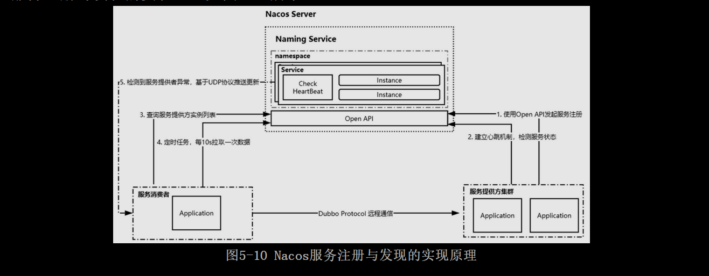

## 5.7 深入解读Nacos源码

Nacos源码部分，我们主要阅读三部分：
* 服务注册。
* 服务地址的获取。
* 服务地址变化的感知。

下面我们基于这三个方面来分析Nacos是如何实现的。

### 5.7.1 Spring Cloud什么时候完成服务注册

**在Spring-Cloud-Common包中有一个类org.springframework.cloud.client.serviceregistry.ServiceRegistry，它是Spring Cloud提供的服务注册的标准**。集成到Spring Cloud中实现服务注册的组件，都会实现该接口。

这个接口有一个**实现类是com.alibaba.cloud.nacos.registry.NacosServiceRegistry**。它是什么时候触发服务注册动作的呢？

Spring Cloud集成Nacos的实现过程

在spring-cloud-commons包的包的META-INF/spring.factories中包含自动装配的配置信息如下：

其中AutoServiceRegistrationAutoConfiguration就是服务注册相关的配置类，代码如下：
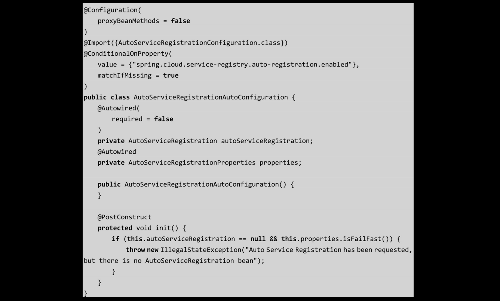

在AutoServiceRegistrationAutoConfiguration配置类中，可以看到注入了一个**AutoServiceRegistration实例，该类的关系图如图5-11所示。可以看出，AbstractAutoServiceRegistration抽象类实现了该接口，并且最重要的是NacosAutoServiceRegistration继承了AbstractAutoServiceRegistration**。
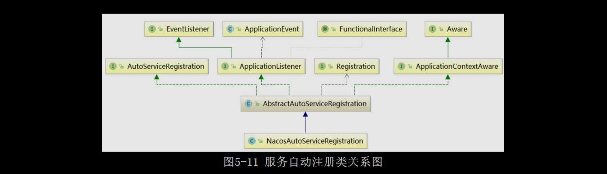

我们重点关注ApplicationListener，熟悉Spring的读者应该知道它是一种事件监听机制，该类的声明如下：

其中方法的作用是监听某个指定的事件。而AbstractAutoServiceRegistration实现了该抽象方法，并且监听WebServerInitializedEvenet事件（当Webserver初始化完成之后），调用this.bind（event）方法。

继续跟进this.bind方法，可以发现**最终会调用NacosServiceRegistry.register方法进行服务注册**。

Spring Cloud Alibaba Dubbo集成Nacos的实现

**Spring Cloud Alibaba Dubbo集成Nacos时，服务的注册是依托Dubbo中的自动装配机制完成的**。spring-cloud-alibaba-dubbo下的META-INF/spring.factories文件中自动装配了一个和服务注册相关的配置类DubboLoadBalancedRestTemplatAutoConfiguration。
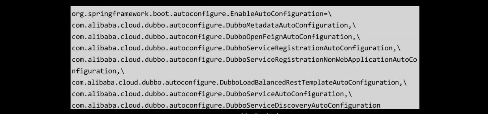
DubboLoadBalancedRestTemplateAutoConfiguration的定义如下。

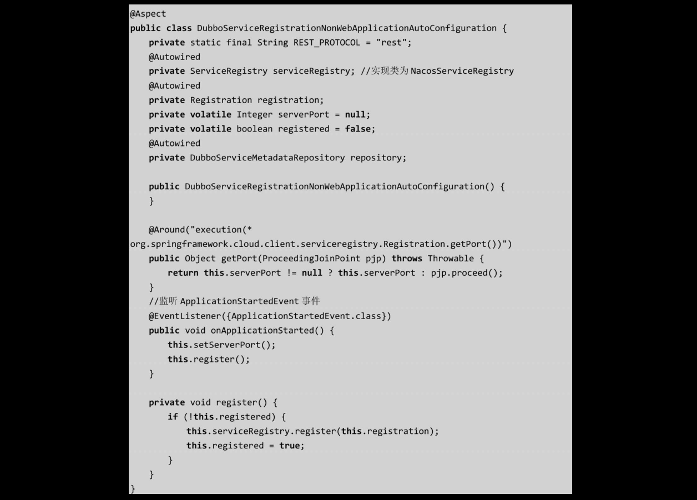
在该类中，有一个@EventListener的声明，它会监听ApplicationStartedEvent事件（Spring Boot 2.0新增的事件），该事件是在刷新上下文之后、调用application命令之前触发的。

**收到事件通知后，调用this.register，最终仍然调用NacosServiceRegistry中的register方法实现服务的注册**。

### 5.7.2 NacosServiceRegistry的实现

**在NacosServiceRegistry.registry方法中，调用了Nacos Client SDK中的namingService.registerInstance完成服务的注册**。    

再来看一下namingService.rgisterInstance()方法的实现，注意逻辑如下。
* 通过beatReactor.addBeatInfo创建心跳信息实现健康检测，Nacos Server必须要确保注册的服务实例是健康的，而心跳检测就是服务健康检测的手段。
* serverProxy.registerService实现服务注册：
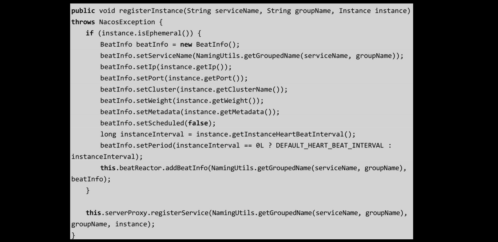

服务注册的逻辑在下一节中单独分析，这里中的关注beatReactor.addBeatInfo实现的心跳机制。很多读者都知道心跳机制，但是不太清楚该怎么实现，心跳机制的代码如下：    
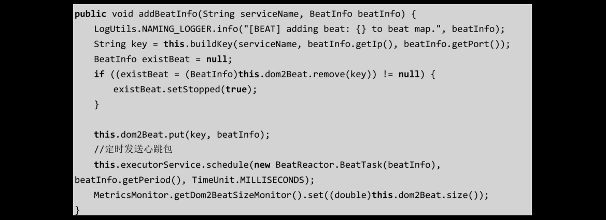
从上述代码看，**所谓心跳机制就是客户端通过schedule定时向服务端发送一个数据包，然后启动一个线程不断检测服务端的回应，如果在设定时间内没有收到服务端的回应，则认为服务器出现了故障。Nacos服务端会根据客户端的心跳包不断更新服务的状态**。

### 5.7.3 从源码层面分析Nacos服务注册的原理

Nacos提供了SDK及Open API的形式来实现服务注册。前面我们通过Open API实现了一个服务地址的注册，其中serviceName表示服务名、ip/port表示该服务对应的地址。

基于SDK形式实现服务注册的方法如下：

这两种形式的本质都一样，**SDK方式只是提供了一种访问的封装，在底层仍然是基于HTTP协议完成请求**的，所以我们直接基于Open API请求方式来分析服务端的服务注册原来。

> 注：源码分析的版本为1.1.4，大家可以在GitHub上搜索并下载。

    
对于服务注册，对外提供的服务端口请求地址为nacos/v1/ns/instance，实现代码在nacos-naming模块下的InstanceController类中。
* 从请求参数中获得serviceName（服务名）和namespaceId（命名空间Id）。
* 调用registerInstance注册实例。

以上这段代码，**以本章中演示的项目为例，serviceName实际上就是spring-cloud-nacos-sample，namespanceId的值为public**。接下来我们重点关注rgisterInstance方法，它的主要逻辑是：
* 创建一个空服务（在Nacos控制台“服务列表”中展示的服务信息），实际上是初始化一个serviceMap，它是一个ConcurrentHashMap集合。
* getService，从serviceMap中根据namespaceId和serviceName得到一个服务对象。
* 调用addInstance添加服务实例。
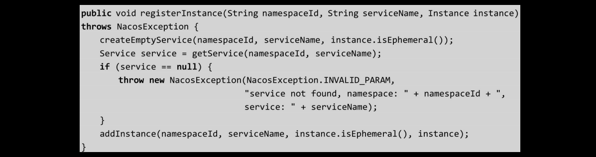
下面简单分析一下createEmptyService创建空服务的代码，最终调用的方法时createServiceIfAbsent。
* 根据namspaceId、serviceName从缓存中获取Service实例。
* 如果Service实例为空，则创建并保存到缓存中。

也没有太多的复杂逻辑，主要关注putServiceAndInit方法，它实现了以下功能：
* 通过putService方法将服务缓存到内存。
* service.init()建立心跳检查机制。
* consistencyService.listen实现数据一致性的监听。
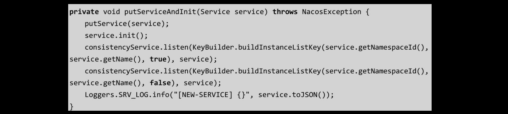

service.init()方法的代码就不看了，如图5-12所示，它**主要通过定时任务不断检测当前服务下所有实例最后发送心跳包的时间。如果超时，则设置healty为false表示服务不健康，并且发送服务变更事件**。在这里请大家思考一个问题，服务实例的最后心跳包更新时间是谁来触发的？实际上前面有讲到，Nacos客户端注册服务的同时也建立了心跳机制。
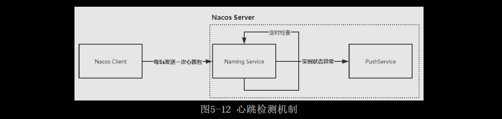

下面看putService方法，它的功能是将Service保存到serviceMap中。
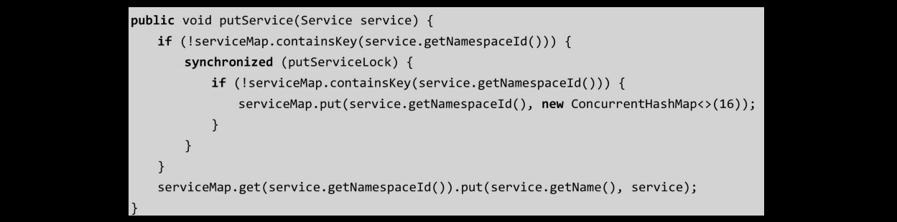
上述步骤完成之后，继续调用addInstance方法把当前注册的服务实例保存到Service中。

至此，服务的注册基本上就完成了，可能各位读者会有点意犹未尽，实际上Alibaba下的各个组件都是可以独立写成一本书来介绍的。本书的主要目的还是讲解Spring Cloud Alibaba生态，因此在源码部分基本会以核心功能为主进行引导，有兴趣的读者在阅读源码过程中遇到问题可以直接在GitHub上提问。

最后，简单总结一下服务注册的完整过程：
* Nacos客户端通过Open API的形式发生服务注册请求。
* Nacos服务端收到请求后，做以下三件事：
* 构建一个Service对象保存到ConcurrentHashMap集合中。
* 使用定时任务对当前服务下的所有实例建立心跳检测机制。
* 基于数据一致性协议将服务数据进行同步。

### 5.7.4 揭秘服务提供者地址查询

    了解了服务注册的原理之后，再来看服务地址查询功能就很容易理解了。查询服务列表有两种形式。

    基于Open API形式：

    使用SDK的方式如下，healthy表示服务的健康状态。

    找到Nacos-Naming模块下的InstanceController类。
	* 
解析请求参数。
	* 
通过doSrvIPXT返回服务列表数据。

    doSrvIPXT方法比较长，我们主要看核心部分的逻辑。
	* 
根据namespaceId、serviceName获得Service实例。
	* 
从Service实例中基于srvIPs得到所有服务提供者的实例信息。
	* 
遍历组装JSON字符串并返回。

# [README](../README.md "回到 README")