# [README](../README.md "回到 README")

# 第8章 分布式事务
提到事务这个概念，相信大家第一时间想到的是数据库的事务。所谓的**数据库事务是指作为单个逻辑工作单元执行的多个数据库操作，要么同时成功，要么同时失败，它必须满足ACID特性**，即：
* 原子性（Atomicity）：事务必须是原子工作单元，不可继续分割，要么全部成功，要么全部失败。
* 一致性（Consistency）：事务完成时，所有数据都必须保持一致。
* 隔离性（Isolation）：由于并发事务所做的修改必须与任何其他并发事务所做的修改隔离。
* 持久性（Durability）：事务执行完成之后，它对系统的影响是永久的。

上述是针对单库多表的情况事务所要满足的特性。在微服务框架下，随着业务服务的拆分及数据库的拆分，会存在如图8-1所示的场景，订单和库存分别拆分成了两个独立的数据库，当客户端发起一个下单操作时，需要在订单服务对应的数据库中创建订单，同时需要基于RPC通信调用库存服务完成商品库存的扣减。

在这样一个场景中，原本的单库事务操作就变成了多个数据库的事务操作，由于每个数据库的事务执行情况只有自己知道，比如订单数据库并不知道库存数据库的执行结果，这样就会导致订单数据库和库存数据库的数据不一致问题，比如订单创建成功，库存扣减失败，就可能会导致“超卖”问题。这就是所谓的分布式事务场景。准确来说，**分布式事务是指事务的参与者、支持事务的服务器、资源服务器以及事务管理器分别位于分布式系统的不同节点上**。
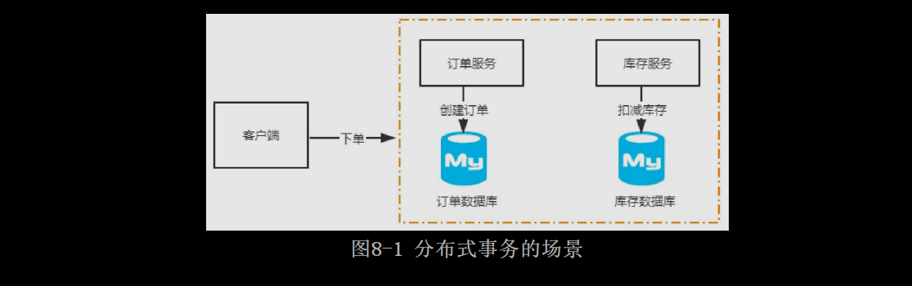

## 8.1 分布式事务问题的理论模型

**分布式事务问题也叫分布式数据一致性问题**，简单来说就是如何在分布式场景中保证多个节点数据的一致性。分布式事务产生的核心原因在于存储资源的分布性，比如多个数据库，或者MySQL和Redis两种不同存储设备的数据一致性等。在实际应用中，我们应该尽可能地从设计层面去避免分布式事务的问题，因为任何一种解决方案都会增加系统的复杂度。接下来我们了解一下分布式事务问题的常见解决方案。

### 8.1.1 X/Open分布式事务模型

X/Open DTP（X/Open Distributed Transaction Processing Reference Model）是X/Open这个组织定义的一套分布式事务的标准。这个标准提出了使用两个阶段提交（2PC，Two-Phase-Commit）来保证分布式事务的完整性。如图8-2所示，X/Open DTP中包含以下三种角色。

* AP：Application，表示应用程序。
* RM：Resource Manager，表示资源管理器，比如数据库。
* TM：Transaction Manager，表示事物管理器，一般指事物协调者，负责协调和管理事务，提供AP编程接口或管理RM。可以理解为spring中提供的Transaction Manager。

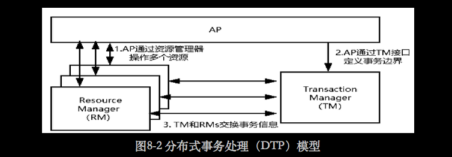
图8-2所展示的角色和关系与本地事务的原理基本相同，唯一不同的在于，如果此时RM代表数据库，那么TM需要能够管理多个数据库的事务，大致实现步骤如下：
* 配置TM，把多个RM注册到TM，相当于TM注册RM作为数据源。
* AP从TM管理的RM中获取连接，如果RM是数据库则获取JDBC连接。
* AP向TM发起一个全局事务，生成全局事务ID（XID），XID会通知各个RM。
* AP通过第二步获得的连接直接操作RM完成数据操作。这时，AP在每次操作时会把XID传递给RM。
* AP结束全局事务，TM会通知各个RM全局事务结束。
* 根据各个RM的事务执行结果，执行提交或者回滚操作。

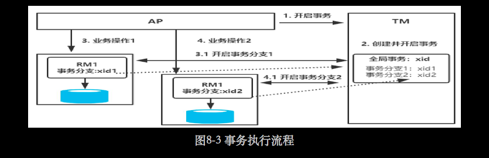
为了更清晰地理解，读者可参考如图8-3所示的流程图，实际上这里会涉及全局事务的概念。也就是说，在原本的单机事务下，会存在夸库事务的可见性问题，导致无法实现**多节点事务的全局可控**。而TM就是一个全局事务管理器，它可以管理多个资源管理器的事务。TM最终会根据各个分支事务的执行结果进行提交或者回滚，如果注册的所有分支事务中任何一个节点事务执行失败，为了保证数据的一致性，TM会触发各个RM的事务回滚操作。
    
需要注意的是，**TM和多个RM之间的事务控制，是基于XA协议（XA Specification）来完成的**。XA协议是X/Open提出的分布式事务处理规范，也是分布式事务处理的工业标准，它定义了xa_和ax_系列的函数原型及功能描述、约束等。目前Oracle、MySQL、DB2都实现了XA接口，所以它们都可以作为RM。

### 8.1.2 两个阶段提交协议

细心的读者不难发现，在图8-3中TM实现了多个RM事务的管理，实际上会涉及**两个阶段的提交，第一阶段是事务的准备阶段，第二阶段是事务的提交或者回滚阶段**。这两个阶段都是由事务管理器发起的。两阶段提交协议的执行流程如下。
* 准备阶段：事务管理器（TM）通知资源管理器（RM）准备分支事务，记录事务日志，并告知事务管理器的准备结果。
* 提交/回滚阶段：如果所有的资源管理器（RM）在准备阶段都明确返回成功，则事务管理器（TM）向所有的资源管理器（RM）发起事务提交指令完成数据的变更。反之，如果任何一个资源管理器（RM）明确返回失败，则事务管理器（TM）会向所有资源管理器（RM）发送事务回滚指令。完整的执行流程如图8-4所示。
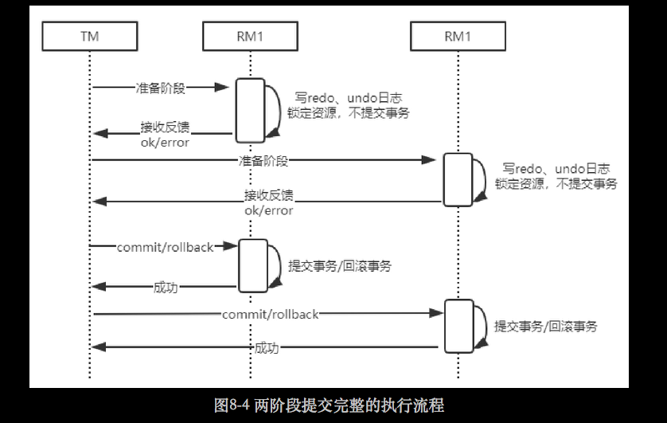

两个阶段提交将一个事务的处理过程分为投票和执行两个阶段，它的优点在于充分考虑到了分布式系统的不可靠因素，并且采用非常简单的方式（两阶段提交）就把由于系统不可靠而导致事务提交失败的概率降到最小。当然，它也并不是完美的，存在以下缺点。
* 同步阻塞：从图8-4的执行流程来看，所有参与者（RM）都是事务阻塞型的，对于任何一次指令都必须要有明确的响应才能继续进行下一步，否则就会处于阻塞状态，占用的资源一直被锁定。
* 过于保守：任何一个节点失败都会导致数据回滚。
* 事务协调者的单点故障：如果协调者在第二阶段出现了故障，那么其他的参与者（RM）会一直处于锁定状态。
* “脑裂”导致数据不一致问题：在第二阶段中，事务协调者向所有参与者（RM）发送commit请求后，发生局部网络异常导致只有一部分参与者（RM）接受了commit请求，这部分参与者（RM）收到请求后会执行commit操作，但是未收到commit请求的节点由于事务无法提交，导致数据出现不一致问题。

### 8.1.3 三阶段提交协议

**三阶段提交协议是两阶段提交协议的改进版本，它利用超时机制解决了同步阻塞的问题**，三阶段提交协议的具体描述如下。
* CanCommit（询问阶段）：事务协调者向参与者发送事务执行请求，询问是否可以完成指令，参与者只需要回答是或者不是即可，不需要做真正的事务操作，这个阶段会有超时中止机制。
* PreCommit（准备阶段）：事务协调者会根据参与者的反馈结果决定是否继续执行，如果在询问阶段所有参与者都返回可以执行操作，则事务协调者会向所有参与者发送PreCommit请求，参与者收到请求后写redo和undo日志，执行事务操作但是不提交事务，然后返回ACK响应等待事务协调者的下一步通知。如果在询问阶段任意参与者返回不能执行操作的结果，那么事务协调者会向所有参与者发送事务中断请求。
* DoCommit（提交或回滚阶段）：这个阶段也会存在两种结果，仍然根据上一步骤的执行结果来决定DoCommit的执行方法。如果每个参与者在PreCommit阶段都返回成功，那么事务协调者会向所有参与者发起事务提交指令。反之，如果参与者中的任一参与者返回失败，那么事务协调者就会发起中止指令来回滚事务。

三阶段提交协议的时序图如图8-5所示。
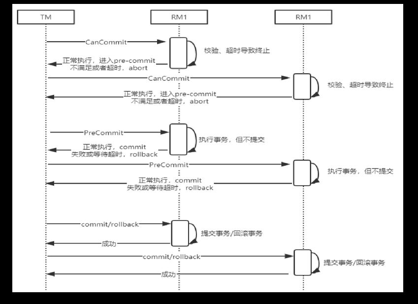

三阶段提交协议和两阶段提交协议相比有一些不同点：

**增加了一个CanCommit阶段**，用于询问所有参与者是否可以执行事务操作并且响应，它的好处是，可以尽早发现无法执行操作而中止后续的行为。
**在准备阶段之后，事务协调者和参与者都引入了超时机制，一旦超时，事务协调者和参与者会继续提交事务，并且认为处于成功状态，因为在这种情况下事务默认为成功的可能性比较大**。
    实际上，一旦超时，在三个阶段提交协议下仍然可能出现数据不一致的情况，当然概率是比较小的。另外，最大的好处就是基于超时机制来避免资源的永久锁定。需要注意的是，不管是两个阶段提交协议还是三个阶段提交协议，都是数据一致性解决方案的实现，我们可以在实际应用中灵活调整。**比如ZooKeeper集群中的数据一致性，就用到了优化版的两阶段提交协议**，优化的地方在于，它不需要所有参数值在第一阶段返回成功才能提交事务，而是利用少数服从多数的投票机制来完成数据的提交或者回滚。

### 8.1.4 CAP定理和BASE理论

**前面提到的两阶段提交和三阶段提交是XA协议解决分布式数据一致性问题的基本原理**，但是这**两种方案为了保证数据的强一致性，降低了可用性**。实际上这里涉及分布式事务的两个理论模型。

CAP定理
CAP定理，又叫布鲁尔定理。简单来说它是指在分布式系统中不可能同时满足一致性（C：Consistency）、可用性（A：Avaliability）、分区容错性（P：Partition Tolerance）这三个基本需求，最多同时满足两个。
* C：数据在多个副本中要保持强一致，比如前面说的分布式数据一致性问题。
* A：系统对外提供的服务必须一直处于可用状态，在任何故障下，客户端都能在合理的时间内获得服务端的非错误响应。
* P：在分布式系统中遇到任何网络分区故障，系统仍然能够正常对外提供服务。
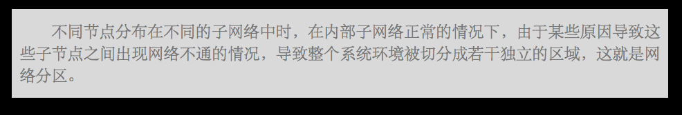
CAP定理证明，在分布式系统中，要么满足CP，要么满足AP，不可能实现CAP或者CA。原因是网络通信并不是绝对可靠的，比如网络延时、网络异常等都会导致系统故障。而在**分布式系统中，即便出现网络故障也需要保证系统仍然能够正常对外提供服务，所以在分布式系统中Partition Tolerance是必然存在的，也就是需要满足分区容错性**。

如果是CA或者CAP这种情况，相当于网络百分之百可靠，否则当出现网络分区的情况时，为了保证数据的一致性，必须拒绝客户端的请求。但是如果拒绝了请求，就无法满足A,所以在分布式系统中不可能选择CA，因此只能有AP或者CP两种选择。
AP：**对于AP来说，相当于放弃了强一致性，实现最终的一致，这是很多互联网公司解决分布式数据一致性问题的主要选择**。
CP：**放弃了高可用性，实现强一致性。前面提到的两阶段提交和三阶段提交都采用这种方案。可能导致的问题是用户完成一个操作会等待较长的时间**。

BASE理论
BASE理论是由于CAP中一致性和可用性不可兼得而衍生出来的一种新的思想，**BASE理论的核心思想是通过牺牲数据的强一致性来获得高可用性**。它有如下三个特性。
* Basically Available（基本可用）：分布式系统在出现故障时，允许损失一部分功能的可用性，保证核心功能的可用。
* Soft State（软状态）：允许系统中的数据存在中间状态，这个状态不影响系统的可用性，也就是允许系统中不同节点的数据副本之间的同步存在延时。
* Eventually Consistent（最终一致性）：中间状态的数据在经过一段时间之后，会达到一个最终的数据一致性。

BASE理论并没有要求数据的强一致，而是允许数据在一段时间内是不一致的，但是数据最终会在某个时间点实现一致。在互联网产品中，大部分都会采用BASE理论来实现数据的一致，因为**产品的可用性对于用户来说更加重要**。

举个例子，在电商平台中用户发起一个订单的支付，不需要同步等待支付的执行结果，系统会返回一个支付处理中的状态到用户界面。对于用户来说，他可以从订单列表中看到支付的处理结果。而对于系统来说，当第三方的支付处理成功之后，再更新该订单的支付状态即可。在这个场景中，虽然订单的支付状态和第三方的支付状态存在短期的不一致，但是用户却获得了更好的产品体验。

## 8.2 分布式事务问题的常见解决方案

在前面的章节中已经详细分析了分布式事务的问题及理论模型，并且基于CAP理论我们知道对于数据一致性问题有AP和CP两种方案，但是在电商领域等互联网场景下，**基于CP的强一致性方案在数据库性能和系统处理能力上会存在一定的瓶颈。所以在互联网场景中更多采用柔性事务**，**所谓的柔性事务是遵循BASE理论来实现的事务模型，它有两个特性：基本可用、柔性状态**。在本节中主要基于柔性事务模型来分析互联网产品中分布式事务的常见解决方案。

### 8.2.1 TCC补偿性方案

TCC（Try-Confirm-Cancel）是一种比较成熟的分布式数据一致性解决方案，它实际上是把一个完整的业务拆分为如下三个步骤。
Try：这个阶段主要对数据的校验或者资源的预留。
Confirm：确认真正执行的任务，只操作Try阶段预留的资源。
Cancel：取消执行，释放Try阶段预留的资源。

其实TCC**是一种两阶段提交的思想，第一阶段通过Try进行准备工作，第二阶段Confirm/Cancel表示Try阶段操作的确认和回滚**。在分布式事务场景中，每个服务实现TCC之后，就作为其中的一个资源，参与到整个分布式事务中。然后主业务服务在第一阶段中分别调用所有TCC服务的Try方法。最后根据第一个阶段的执行情况来决定对第二阶段的Confirm或者Cancel。TCC执行流程如图8-6所示。
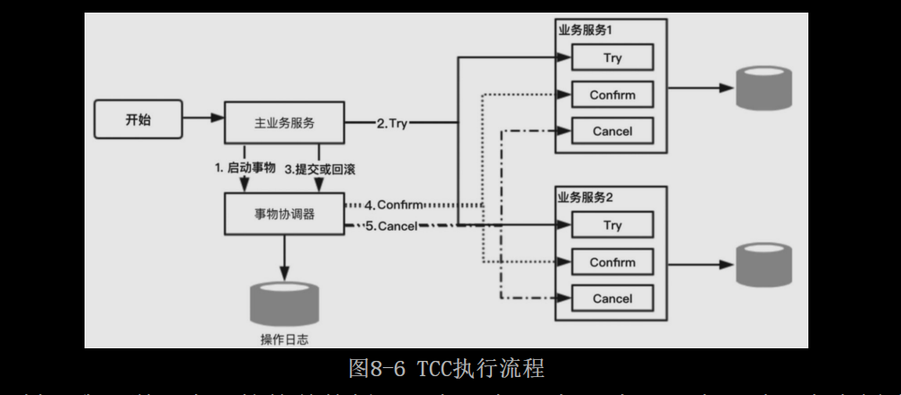

对应TCC的工作机制，我们举一个比较简单的例子。在一个理财App中，用户通过账户余额购买一个理财产品，这里涉及两个事务操作：
* 在账户服务中，对用户账户余额进行扣减。
* 在理财产品服务中，对指定理财产品可申购金额进行扣减。

这两个事务操作在微服务架构下分别对应的是两个不同的微服务，以及独立的数据库操作，**在TCC的工作机制中，首先针对账户服务和理财产品服务分别提供Try、Confirm和Cancel三个方法**。
* 在账户服务的**Try方法中对实际申购金额进行冻结，Confirm方法把Try方法冻结的资金进行实际的扣减**，**Cancel方法把Try方法冻结的资金进行解冻**。
* 理财产品服务的**Try方法中将本次申购的部分额度进行冻结，Confirm方法把Try方法中冻结的额度进行实际扣减，Concel方法把Try方法中冻结的额度进行释放**。

在一个主业务方法中，分别调用这两个服务对外提供的处理方法（资金扣减、理财产品可申购额度扣减），这两个服务做实际业务处理时，会**先调用Try方法来做资源预留，如果这两个方法处理都正常，TCC事务协调器就会调用Confirm方法对预留资源进行实际应用**。否则TCC事务协调器一旦感知到任何一个服务的Try方法处理失败，就会调用各个服务的Cancel方法进行回滚，从而保证数据的一致性。

在一些特殊情况下，比如理财产品服务宕机或者出现异常，导致该服务并没有收到TCC事务协调器的Cancel或者Confirm请求，怎么办呢？没关系，**TCC事务框架会记录一些分布式事务的操作日志，保存分布式事务运行的各个阶段和状态。TCC事务协调器会根据操作日志来进行重试，以达到数据的最终一致性**。

需要注意的是，**TCC服务支持接口调用失败发起重试，所以TCC暴露的接口都需要满足幂等性**。

### 8.2.2 基于可靠消息的最终一致性方案

基于可靠性消息的最终一致性是互联网公司比较常用的分布式数据一致性解决方案，它**主要利用消息中间件（Kafka、RocketMQ或RabbitMQ）的可靠性机制来实现数据一致性的投递**。以电商平台的支付场景为例，用户完成订单的支付后不需要同步等待支付结果，可以继续做其他事情。但是对于系统来说，大部分是在发起支付之后，等到第三方支付平台提供异步支付结果通知，再根据结果来设置该订单的支付状态。并且如果是支付成功的状态，大部分电商平台基于营销策略还会给账户增加一定的积分奖励。所以，当系统接收到第三方返回的支付结果时，需要更新支付服务的支付状态，以及更新账户服务的积分余额，这里就涉及两个服务的数据一致性问题。从这个场景中可以发现这里的数据一致性并不要求实时性，所以我们可以采用**基于可靠性消息的最终一致性方案来保证支付服务和账户服务的数据一致性**。如图8-7所示，支付服务收到支付结果通知后，先更新支付订单的状态，再发送一条消息到分布式消息队列中，账户服务会监听到指定队列的消息并进行相应的处理，完成数据的同步。
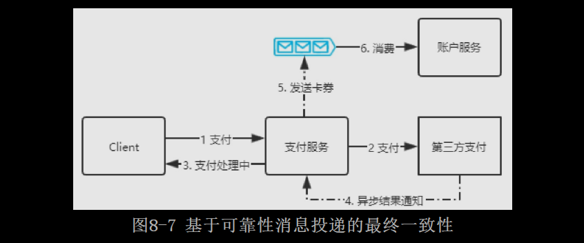

在**图8-7的解决方案中，我们不难发现一些问题，就是支付服务的本地事务与发送消息这个操作的原子性问题**，具体描述如下。
* 先发送消息，再执行数据库事务，在这种情况下可能会出现消息发送成功但是本地事务更新失败的情况，仍然会导致数据不一致的问题。
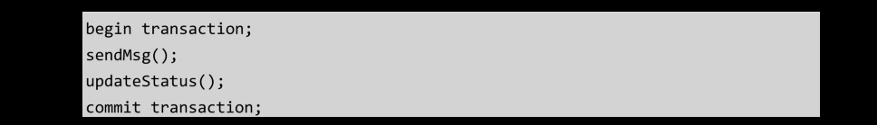
* 先执行数据库事务操作，再发布消息，在这种情况下可能会出现MQ响应超时导致异常，从而将本地事务回滚，但消息可能已经发生成功了，也会存在数据不一致的问题。
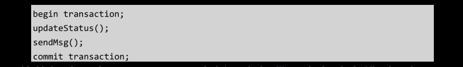

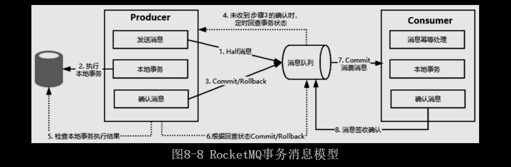
以上问题也有很多成熟的解决方案，**以RocketMQ为例，它提供了事务消息模型，如图8-8所示，具体的执行逻辑如下**：
* 生产者发送一个事务消息到消息队列上，消息队列只记录这条消息的数据，此时消费者无法消费这条消息。
* 生产者执行具体的业务逻辑，完成本地事务的操作。
* 接着生产者根据本地事务的执行结果发送一条确认消息给消息队列服务器，如果本地事务执行成功，则发送一个Commit消息，表示在第一步中发送的消息可以被消费，否则，消息队列服务器会把第一步存储的消息删除。
* 如果生产者在执行本地事务的过程中因为某些情况一直未给消息队列服务器发送确认，那么消息队列服务器会定时主动回查生产者获取本地事务的执行结果，然后根据回查结果来决定这条消息是否需要投递给消费者。
* 消息队列服务器上存储的消息被生产者确认之后，消费者就可以消费这条消息，消息消费完成之后发送一个确认标识给消息队列服务器，标识该消息投递成功。

在RocketMQ事务消息模型中，事务是由生产者来完成的，消费者不需要考虑，因为消息队列可靠性投递机制的存在，如果消费者没有签收该消息，那么消息队列服务器会重复投递，从而实现生产者的本地数据和消费者的本地数据在消息队列的机制下达到最终一致。

不难发现，**在RocketMQ的事务消息模型中最核心的机制应该是事务回查**，实际上查询模式在很多类似的场景中都可以应用。在分布式系统中，由于网络通信的存在，服务之间的远程通信除成功和失败两种结果外，还存在一种未知状态，比如网络超时。服务提供者可以提供一个查询接口向外部输出操作的执行状态，服务调用者可以通过调用该接口得知之前操作的结果并进行相应的处理。

### 8.2.3 最大努力通知型

**最大努力通知型和基于可靠消息的最终一致性方案的实现是类似的，它是一种比较简单的柔性事务解决方案，也比较适用于对数据一致性要求不高的场景，最典型的使用场景是支付宝支付结果通知**，实现流程如图8-9所示。

下面站在商户的角度来分析最大努力通知型的处理过程。
* 商户先创建一个支付订单，然后调用支付宝发起支付请求。
* 支付宝唤醒支付页面完成支付操作，支付宝同样会针对该商户创建一个支付交易，并且根据用户的支付结果记录支付状态。
* 支付完成后触发一个回调通知给商户，商户收到该通知后，根据结果修改本地支付订单的状态，并且返回一个处理状态给支付宝。
* 针对这个订单，在理想状态下支付宝的交易状态和商户的交易状态会在通知完成后达到最终一致。**但是由于网络的不确定性，支付结果通知可能会失败或者丢失，导致商户端的支付订单的状态是未知的。所以最大努力通知型的作用就体现了，如果商户端在收到支付结果通知后没有返回一个“SUCCESS”状态码，那么这个支付结果回调请求会以衰减重试机制（逐步拉大通知的间隔）继续触发，比如1min、5min、10min、30min……知道达到最大通知次数**。如果达到指定次数后商户还没有返回确认状态，怎么处理呢？
* 支付宝提供了一个交易结果查询接口，可以根据这个支付订单号去支付宝查询支付状态，然后根据返回的结果来更新商户的支付订单状态，这个过程可以通过定时器来触发，也可以通过人工对账来触发。

从上述分析可以发现，所谓的最大努力通知，就是在商户端如果没有返回一个消息确认时，支付宝会不断地进行重试，直到收到一个消息确认或者达到最大重试次数。

不难发现它的实现机制和图8-8中的事务消息模型的消费者消费模型类似，在消费者没有向消息中间件服务器发送确认之前，这个消息会被重复投递，确保消息的可靠性消费。

## 8.3 分布式事务框架Seata

**Seata是一款开源的分布式事务解决方案，致力于在微服务架构下提供高性能和简单易用的分布式事务服务。它提供了AT、TCC、Saga和XA事务模式，为开发者提供了一站式的分布式事务解决方案**。其中TCC和XA我们前面分析过，AT和Saga这两种事务模式是什么呢？下面先来简单介绍一下这两种事务模式。

### 8.3.1 AT模式

**AT模式是Seata最主推的分布式事务解决方案，它是基于XA演进而来的一种分布式事务模式，所以它同样分为三大模块，分别是TM、RM和TC，其中TM和RM作为Seata的客户端与业务系统集成，TC作为Seata的服务独立部署**。**TM表示事务管理器（Transaction Manager），它负责向TC注册一个全局事务，并生成一个全局唯一的XID。在AT模式下，每个数据库资源被当做一个RM（Resource Manager），在业务层面通过JDBC标准的接口访问RM时，Seata会对所有请求进行拦截。每个本地事务进行提交时，RM都会向TC（Transaction Coordinator，事务协调器）注册一个分支事务**。Seata的AT事务模型如图8-10所示。
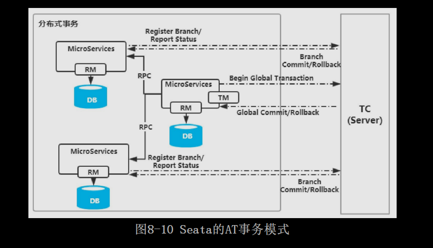
具体执行流程如下：
* TM向TC注册全局事务，并生成全局唯一的XID。
* RM向TC注册分支事务，并将其纳入该XID对应的全局事务范围。
* RM想TC汇报资源的准备状态。
* TC汇总所有事务参与者的执行状态，决定分布式事务是全部回滚还是提交。
* TC通知所有RM提交/回滚事务。

**AT模式和XA一样，也是一个两阶段提交事务模型，不过和XA相比，做了很多优化**，笔者会在后续的章节中重点分析AT模式的实现原理。

### 8.3.2 Saga模式

Saga模式又称为长事务解决方案，它是由普林斯顿大学的Hector Garcia-Molina和Kenneth Salem提出的，**主要描述的是在没有两阶段提交的情况下如何解决分布式事务问题**。其核心思想是：**把一个业务流程中的长事务拆分为多个本地短事务，业务流程中的每个参与者都提交真实的提交给该本地短事务，当其中一个参与者事务执行失败，则通过补偿机制补偿前面已经成功的参与者**。

如图8-11所示，Sage由一系列sub-transaction Ti 组成，每个Ti 都有对应的补偿动作Ci ，补偿动作用于撤销Ti 造成的数据变更结果。它和TCC相比，少了Try这个预留动作，每一个Ti 操作都真实地影响到数据库。
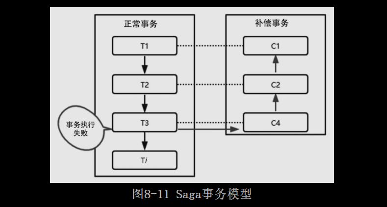

按照Sage的工作模式，有两种执行方式：
* T1，T2，T3，...，Ti ：这种方式表示所有事务都正常执行。
* T1，T2，T3，...，Tj，Cj，...，C2，C1（其中0<j<i）：这种方式表示执行到Tj 事务时出现异常，通过补充操作撤销之前所有成功的sub-transaction。

另外，Sage提供了以下两种补偿恢复方式。
* 向后恢复，也就是上面提到的第二种工作模式，如果任何一个子事务执行失败，则把之前执行的结果逐一撤销。
* 向前恢复，**也就是不进行补偿，而是对失败的事务进行重试，这种方式比较适合于事务必须要执行成功的场景**。

不管是向后恢复还是向前恢复，都可能出现失败的情况，在最坏的情况下只能人工干预处理。

#### 8.3.2.1 Saga的优劣势

和XA或者TCC相比，它的优势包括：**一阶段直接提交本地事务；没有锁等待，性能较高；在事件驱动的模式下，短事务可以异步执行；补偿机制的实现比较简单**。

缺点是**Saga并不提供原子性和隔离性支持，隔离性的影响是比较大的，比如用户购买一个商品后系统赠送一张优惠券，如果用户已经把优惠券使用了，那么事务如果出现异常要回滚时就会出现问题**。

    #### 8.3.2.2 Saga的实现方式

在一个电商平台的下单场景中，一般会涉及订单的创建、商品库存的扣减、钱包支付、积分赠送等操作，整体的时序图如图8-12所示。
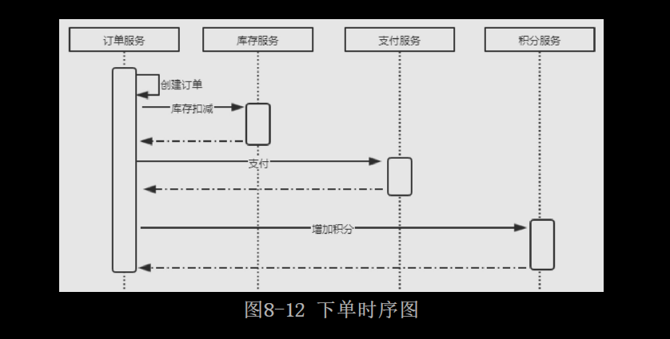

电商平台下单的流程是一个典型的长事务场景，根据Saga模式的定义，先将长事务拆分成多个本地短事务，每个服务的本地事务按照执行顺序逐一提交，一旦其中一个服务的事务出现异常，则采用补偿的方式逐一撤回。这一过程的实现会涉及Saga的协调模式，它有两种常用的协调模式。
* 事件/编排式：把Saga的决策和执行顺序逻辑分布在Saga的每一个参与者中，它们通过交换事件的方式来进行沟通。
* 命令/协同式：把Saga的决策和执行顺序逻辑集中在一个Saga控制类中，它以命令/回复的方式与每项服务进行通信，告诉他们应该执行哪些操作。

事件/编排式
在基于事件的编排模式中，第一个服务执行完一个本地事务之后，发送一个事件。这个事件会被一个或者多个服务监听，监听到这个事务的服务再执行本地事务并发布新的事件，此后一直延续这种事件触发模式，直到该业务流程中最后一个服务的本地事务执行结束，才意味着整个分布式长事务也执行结束，如图8-13所示。
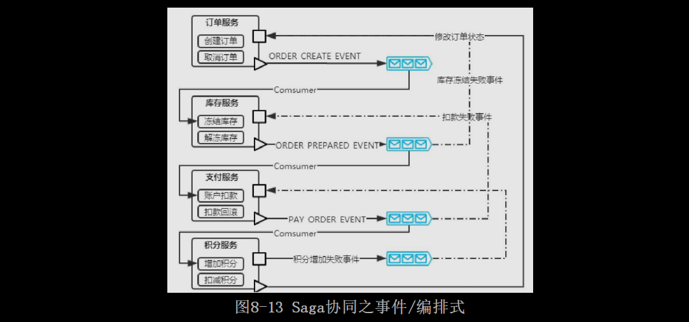

这个流程看起来很复杂，但是却是比较常见的解决方案，下面简单描述一下具体的步骤。
* 订单服务创建新的订单，把订单状态设置为待支付，并发布一个ORDER_CREATE_EVENT事件。
* 库存服务监听到ORDER_CREATE_EVENT事件后，执行本地的库存冻结方法，如果执行成功，则发布一个ORDER_PREPARED_EVENT事件。
* 支付服务监听ORDER_PREPARED_EVENT事件后，执行账户扣款方法，并发布PAY_ORDER_EVENT事件。
* 最后，积分服务监听PAY_ORDER_EVENT事件，增加账户积分，并更新订单状态为成功。

上述任一步骤执行失败，都会发送一个失败的事件，每个服务需要监听失败的情况根据实际需求进行逐一回滚。

命令/协同式
命令/协同式需要定义一个Saga协调器，负责告诉每一个参与者该做什么，Saga协调器以命令/回复的方式与每项服务进行通信，如图8-14所示。
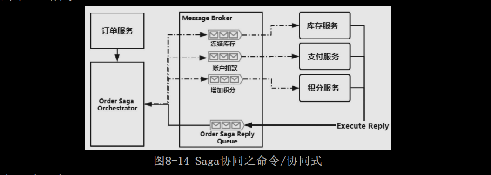

命令/协同式的实现步骤如下：
* 订单服务首先创建一个订单，然后创建一个订单Saga协调器，启动订单事务。
* Saga协调器向库存服务发送冻结库存命令，库存服务通过Order Saga Reply Queue回复执行结果。
* 接着，Saga协调器继续向支付服务发起账户扣款命令，支付服务通过Order Saga Reply Queue回复执行结果。
* 最后，Saga协调器向积分服务发起增加积分命令，积分服务回复执行结果。

需要注意的是，**订单Saga协调器必须提前知道“创建订单事务”的所有流程（Seata是通过基于JSON的状态机引擎来实现的），并且在整个流程中任何一个环节执行失败，它都需要向每个参与者发送命令撤销之前的事务操**作。

## 8.4 Seata的安装

# [README](../README.md "回到 README")