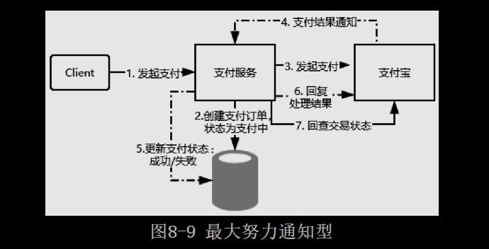

# [README](../README.md "回到 README")

# 第8章 分布式事务
提到事务这个概念，相信大家第一时间想到的是数据库的事务。所谓的**数据库事务是指作为单个逻辑工作单元执行的多个数据库操作，要么同时成功，要么同时失败，它必须满足ACID特性**，即：
* 原子性（Atomicity）：事务必须是原子工作单元，不可继续分割，要么全部成功，要么全部失败。
* 一致性（Consistency）：事务完成时，所有数据都必须保持一致。
* 隔离性（Isolation）：由于并发事务所做的修改必须与任何其他并发事务所做的修改隔离。
* 持久性（Durability）：事务执行完成之后，它对系统的影响是永久的。

上述是针对单库多表的情况事务所要满足的特性。在微服务框架下，随着业务服务的拆分及数据库的拆分，会存在如图8-1所示的场景，订单和库存分别拆分成了两个独立的数据库，当客户端发起一个下单操作时，需要在订单服务对应的数据库中创建订单，同时需要基于RPC通信调用库存服务完成商品库存的扣减。

在这样一个场景中，原本的单库事务操作就变成了多个数据库的事务操作，由于每个数据库的事务执行情况只有自己知道，比如订单数据库并不知道库存数据库的执行结果，这样就会导致订单数据库和库存数据库的数据不一致问题，比如订单创建成功，库存扣减失败，就可能会导致“超卖”问题。这就是所谓的分布式事务场景。准确来说，**分布式事务是指事务的参与者、支持事务的服务器、资源服务器以及事务管理器分别位于分布式系统的不同节点上**。

## 8.1 分布式事务问题的理论模型

**分布式事务问题也叫分布式数据一致性问题**，简单来说就是如何在分布式场景中保证多个节点数据的一致性。分布式事务产生的核心原因在于存储资源的分布性，比如多个数据库，或者MySQL和Redis两种不同存储设备的数据一致性等。在实际应用中，我们应该尽可能地从设计层面去避免分布式事务的问题，因为任何一种解决方案都会增加系统的复杂度。接下来我们了解一下分布式事务问题的常见解决方案。

### 8.1.1 X/Open分布式事务模型

X/Open DTP（X/Open Distributed Transaction Processing Reference Model）是X/Open这个组织定义的一套分布式事务的标准。这个标准提出了使用两个阶段提交（2PC，Two-Phase-Commit）来保证分布式事务的完整性。如图8-2所示，X/Open DTP中包含以下三种角色。

* AP：Application，表示应用程序。
* RM：Resource Manager，表示资源管理器，比如数据库。
* TM：Transaction Manager，表示事物管理器，一般指事物协调者，负责协调和管理事务，提供AP编程接口或管理RM。可以理解为spring中提供的Transaction Manager。

图8-2所展示的角色和关系与本地事务的原理基本相同，唯一不同的在于，如果此时RM代表数据库，那么TM需要能够管理多个数据库的事务，大致实现步骤如下：
* 配置TM，把多个RM注册到TM，相当于TM注册RM作为数据源。
* AP从TM管理的RM中获取连接，如果RM是数据库则获取JDBC连接。
* AP向TM发起一个全局事务，生成全局事务ID（XID），XID会通知各个RM。
* AP通过第二步获得的连接直接操作RM完成数据操作。这时，AP在每次操作时会把XID传递给RM。
* AP结束全局事务，TM会通知各个RM全局事务结束。
* 根据各个RM的事务执行结果，执行提交或者回滚操作。

为了更清晰地理解，读者可参考如图8-3所示的流程图，实际上这里会涉及全局事务的概念。也就是说，在原本的单机事务下，会存在夸库事务的可见性问题，导致无法实现**多节点事务的全局可控**。而TM就是一个全局事务管理器，它可以管理多个资源管理器的事务。TM最终会根据各个分支事务的执行结果进行提交或者回滚，如果注册的所有分支事务中任何一个节点事务执行失败，为了保证数据的一致性，TM会触发各个RM的事务回滚操作。
    
需要注意的是，**TM和多个RM之间的事务控制，是基于XA协议（XA Specification）来完成的**。XA协议是X/Open提出的分布式事务处理规范，也是分布式事务处理的工业标准，它定义了xa_和ax_系列的函数原型及功能描述、约束等。目前Oracle、MySQL、DB2都实现了XA接口，所以它们都可以作为RM。

### 8.1.2 两个阶段提交协议

细心的读者不难发现，在图8-3中TM实现了多个RM事务的管理，实际上会涉及**两个阶段的提交，第一阶段是事务的准备阶段，第二阶段是事务的提交或者回滚阶段**。这两个阶段都是由事务管理器发起的。两阶段提交协议的执行流程如下。
* 准备阶段：事务管理器（TM）通知资源管理器（RM）准备分支事务，记录事务日志，并告知事务管理器的准备结果。
* 提交/回滚阶段：如果所有的资源管理器（RM）在准备阶段都明确返回成功，则事务管理器（TM）向所有的资源管理器（RM）发起事务提交指令完成数据的变更。反之，如果任何一个资源管理器（RM）明确返回失败，则事务管理器（TM）会向所有资源管理器（RM）发送事务回滚指令。完整的执行流程如图8-4所示。

两个阶段提交将一个事务的处理过程分为投票和执行两个阶段，它的优点在于充分考虑到了分布式系统的不可靠因素，并且采用非常简单的方式（两阶段提交）就把由于系统不可靠而导致事务提交失败的概率降到最小。当然，它也并不是完美的，存在以下缺点。
* 同步阻塞：从图8-4的执行流程来看，所有参与者（RM）都是事务阻塞型的，对于任何一次指令都必须要有明确的响应才能继续进行下一步，否则就会处于阻塞状态，占用的资源一直被锁定。
* 过于保守：任何一个节点失败都会导致数据回滚。
* 事务协调者的单点故障：如果协调者在第二阶段出现了故障，那么其他的参与者（RM）会一直处于锁定状态。
* “脑裂”导致数据不一致问题：在第二阶段中，事务协调者向所有参与者（RM）发送commit请求后，发生局部网络异常导致只有一部分参与者（RM）接受了commit请求，这部分参与者（RM）收到请求后会执行commit操作，但是未收到commit请求的节点由于事务无法提交，导致数据出现不一致问题。

### 8.1.3 三阶段提交协议

**三阶段提交协议是两阶段提交协议的改进版本，它利用超时机制解决了同步阻塞的问题**，三阶段提交协议的具体描述如下。
* CanCommit（询问阶段）：事务协调者向参与者发送事务执行请求，询问是否可以完成指令，参与者只需要回答是或者不是即可，不需要做真正的事务操作，这个阶段会有超时中止机制。
* PreCommit（准备阶段）：事务协调者会根据参与者的反馈结果决定是否继续执行，如果在询问阶段所有参与者都返回可以执行操作，则事务协调者会向所有参与者发送PreCommit请求，参与者收到请求后写redo和undo日志，执行事务操作但是不提交事务，然后返回ACK响应等待事务协调者的下一步通知。如果在询问阶段任意参与者返回不能执行操作的结果，那么事务协调者会向所有参与者发送事务中断请求。
* DoCommit（提交或回滚阶段）：这个阶段也会存在两种结果，仍然根据上一步骤的执行结果来决定DoCommit的执行方法。如果每个参与者在PreCommit阶段都返回成功，那么事务协调者会向所有参与者发起事务提交指令。反之，如果参与者中的任一参与者返回失败，那么事务协调者就会发起中止指令来回滚事务。

三阶段提交协议的时序图如图8-5所示。

三阶段提交协议和两阶段提交协议相比有一些不同点：

**增加了一个CanCommit阶段**，用于询问所有参与者是否可以执行事务操作并且响应，它的好处是，可以尽早发现无法执行操作而中止后续的行为。
**在准备阶段之后，事务协调者和参与者都引入了超时机制，一旦超时，事务协调者和参与者会继续提交事务，并且认为处于成功状态，因为在这种情况下事务默认为成功的可能性比较大**。
    实际上，一旦超时，在三个阶段提交协议下仍然可能出现数据不一致的情况，当然概率是比较小的。另外，最大的好处就是基于超时机制来避免资源的永久锁定。需要注意的是，不管是两个阶段提交协议还是三个阶段提交协议，都是数据一致性解决方案的实现，我们可以在实际应用中灵活调整。**比如ZooKeeper集群中的数据一致性，就用到了优化版的两阶段提交协议**，优化的地方在于，它不需要所有参数值在第一阶段返回成功才能提交事务，而是利用少数服从多数的投票机制来完成数据的提交或者回滚。

### 8.1.4 CAP定理和BASE理论

**前面提到的两阶段提交和三阶段提交是XA协议解决分布式数据一致性问题的基本原理**，但是这**两种方案为了保证数据的强一致性，降低了可用性**。实际上这里涉及分布式事务的两个理论模型。

CAP定理
CAP定理，又叫布鲁尔定理。简单来说它是指在分布式系统中不可能同时满足一致性（C：Consistency）、可用性（A：Avaliability）、分区容错性（P：Partition Tolerance）这三个基本需求，最多同时满足两个。
* C：数据在多个副本中要保持强一致，比如前面说的分布式数据一致性问题。
* A：系统对外提供的服务必须一直处于可用状态，在任何故障下，客户端都能在合理的时间内获得服务端的非错误响应。
* P：在分布式系统中遇到任何网络分区故障，系统仍然能够正常对外提供服务。

CAP定理证明，在分布式系统中，要么满足CP，要么满足AP，不可能实现CAP或者CA。原因是网络通信并不是绝对可靠的，比如网络延时、网络异常等都会导致系统故障。而在**分布式系统中，即便出现网络故障也需要保证系统仍然能够正常对外提供服务，所以在分布式系统中Partition Tolerance是必然存在的，也就是需要满足分区容错性**。

如果是CA或者CAP这种情况，相当于网络百分之百可靠，否则当出现网络分区的情况时，为了保证数据的一致性，必须拒绝客户端的请求。但是如果拒绝了请求，就无法满足A,所以在分布式系统中不可能选择CA，因此只能有AP或者CP两种选择。
AP：**对于AP来说，相当于放弃了强一致性，实现最终的一致，这是很多互联网公司解决分布式数据一致性问题的主要选择**。
CP：**放弃了高可用性，实现强一致性。前面提到的两阶段提交和三阶段提交都采用这种方案。可能导致的问题是用户完成一个操作会等待较长的时间**。

BASE理论
BASE理论是由于CAP中一致性和可用性不可兼得而衍生出来的一种新的思想，**BASE理论的核心思想是通过牺牲数据的强一致性来获得高可用性**。它有如下三个特性。
* Basically Available（基本可用）：分布式系统在出现故障时，允许损失一部分功能的可用性，保证核心功能的可用。
* Soft State（软状态）：允许系统中的数据存在中间状态，这个状态不影响系统的可用性，也就是允许系统中不同节点的数据副本之间的同步存在延时。
* Eventually Consistent（最终一致性）：中间状态的数据在经过一段时间之后，会达到一个最终的数据一致性。

BASE理论并没有要求数据的强一致，而是允许数据在一段时间内是不一致的，但是数据最终会在某个时间点实现一致。在互联网产品中，大部分都会采用BASE理论来实现数据的一致，因为**产品的可用性对于用户来说更加重要**。

举个例子，在电商平台中用户发起一个订单的支付，不需要同步等待支付的执行结果，系统会返回一个支付处理中的状态到用户界面。对于用户来说，他可以从订单列表中看到支付的处理结果。而对于系统来说，当第三方的支付处理成功之后，再更新该订单的支付状态即可。在这个场景中，虽然订单的支付状态和第三方的支付状态存在短期的不一致，但是用户却获得了更好的产品体验。

## 8.2 分布式事务问题的常见解决方案

在前面的章节中已经详细分析了分布式事务的问题及理论模型，并且基于CAP理论我们知道对于数据一致性问题有AP和CP两种方案，但是在电商领域等互联网场景下，**基于CP的强一致性方案在数据库性能和系统处理能力上会存在一定的瓶颈。所以在互联网场景中更多采用柔性事务**，**所谓的柔性事务是遵循BASE理论来实现的事务模型，它有两个特性：基本可用、柔性状态**。在本节中主要基于柔性事务模型来分析互联网产品中分布式事务的常见解决方案。

### 8.2.1 TCC补偿性方案

TCC（Try-Confirm-Cancel）是一种比较成熟的分布式数据一致性解决方案，它实际上是把一个完整的业务拆分为如下三个步骤。
Try：这个阶段主要对数据的校验或者资源的预留。
Confirm：确认真正执行的任务，只操作Try阶段预留的资源。
Cancel：取消执行，释放Try阶段预留的资源。

其实TCC**是一种两阶段提交的思想，第一阶段通过Try进行准备工作，第二阶段Confirm/Cancel表示Try阶段操作的确认和回滚**。在分布式事务场景中，每个服务实现TCC之后，就作为其中的一个资源，参与到整个分布式事务中。然后主业务服务在第一阶段中分别调用所有TCC服务的Try方法。最后根据第一个阶段的执行情况来决定对第二阶段的Confirm或者Cancel。TCC执行流程如图8-6所示。

对应TCC的工作机制，我们举一个比较简单的例子。在一个理财App中，用户通过账户余额购买一个理财产品，这里涉及两个事务操作：
* 在账户服务中，对用户账户余额进行扣减。
* 在理财产品服务中，对指定理财产品可申购金额进行扣减。

这两个事务操作在微服务架构下分别对应的是两个不同的微服务，以及独立的数据库操作，**在TCC的工作机制中，首先针对账户服务和理财产品服务分别提供Try、Confirm和Cancel三个方法**。
* 在账户服务的**Try方法中对实际申购金额进行冻结，Confirm方法把Try方法冻结的资金进行实际的扣减**，**Cancel方法把Try方法冻结的资金进行解冻**。
* 理财产品服务的**Try方法中将本次申购的部分额度进行冻结，Confirm方法把Try方法中冻结的额度进行实际扣减，Concel方法把Try方法中冻结的额度进行释放**。

在一个主业务方法中，分别调用这两个服务对外提供的处理方法（资金扣减、理财产品可申购额度扣减），这两个服务做实际业务处理时，会**先调用Try方法来做资源预留，如果这两个方法处理都正常，TCC事务协调器就会调用Confirm方法对预留资源进行实际应用**。否则TCC事务协调器一旦感知到任何一个服务的Try方法处理失败，就会调用各个服务的Cancel方法进行回滚，从而保证数据的一致性。

在一些特殊情况下，比如理财产品服务宕机或者出现异常，导致该服务并没有收到TCC事务协调器的Cancel或者Confirm请求，怎么办呢？没关系，**TCC事务框架会记录一些分布式事务的操作日志，保存分布式事务运行的各个阶段和状态。TCC事务协调器会根据操作日志来进行重试，以达到数据的最终一致性**。

需要注意的是，**TCC服务支持接口调用失败发起重试，所以TCC暴露的接口都需要满足幂等性**。

### 8.2.2 基于可靠消息的最终一致性方案

基于可靠性消息的最终一致性是互联网公司比较常用的分布式数据一致性解决方案，它**主要利用消息中间件（Kafka、RocketMQ或RabbitMQ）的可靠性机制来实现数据一致性的投递**。以电商平台的支付场景为例，用户完成订单的支付后不需要同步等待支付结果，可以继续做其他事情。但是对于系统来说，大部分是在发起支付之后，等到第三方支付平台提供异步支付结果通知，再根据结果来设置该订单的支付状态。并且如果是支付成功的状态，大部分电商平台基于营销策略还会给账户增加一定的积分奖励。所以，当系统接收到第三方返回的支付结果时，需要更新支付服务的支付状态，以及更新账户服务的积分余额，这里就涉及两个服务的数据一致性问题。从这个场景中可以发现这里的数据一致性并不要求实时性，所以我们可以采用**基于可靠性消息的最终一致性方案来保证支付服务和账户服务的数据一致性**。如图8-7所示，支付服务收到支付结果通知后，先更新支付订单的状态，再发送一条消息到分布式消息队列中，账户服务会监听到指定队列的消息并进行相应的处理，完成数据的同步。

在**图8-7的解决方案中，我们不难发现一些问题，就是支付服务的本地事务与发送消息这个操作的原子性问题**，具体描述如下。
* 先发送消息，再执行数据库事务，在这种情况下可能会出现消息发送成功但是本地事务更新失败的情况，仍然会导致数据不一致的问题。

* 先执行数据库事务操作，再发布消息，在这种情况下可能会出现MQ响应超时导致异常，从而将本地事务回滚，但消息可能已经发生成功了，也会存在数据不一致的问题。

以上问题也有很多成熟的解决方案，**以RocketMQ为例，它提供了事务消息模型，如图8-8所示，具体的执行逻辑如下**：
* 生产者发送一个事务消息到消息队列上，消息队列只记录这条消息的数据，此时消费者无法消费这条消息。
* 生产者执行具体的业务逻辑，完成本地事务的操作。
* 接着生产者根据本地事务的执行结果发送一条确认消息给消息队列服务器，如果本地事务执行成功，则发送一个Commit消息，表示在第一步中发送的消息可以被消费，否则，消息队列服务器会把第一步存储的消息删除。
* 如果生产者在执行本地事务的过程中因为某些情况一直未给消息队列服务器发送确认，那么消息队列服务器会定时主动回查生产者获取本地事务的执行结果，然后根据回查结果来决定这条消息是否需要投递给消费者。
* 消息队列服务器上存储的消息被生产者确认之后，消费者就可以消费这条消息，消息消费完成之后发送一个确认标识给消息队列服务器，标识该消息投递成功。

在RocketMQ事务消息模型中，事务是由生产者来完成的，消费者不需要考虑，因为消息队列可靠性投递机制的存在，如果消费者没有签收该消息，那么消息队列服务器会重复投递，从而实现生产者的本地数据和消费者的本地数据在消息队列的机制下达到最终一致。

不难发现，**在RocketMQ的事务消息模型中最核心的机制应该是事务回查**，实际上查询模式在很多类似的场景中都可以应用。在分布式系统中，由于网络通信的存在，服务之间的远程通信除成功和失败两种结果外，还存在一种未知状态，比如网络超时。服务提供者可以提供一个查询接口向外部输出操作的执行状态，服务调用者可以通过调用该接口得知之前操作的结果并进行相应的处理。

### 8.2.3 最大努力通知型

**最大努力通知型和基于可靠消息的最终一致性方案的实现是类似的，它是一种比较简单的柔性事务解决方案，也比较适用于对数据一致性要求不高的场景，最典型的使用场景是支付宝支付结果通知**，实现流程如图8-9所示。

下面站在商户的角度来分析最大努力通知型的处理过程。
* 商户先创建一个支付订单，然后调用支付宝发起支付请求。
* 支付宝唤醒支付页面完成支付操作，支付宝同样会针对该商户创建一个支付交易，并且根据用户的支付结果记录支付状态。
* 支付完成后触发一个回调通知给商户，商户收到该通知后，根据结果修改本地支付订单的状态，并且返回一个处理状态给支付宝。
* 针对这个订单，在理想状态下支付宝的交易状态和商户的交易状态会在通知完成后达到最终一致。**但是由于网络的不确定性，支付结果通知可能会失败或者丢失，导致商户端的支付订单的状态是未知的。所以最大努力通知型的作用就体现了，如果商户端在收到支付结果通知后没有返回一个“SUCCESS”状态码，那么这个支付结果回调请求会以衰减重试机制（逐步拉大通知的间隔）继续触发，比如1min、5min、10min、30min……知道达到最大通知次数**。如果达到指定次数后商户还没有返回确认状态，怎么处理呢？
* 支付宝提供了一个交易结果查询接口，可以根据这个支付订单号去支付宝查询支付状态，然后根据返回的结果来更新商户的支付订单状态，这个过程可以通过定时器来触发，也可以通过人工对账来触发。

从上述分析可以发现，所谓的最大努力通知，就是在商户端如果没有返回一个消息确认时，支付宝会不断地进行重试，直到收到一个消息确认或者达到最大重试次数。

不难发现它的实现机制和图8-8中的事务消息模型的消费者消费模型类似，在消费者没有向消息中间件服务器发送确认之前，这个消息会被重复投递，确保消息的可靠性消费。

## 8.3 分布式事务框架Seata

**Seata是一款开源的分布式事务解决方案，致力于在微服务架构下提供高性能和简单易用的分布式事务服务。它提供了AT、TCC、Saga和XA事务模式，为开发者提供了一站式的分布式事务解决方案**。其中TCC和XA我们前面分析过，AT和Saga这两种事务模式是什么呢？下面先来简单介绍一下这两种事务模式。

### 8.3.1 AT模式

**AT模式是Seata最主推的分布式事务解决方案，它是基于XA演进而来的一种分布式事务模式，所以它同样分为三大模块，分别是TM、RM和TC，其中TM和RM作为Seata的客户端与业务系统集成，TC作为Seata的服务独立部署**。**TM表示事务管理器（Transaction Manager），它负责向TC注册一个全局事务，并生成一个全局唯一的XID。在AT模式下，每个数据库资源被当做一个RM（Resource Manager），在业务层面通过JDBC标准的接口访问RM时，Seata会对所有请求进行拦截。每个本地事务进行提交时，RM都会向TC（Transaction Coordinator，事务协调器）注册一个分支事务**。Seata的AT事务模型如图8-10所示。

具体执行流程如下：
* TM向TC注册全局事务，并生成全局唯一的XID。
* RM向TC注册分支事务，并将其纳入该XID对应的全局事务范围。
* RM想TC汇报资源的准备状态。
* TC汇总所有事务参与者的执行状态，决定分布式事务是全部回滚还是提交。
* TC通知所有RM提交/回滚事务。

**AT模式和XA一样，也是一个两阶段提交事务模型，不过和XA相比，做了很多优化**，笔者会在后续的章节中重点分析AT模式的实现原理。

### 8.3.2 Saga模式

Saga模式又称为长事务解决方案，它是由普林斯顿大学的Hector Garcia-Molina和Kenneth Salem提出的，**主要描述的是在没有两阶段提交的情况下如何解决分布式事务问题**。其核心思想是：**把一个业务流程中的长事务拆分为多个本地短事务，业务流程中的每个参与者都提交真实的提交给该本地短事务，当其中一个参与者事务执行失败，则通过补偿机制补偿前面已经成功的参与者**。

如图8-11所示，Sage由一系列sub-transaction Ti 组成，每个Ti 都有对应的补偿动作Ci ，补偿动作用于撤销Ti 造成的数据变更结果。它和TCC相比，少了Try这个预留动作，每一个Ti 操作都真实地影响到数据库。

按照Sage的工作模式，有两种执行方式：
* T1，T2，T3，...，Ti ：这种方式表示所有事务都正常执行。
* T1，T2，T3，...，Tj，Cj，...，C2，C1（其中0<j<i）：这种方式表示执行到Tj 事务时出现异常，通过补充操作撤销之前所有成功的sub-transaction。

另外，Sage提供了以下两种补偿恢复方式。
* 向后恢复，也就是上面提到的第二种工作模式，如果任何一个子事务执行失败，则把之前执行的结果逐一撤销。
* 向前恢复，**也就是不进行补偿，而是对失败的事务进行重试，这种方式比较适合于事务必须要执行成功的场景**。

不管是向后恢复还是向前恢复，都可能出现失败的情况，在最坏的情况下只能人工干预处理。

#### 8.3.2.1 Saga的优劣势

和XA或者TCC相比，它的优势包括：**一阶段直接提交本地事务；没有锁等待，性能较高；在事件驱动的模式下，短事务可以异步执行；补偿机制的实现比较简单**。

缺点是**Saga并不提供原子性和隔离性支持，隔离性的影响是比较大的，比如用户购买一个商品后系统赠送一张优惠券，如果用户已经把优惠券使用了，那么事务如果出现异常要回滚时就会出现问题**。

    #### 8.3.2.2 Saga的实现方式

在一个电商平台的下单场景中，一般会涉及订单的创建、商品库存的扣减、钱包支付、积分赠送等操作，整体的时序图如图8-12所示。

电商平台下单的流程是一个典型的长事务场景，根据Saga模式的定义，先将长事务拆分成多个本地短事务，每个服务的本地事务按照执行顺序逐一提交，一旦其中一个服务的事务出现异常，则采用补偿的方式逐一撤回。这一过程的实现会涉及Saga的协调模式，它有两种常用的协调模式。
* 事件/编排式：把Saga的决策和执行顺序逻辑分布在Saga的每一个参与者中，它们通过交换事件的方式来进行沟通。
* 命令/协同式：把Saga的决策和执行顺序逻辑集中在一个Saga控制类中，它以命令/回复的方式与每项服务进行通信，告诉他们应该执行哪些操作。

事件/编排式
在基于事件的编排模式中，第一个服务执行完一个本地事务之后，发送一个事件。这个事件会被一个或者多个服务监听，监听到这个事务的服务再执行本地事务并发布新的事件，此后一直延续这种事件触发模式，直到该业务流程中最后一个服务的本地事务执行结束，才意味着整个分布式长事务也执行结束，如图8-13所示。

这个流程看起来很复杂，但是却是比较常见的解决方案，下面简单描述一下具体的步骤。
* 订单服务创建新的订单，把订单状态设置为待支付，并发布一个ORDER_CREATE_EVENT事件。
* 库存服务监听到ORDER_CREATE_EVENT事件后，执行本地的库存冻结方法，如果执行成功，则发布一个ORDER_PREPARED_EVENT事件。
* 支付服务监听ORDER_PREPARED_EVENT事件后，执行账户扣款方法，并发布PAY_ORDER_EVENT事件。
* 最后，积分服务监听PAY_ORDER_EVENT事件，增加账户积分，并更新订单状态为成功。

上述任一步骤执行失败，都会发送一个失败的事件，每个服务需要监听失败的情况根据实际需求进行逐一回滚。

命令/协同式
命令/协同式需要定义一个Saga协调器，负责告诉每一个参与者该做什么，Saga协调器以命令/回复的方式与每项服务进行通信，如图8-14所示。

命令/协同式的实现步骤如下：
* 订单服务首先创建一个订单，然后创建一个订单Saga协调器，启动订单事务。
* Saga协调器向库存服务发送冻结库存命令，库存服务通过Order Saga Reply Queue回复执行结果。
* 接着，Saga协调器继续向支付服务发起账户扣款命令，支付服务通过Order Saga Reply Queue回复执行结果。
* 最后，Saga协调器向积分服务发起增加积分命令，积分服务回复执行结果。

需要注意的是，**订单Saga协调器必须提前知道“创建订单事务”的所有流程（Seata是通过基于JSON的状态机引擎来实现的），并且在整个流程中任何一个环节执行失败，它都需要向每个参与者发送命令撤销之前的事务操**作。

## 8.4 Seata的安装

Seata是一个需要独立部署的中间件，除直接部署外，它还支持多种部署方式，比如Docker、Kubernetes、Helm。本节主要讲解直接安装的方式。
* 在Seata官网下载1.0.0版本的安装包，1.0.0是笔者写作时最新的发布版本。
* 进入${SEATA_HOME}\bin目录，根据系统类型执行相应的启动脚本，在Linux/Max下的执行命令如下。

* seata-server.sh支持设置启动参数，完整的参数列表如表8-1所示。

### 8.4.1 file存储模式

Server端存储模式（store.mode）有file、db两种（后续将引入Raft实现Seata的高可用机制），file存储模式无须改动，直接启动即可。

File存储模式为单机模式，全局事务会话信息持久化在本地文件${SEATA_HOME}\bin\sessionStore\root.data中，性能较高，启动命令如下：

### 8.4.2 db存储模式

db存储模式为高可用模式，全局事务会话信息通过db共享，性能相对差一些。操作步骤如下。
* 创建表结构。Seata全局事务会话信息由全局事务、分支事务、全局锁构成，对应表globatable、branchtable、lock_table。

* 设置事务日志存储方式，进入${SEATA_HOME}\conf\file.conf，修改store.mode="db"。
* 修改数据库连接：

* 启动seata-server：

参数说明如下。
> -h：注册到注册中心的IP地址，Seata-Server可以把自己注册到注册中心，支持Nacos、Eureka、Redis、Zookeeper、Consul、Etcd3、Sofa。    
> -p：Server RPC监听端口。    
> -m：全局事务会话信息存储模式，包括file、db，优先读取启动参数。   
> -n：Server node，有多个Server时，需区分各自节点，用于生成不同区间的transactionId，以免冲突。    

### 8.4.3 Seata服务端配置中心说明

在${SEATA_HOME}\conf目录下有两个配置文件，分别是registry.conf和file.conf。

#### 8.4.3.1 registry.conf配置说明

registry
registry.conf中包含两项配置：registry、config，完整的配置内容如下。

**registry表示配置Seata服务注册的地址**，支持目前市面上所有主流的注册中心组件。它的配置非常简单，**通过type指定注册中心的类型，然后根据指定的类型配置对应的服务地址信息，比如当type=nacos时**，则匹配到Nacos的配置项如下。

**type默认为file，它表示不依赖于配置中心，在file类型下，可以不依赖第三方注册中心快速集成Seata，不过，file类型不具备注册中心的动态发现和动态配置功能**。
    
config
**config配置用于配置Seata服务端的配置文件地址**，**也就是可以通过config配置指定Seata服务端的配置信息的加载位置，它支持从远程配置中心读取和本地文件读取两种方式**。如果配置为远程配置中心，可以使用type指定，配置形式和registry相同。

在默认情况下type=file，它会加载file.conf文件中的配置信息。

#### 8.4.3.2 file.conf配置说明

**file.conf存储的是Seata服务端的配置信息**，完整配置如下。它包含transport、server、metrics，分别表示协议配置、服务端配置、监控。

Seata服务端启动时会加载file.conf中的配置参数，这些参数读者不需要记，只需要知道这些参数可以优化即可，在Seata官网上对参数有非常详细的说明。

#### 8.4.3.3 从配置中心加载配置

从目前的分析过程中我们知道，**Seata服务在启动时可以将自己注册到注册中心，并且file.conf文件中的配置同样可以保存在配置中心**，并且file.conf文件中的配置同样可以保存在配置中，接下来我们尝试把配置信息存储到Nacos上.

将配置上传到Nacos
在GitHub的官方代码托管平台下载Seata的源码，在源码包中有一个script文件夹（目前只在源码包中存在），目录结构如下：
* client：存放客户端的SQL脚本，参数配置。
* config-center：各个配置中心参数导入脚本，config.txt（包含server和client）为通用参数文件。
* server：服务端数据库脚本及各个容器配置。

进入config-center目录，包含config.txt和不同配置中心的目录（该目录下包含shell脚本和py脚本）。其中config.tex存放的是Seata客户端和服务端的所有配置信息。

在config-center\nacos目录下，执行如下脚本：

该脚本的作用是把config.txt中的配置信息上传到Nacos配置中心。由于config.txt中提供的是默认配置，在实际使用时可以先修改该文件中的内容，再执行上传操作（当然，也可以上传完成之后在Nacos控制台上根据实际需求修改对应的配置项）。

脚本如果执行正确，将会在Nacos配置中心看到如图8-15所示的配置列表。

Seata服务端修改配置加载位置
进入${SEATA_HOME}\conf目录，修改registry.conf文件中的config段，完整配置如下：

至此，我们便完成了Seata服务端的注册及统一配置的管理。

## 8.5 AT模式Dubbo集成Seata

在本节中，我们仍然通过一个电商平台的购买逻辑，基于Dubbo集成Seata实现一个分布式事务的解决方案。在整个业务流程中，会涉及如下三个服务。
* 订单服务：用于创建订单。
* 账户服务：从账户中扣除余额。
* 库存服务：扣减指定商品的库存数量。

图8-16是这个三个微服务的整体架构图，用户执行下单请求时，会调用下单业务的REST接口，该接口会分别调用库存服务及订单服务。另外，订单服务还会调用账户服务先进行资金冻结，整个流程涉及这三个服务的分布式事务问题。

### 8.5.1 项目准备

使用第5章构建的基于Spring Boot+Nacos+Dubbo的项目结构，分别构建以下服务。
* sample-order-service，订单服务。
* sample-repo-service，库存服务。
* sample-account-service，账户服务。
* sample-seata-common，公共服务组件。
* sample-rest-web，提供统一业务的REST接口服务。

 其中sample-order-service、sample-repo-service、sample-account-service是基于Spring Boot+Dubbo构建的微服务，sample-rest-web提供统一的业务服务入口，sample-seata-common提供公共组件。

### 8.5.2 数据库准备

创建三个数据库：seata_order、seata_repo、seata_account，分别在这三个数据库中创建对应的业务表。

### 8.5.3 核心方法说明

为了避免项目的基础配置占用过多的篇幅，本节中主要列出每个服务的核心方法及作用，完整的源码请去GitHub下载。

sample-order-service、sample-repo-service、sample-account-service这三个服务需要集成MyBatis，用于和数据库交互，集成的过程比较简单，笔者不做过多阐述。

sample-account-service
账务服务提供余额扣减的功能，具体代码如下。

sample-order-service
订单服务负责创建订单，并且在创建订单之前先基于Dubbo协议调用账户的资金扣减接口。

sample-repo-service
库存服务提供库存扣减功能，同样这里也没有处理高并发场景下的性能及安全问题。

sample-rest-web
sample-rest-web是基于Spring Boot的Web项目，主要用于对外提供以业务为维度的REST接口，它会分别调用库存服务和订单服务，实现库存扣减及订单创建功能。

RestOrderServiceImpl的具体实现如下。

### 8.5.4 项目启动顺序及访问
这几个项目彼此之间存在依赖关系，服务与服务之间的依赖可以参考图8-16，服务的启动顺序为：
* sample-seata-common为公共组件，需要先通过mvn。
* install安装到本地仓库，给其他服务依赖。
* 接下来启动账户服务sample-account-service，它会被订单服务调用。
* 启动订单服务sample-order-service。
* 启动库存服务sample-repo-service。
* 启动sample-rest-web，它作为REST的业务入口，最后启动。

通过如下curl命令进行整改下单流程的测试，并监控数据库表中对应数据的变化，确保整个调用链路是正常的。

### 8.5.5 整合Seata实现分布式事务

在上述流程中，假设库存扣减成功了，但是在创建订单时如果由于账户资金不足导致失败，就会出现数据不一致的场景。按照正常的流程来说，被扣减的库存需要加回去，这就是一个分布式事务的场景。接下来我们在项目中整合Seata来解决该问题。

#### 8.5.5.1 添加Seata Jar包依赖

分别在4个项目中添加Seata的Starter组件依赖。

#### 8.5.5.2 添加Seata配置项目

同样分别在4个项目中的application.yml文件中添加Seata的配置项，具体配置明细如下。

上述配置中有几个配置项需要注意：
* seata.support.spring.datasource-autoproxy：true属性表示数据源自动代理开关，在sample-order-service、sample-account-service、sample-repo-service中设置为true，在sample-rest-web中设置为false，因为该项目并没有访问数据源，不需要代理。
* 如果注册中心为file，seata.service.grouplist需要添加Seata服务端连接地址。在默认情况下，注册中心配置为file，如果需要从注册中心上进行服务发现，可以增加如下配置。

* tx-service-group表示指定服务所属的事务分组，如果没有指定，默认使用spring.application.name加上字符串-seata-service-group。需要注意这两项配置必须要配置一项，否则会报错。

#### 8.5.5.3 添加回滚日志表

分别在3个数据库seata-account、seata-repo、seata-order中添加一张回滚日志表，用于记录每个数据库操作的回滚日志，当某个服务的事务出现异常时会根据该日志进行回滚。

#### 8.5.5.4 sample-rest-web增加全局事务控制

修改sample-rest-web工程的RestOrderServiceImpl，做两件事情：
* 增加@GlobalTransactional全局事务注解。
* 模拟一个异常处理，当商品编号等于某个指定的值时抛出异常，触发整个事务的回滚。

#### 8.5.5.5 启动服务进行测试

按照依赖顺序分别启动服务，正常情况下，每个服务都会向TC（Seata-Server）注册一个事务分支，获得如下日志说明事务分支注册成功。

使用curl模拟异常请求，根据程序代码的逻辑，传递一个触发异常的产品编码。

从异常触发的位置来看，如果没有引入分布式事务，那么即便出现了异常，由于库存扣减、订单创建、账户资金扣减等操作都已经生效，所以数据无法被回滚。在引入Seata之后，在异常出现后会触发各个事务分支的数据回滚，保证数据的正确性，如果配置正常，在3个Dubbo服务的控制台中获得如下输出，完成事务回滚操作。

## 8.6 Spring Cloud Alibaba Seata

本节我们主要基于Spring Cloud环境集成Seata实现分布式事务，仍然基于8.5节中描述的场景来进行改造。

在第5章中有详细的Spring Cloud集成Nacos及Dobbo的步骤，所以Spring Cloud项目集成过程不再重复阐述，主要讲解在Spring Cloud中如何集成Seata。

### 8.6.1 Spring Cloud项目准备

构建4个项目，实现逻辑及核心代码与8.5节完全一致，只增加了Greenwich.SR2版本的Spring Cloud依赖。项目名称如下：
* spring-cloud-seata-account.
* spring-cloud-seata-repo.
* spring-cloud-seata-order.
* spring-cloud-seata-rest.

### 8.6.2 集成Spring Cloud Alibaba Seata

在上述的4个服务中分别集成Spring Cloud Alibaba Seata，步骤如下。
* 添加依赖包。

spring-cloud-alibaba-seata不支持yml形式，所以只能使用file.conf和registry.conf文件来描述客户端的配置信息。可以直接将${SEATA_HOME}\conf目录下的这两个文件复制到项目的resource目录中。同样，如果希望从配置中心加载这些配置项，在registry.conf中指定配置中心地址即可。file.conf完整配置项如下。

在上述配置中，vgroup_mapping.${txServiceGroup}="default"表示事务群组，其中${txServiceGroup}表示事务服务分组，它的值要设置为spring.cloud.alibaba.seata.tx-service-group或者spring.application.name+"seata.tx-service-group"。
* 在spring-cloud-seata-account、spring-cloud-seata-repo、spring-cloud-seata-order这3个服务中添加一个配置类SeataAutoConfig，主要做两件事：
    * 配置数据源代理DataSourceProxy。
    * 初始化GlobalTransactionScanner，装载到Spring IoC容器。

在8.5节演示的过程中是不存在上述这个配置类的，原因是**seata-spring-boot-starter主动完成了这些功能，并且Swata自动实现了数据源的代理**。而这里演示的过程是通过手动配置来完成的。其中，**GlobalTransactionScanner中的两个参数分别是applicationId（应用名称）和txServiceGroup（事务分组）**，事务分组会在后续的章节中详细说明。

需要注意的是，2.1.1.RELEASE版本内嵌的seata-all版本是0.9.0,所以它无法和seata-spring-boot-starter兼容。
    
**如果采用上述自定义配置类SeataAutoConfig，需要在@SpringBootApplication注解内exclude掉spring-cloud-alibaba-seata内的GlobalTransactionAutoConfiguration，否则两个配置类会产生冲突**。

* spring-cloud-seata-rest项目中的配置类如下，由于它并没有关联数据源，所以只需要装载GobalTransactionScanner即可，它主要自动扫描包含GlabalTransactional注解的代码逻辑。

至此，基于Spring Cloud生态下的Seata框架整合就配置完成了。实际上，**由于Spring Cloud并没有提供分布式事务处理的标准，所以它不像配置中心那样插拔式地集成各种主流的解决方案**。Spring Cloud Alibaba Seata本质上还是基于Spring Boot自动装配来集成的，在没有提供标准化配置的情况下只能根据不同的分布式事务框架进行配置和整合。

### 8.6.3 关于事务分组的说明

在Seata Client端的file.conf配置中有一个属性vgroup_mapping，它表示事务分组映射，是Seata的资源逻辑，类似于服务实例，它的主要作用是根据分组来获取Seata Server的服务实例。
    
服务分组的工作机制

首先，**在应用程序中需要配置事务分组，也就是使用GlobalTransactionScanner构造方法中的txServiceGroup参数**，这个参数有如下几种赋值方式。
* 默认情况下，获取spring.application.name的值+"-seata-service-group"。
* 在Spring Cloud Alibaba Seata中，可以使用spring.cloud.alibaba.seata.tx-service-group赋值。
* 在Seata-Spring-Boot-Starter中，可以使用seata.tx-service-group赋值。

然后，**Seata客户端会根据应用程序的txServiceGroup去指定位置（file.conf或者远程配置中心）查找service.vgroup_mapping.${txServiceGroup}对应的配置值，该值代表TC集群（Seata Server）的名称**。

**最后，程序会根据集群名称去配置中心或者file.conf中获得对应的服务列表**，也就是clusterName.grouplist对应的TC集群真实的服务列表。实现原理如图8-17所示，具体步骤描述如下。
* 获取事务分组spring-cloud-seata-repo配置的值Agroup。
* 拿到事务分组的值Agroup,拼接成service.vgroup_mapping.Agroup，去配置中心查找集群名，得到default。
* 拼接service.default.grouplist，查找集群名对应的Seata Server服务地址：192.168.1.1:8091。

思考事务分组设计
通过上述分析可以发现，在**客户端获取服务器地址并没有直接采用服务名称，而是增加了一层事务分组映射到集群的配置**。这样做的好处在于，**事务分组可以作为资源的逻辑隔离单位，当某个集群出现故障时，可以把故障缩减到服务级别，实现快速故障转移，只需要切换对应的分组即可**。

## 8.7 Seata AT模式的实现原理

在前面的章节中提到过，AT模式是基于XA事务模型演进而来的，所以它的整体机制也是一个改进版的两阶段提交协议。
* 第一阶段：业务数据和回滚日志记录在同一个本地事务中提交，释放本地锁和连接资源。
* 第二阶段：提交异步化，非常快速地完成。回滚通过第一阶段的回滚日志进行反向补充。

AT模式事务的整体执行流程在8.3.1节中讲过，读者可以将书翻回去再复习一遍。

下面我们详细分析在整个执行流程中，每一个阶段的具体实现原理。同时，为了更好地理解AT模式的工作机制，我们以库存表tbl_repo来描述整个工作过程，表结构及数据如图8-18所示。

### 8.7.1 AT模式第一阶段的实现原理

在业务流程中执行库存扣减操作的数据库操作时，**Seata会基于数据源代理对原执行的SQL进行解析**，代理的配置代码如下（Seata在0.9.0版本之后支持自动代理）。

然后将**业务数据再更新前后保存到undo_log日志表中**，利用本地事务的ACID特性，把业务数据的更新和回滚日志写入同一个本地事务中进行提交，完整的执行流程如图8-19所示。

假设AT分支事务的业务逻辑是：

那么第一阶段的执行逻辑为：
* 通过DataSourceProxy对业务SQL进行解析，得到SQL的类型（UPDATE）、表（tbl_repo）、条件（where prodect_code="GP20200202001"）等相关的信息。
* 查询修改之前的数据镜像，根据解析得到的条件信息生成查询语句，定位数据。

得到该产品代码对应的库存数量为1000。
* 执行业务SQL：更新这条记录的count=count-1。
* 查询修改之后的数据镜像，根据前镜像的结果，通过主键定位数据。

得到修改之后的镜像数据，此时count=999。
* 插入回滚日志：把前、后镜像数据及业务SQL相关的信息生成一条回滚日志记录，插入UNDO_LOG表中。可以在对应库的UNDO_LOG表中获得数据，如图8-20所示。

其中，rollback_info表示回滚的数据包含beforeImage和afterImage。

* 提交前，向TC注册分支事务：申请tbl_repo表中主键值等于1的记录的全局锁。
* 本地事务提交：业务数据的更新和前面步骤中生成的UNDO_LOG一并提交。
* 将本地事务提交的结果上报给TC。

从AT模式第一阶段的实现原理来看，**分支的本地事务可以在第一阶段提交完成后马上释放本地事务锁定的资源。这是AT模式和XA最大的不同点，XA事务的两阶段提交，一般锁定资源后持续到第二阶段的提交或者回滚后才释放资源**。所以实际上AT模式降低了锁的访问，从而提升了分布式事务的处理效率。**之所以能够实现这样的优化，是因为Seata记录了回滚日志，即便第二阶段发生异常，只需要根据UNDO_LOG中记录的数据进行回滚即可**。

### 8.7.2 AT模式第二阶段的原理分析

TC接受到所有事务分支的事务状态汇报之后，决定对全局事务进行提交或者回滚。

事务提交
**如果决定是全局提交，说明此时所有分支事务已经完成了提交，只需要清理UNDO_LOG日志即可**。这也是和XA最大的不同点，其实在第一阶段各个分支事务的本地事务已经提交了，所以这里并不需要TC来触发所有分支事务的提交，如图8-21所示。

图8-21中事务提交的执行流程是：
* 分支事务收到TC的提交请求后把请求放入一个异步任务队列中，并马上返回提交成功的结果给TC。
* 从异步队列中执行分支，提交请求，批量删除相应UNDO_LOG日志。

在第一步中，TC并不需要同步知道分支事务的处理结果，所以分支事务才会采用异步的方式来执行。因为对于提交操作来说，分支事务只需要清除UNDO_LOG日志即可，而即便日志清除失败，也不会对整个分布式事务产生任何影响。

事务回滚
在整个全局事务链中，任何一个事务分支执行失败，全局事务都会进入事务回滚流程。各位读者应该不难猜出，所谓的**回滚无非就是根据UNDO_LOG中记录的数据镜像进行补偿**。如果全局事务回滚成功，数据的一致性就得到了保证。全局事务回滚流程如图8-22所示。

所有分支事务接收到TC的事务回滚请求后，分支事务参与者开启一个本地事务，执行如下操作。
* 通过XID和branch ID查找到相应的UNDO_LOG记录。
* 数据校验：拿UNDO_LOG中的afterImage镜像数据与当前业务表中的数据进行比较，如果不同，说明数据被当前全局事务之外的动作做了修改，那么事务将不会回滚。
* 如果afterImage中的数据和当前业务表中对应的数据相同，则根据UNDO_LOG中的beforeImage镜像数据和业务SQL的相关信息生成回滚语句并执行：

* 提交本地事务，并把本地事务的执行结果（即分支事务回滚的结果）上报给TC。

### 8.7.3 关于事务的隔离性保证

我们指定，在ACID事务特性中，有一个隔离性，所谓的**隔离性是指多个用户并发访问数据库时，数据库为每个用户开启的事务不能被其他事务的操作所干扰，多个并发事务之间要相互隔离**。

在AT模式中，当多个全局事务操作同一张表时，它的**事务隔离性保证是基于全局锁来实现的**，本节分别针对写隔离与读隔离进行分析。

#### 8.7.3.1 写隔离

**写隔离是为了在多个全局事务针对同一张表的同一个字段进行更新操作时，避免全局事务在没有被提交之前被其他全局事务修改**。**写隔离的主要实现是，在第一阶段本地事务提交之前，确保拿到全局锁。如果拿不到全局锁，则不能提交本地事务。并且获取全局锁的尝试会有一个范围限制。如果超出范围将会放弃全局锁的获取，并且回滚事务，释放本地锁**。

以一个具体的案例来分析，假设有两个全局事务tx1和tx2，分别对tb1_repo表的count字段进行更新操作，count的初始值为100。

tx1先执行，开启本地事务，拿到本地锁（数据库级别的锁），更新count=count-1=99。在本地事务提交之前，需要拿到该记录的全局锁，然后提交本地事务并释放本地锁。

tx2接着执行，通用先开启本地事务，拿到本地锁，更新count=count-1=98。本地事务提交之前，先尝试获取该记录的全局锁（全局锁由TC控制），由于该全局锁已经被tx1获取了，所以tx2需要等待以重新获取全局锁。如果全局事务执行整体提交，那么提交时序图如图8-23所示。

如果tx1在第二阶段执行全局回滚，那么tx1需要重新获得该数据的本地锁，然后根据UNDO_LOG进行事务回滚。此时，如果tx2仍然在等待该记录的全局锁，同时持有本地锁，那么tx1分支事务的回滚会失败。**tx1分支事务的回滚过程会一直重试，直到tx2的全局锁获取超时放弃全局锁并回滚本地事务、释放本地锁，之后tx1的分支事务才会回滚成功**。而在整个过程中，**全局锁在tx1结束之前一直被tx1持有，所以不会发生脏写的问题**。全局事务回滚的时序图如图8-24所示。

#### 8.7.3.2 读隔离

我们知道数据库有如下4种隔离级别。
* Read Uncommitted：读取未提交内容。
* Read Committed：读取提交内容。
* Repeatable Read：可重读。
* Serializable：可串行化。

在数据库本地事务隔离级别为Read Committed或者以上时，Seata AT事务模式的默认全局事务隔离级别是Read Uncommitted。在该隔离级别，**所有事务都可以看到其他未提交事务的执行结果，产生脏读。这在最终一致性事务模型中是允许存在的，并且在大部分分布式事务场景中都可以接受脏读**。

在某些特定场景中要求事务隔离级别必须为Read Committed，**目前Seata是通过SelectForUpdateExcutor执行器对Select FOR UPDATE语句进行代理的。SELECT FOR UPDATE语句在执行时会申请全局锁**。如图8-25所示，如果全局锁已经被其他分支事务持有，则释放本地锁（回滚SELECT FOR UPDATE语句的本地执行）并重试。在这个过程中，查询请求会被“BLOCKING”，直到全局锁被拿到，也就是读取的相关数据已提交时才返回。

## 8.8 本章小结

这一章的篇幅较长，主要是在分布式事务领域有太多的理论模型，同时涉及分布式事务的场景也相对复杂一些。

本章主要针对Seata中的AT事务模式进行了详细的讲解，它是Seata主推的一个分布式事务解决方案。在**使用AT模式时有一个前提，RM必须是支持本地事务的关系型数据库**。

**Seata的AT模式基于本地事务的特性，通过拦截并解析SQL的方式，记录自定义的回滚日志。虽然是根据XA事务模型演进过来的，但是它打破了XA协议阻塞性的制约，在一致性、性能、易用性3个方面取得了平衡：在达到确定一致性（非最终一致）的前提下，即保障较高的性能，又能完全不侵入业务**。

**Seata支持TCC、AT、Sage，在大部分场景中，Seata的AT模式都适用。同时可以根据实际需求选择TCC或者Sage等解决方案**。

# [README](../README.md "回到 README")