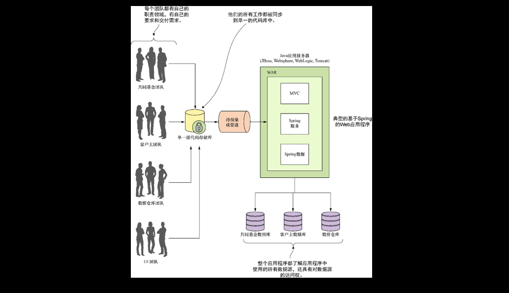
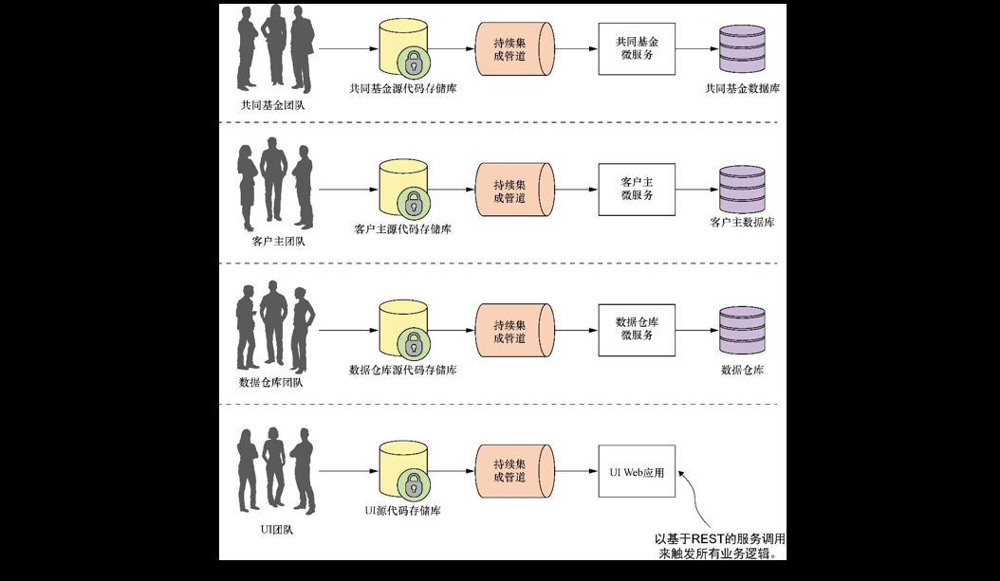
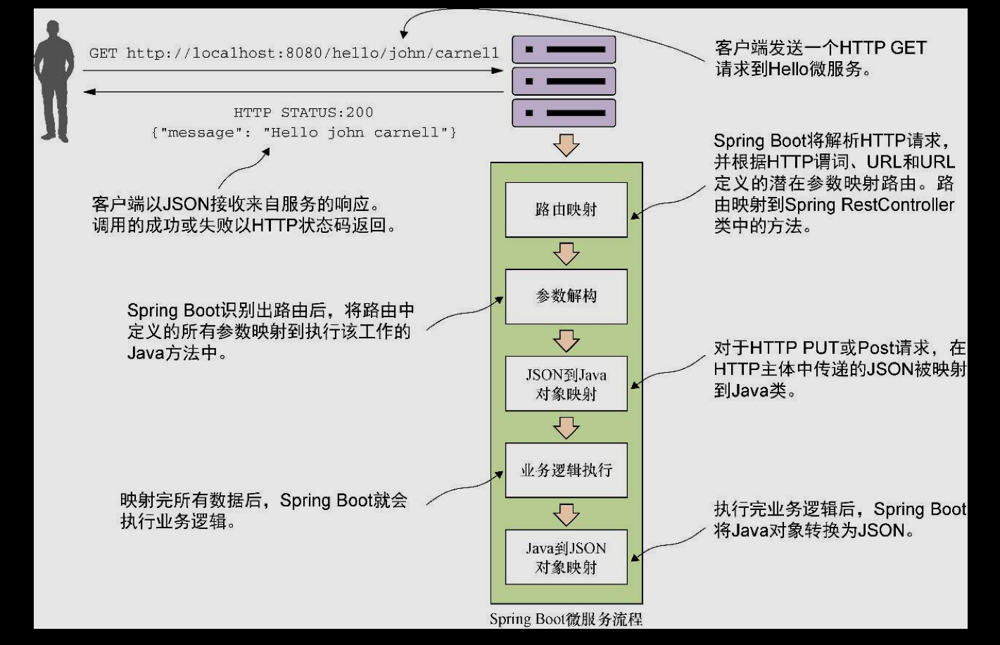
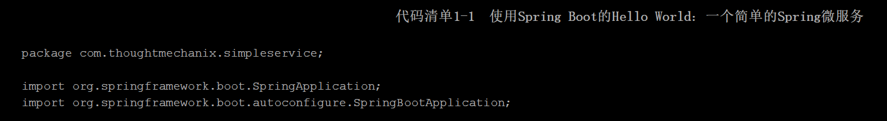
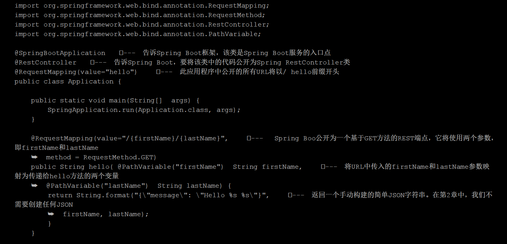
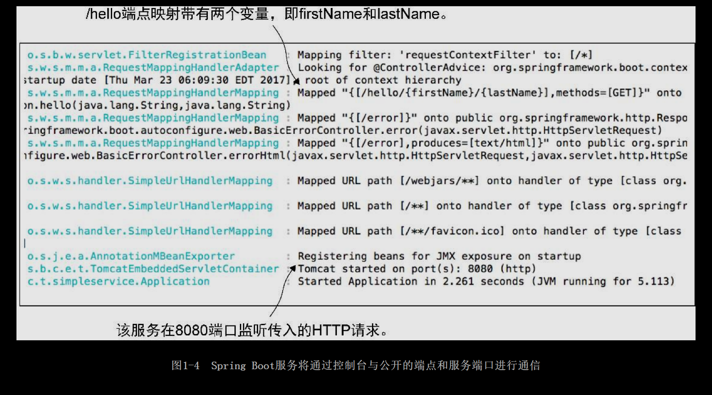
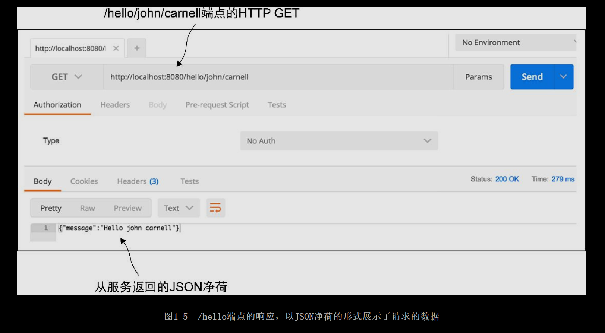
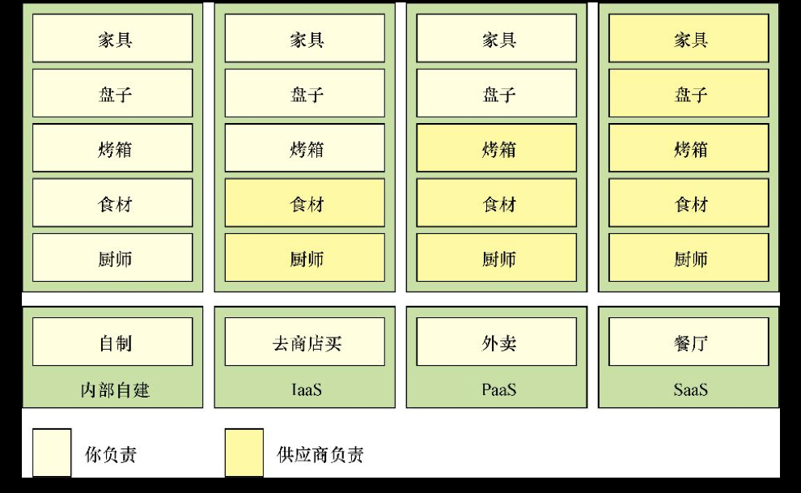
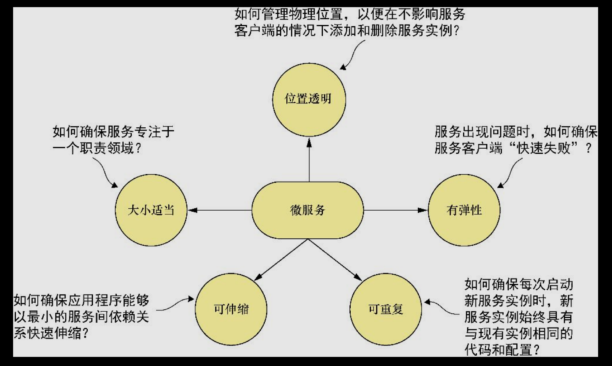

# [README](../README.md "回到 README")

# 第1章 欢迎迈入云世界，Spring
本章主要内容
* 了解微服务以及很多公司使用微服务的原因
* 使用Spring、Spring Boot和Spring Cloud来搭建微服务
* 了解云和微服务为什么与基于微服务的应用程序有关
* 构建微服务涉及的不只是构建微服务代码
* 了解基于云的开发的各个组成部分
* 在微服务开发中使用Spring Boot和Spring Cloud

作为软件开发者，我们一直处于一片混乱和不断变化的海洋之中，这已是软件开发领域中的一个常态。新技术与新方案的突然涌现会让我们受到强烈的冲击，使我们不得不重新评估应该如何为客户搭建和交付解决方案。使用微服务开发软件被许多组织迅速采纳就是应对这种冲击的一个例子。**微服务是松耦合的分布式软件服务，这些服务执行少量的定义明确的任务**。

本书主要介绍微服务框架，以及为什么应该考虑采用微服务架构来构建应用。我们将看到如何利用Java以及Spring Boot和Spring Cloud这两个Spring框架项目来构建微服务。Spring Boot和Spring Cloud为Java开发者提供了一条从开发传统的单体的Spring应用到开发可以部署在云端的微服务应用的迁移路径。

## 1.1 什么是微服务

在微服务的概念逐步形成之前，绝大部分基于Web的应用都是使用单体架构的风格来进行构建的。在单体架构中，应用程序作为单个可以部署的软件制品交付，所有的UI（用户接口）、业务、数据库访问逻辑都被打包在一个应用程序制品中并且部署在一个应用程序服务器上。

虽然应用程序可能是作为单个工作单元部署的，但大多数情况下，会有多个开发团队开发这个应用程序。每个开发团队负责应用程序的不同部分，并且他们经常用自己的功能部件来服务特定的客户。例如，我在一家大型的金融服务公司工作时，我们公司有一个内部定制的客户关系管理（CRM）应用，它涉及多个团队之间的合作，包括**UI团队、客户主团队、数据仓库团队以及共同基金团队**。图1-1阐示了这个应用程序的基本架构。

这里的问题在于，随着单体的CRM应用的规模和复杂度的增长，在该应用程序上进行开发的各个团队的沟通与合作成本没有减少。每当各个团队需要修改代码时，整个应用程序都需要重新构建、重新测试和重新部署。

**微服务的概念最初是在2014年前后悄悄蔓延到软件开发社区的意识中，它是对技术上和组织上扩大大型单体应用程序所面临的诸多挑战的直接回应**。记住，**微服务是一个小的、松耦合的分布式服务**。微服务允许将一个大型的应用分解为具有严格职责定义的便于管理的组件。微服务通过将大型代码分解为小型的精确定义的部分，帮助解决大型代码库中传统的复杂问题。在思考微服务时，一个需要信奉的重要概念就是：**分解和分离应用程序的功能，使它们完全彼此独立**。如果以图1-1所示的CRM应用程序为例，将其分解为微服务，那么它看起来可能像图1-2所示的样子。

由图1-2可以发现，每个功能团队完全拥有自己的服务代码和服务基础设施。他们可以彼此独立地去构建、部署和测试，因为他们的代码、源码控制仓库和基础设施（应用服务器和数据库）现在是完全独立于应用的其他部分的。

微服务框架具有以下的特征。
* 应用程序逻辑**分解为具有明确定义了职责范围的细粒度组件**，这些组件互相协调提供解决方案。
* 每个组件都有一个小的职责领域，并且**完全独立部署**。**微服务应该对业务领域的单个部分负责**。此外，一个微服务应该**可以跨多个应用程序复用**。
* 微服务**通信基于一些基本的原则**（注意，我说的是原则而不是标准），**并采用HTTP和JSON（JavaScript Object Natation）这样的轻量级通信协议**，在服务消费者和服务提供者之间进行数据交换。
* 服务的**底层采用什么技术实现并没有什么影响**，因为应用程序始终使用技术中立的协议（JSON是最常见的）进行通信。这意味着构建在微服务之上的应用程序能够使用多种编程语句和技术进行构建。
* 微服务利用其小、独立和分布式的性质，**使组织拥有明确责任领域的小型开发团队**。这些团队可能为同一个目标工作，如交付一个应用程序，但是每个团队只负责他们在做的服务。

我经常和同事开玩笑，说微服务是构建云应用程序的“诱人上瘾的毒药”。你开始构建微服务是因为它们能够为你的开发团队提供高度的灵活性和自治权，但你和你的团队很快就会发现，微服务的小而独立的特性使它们可以轻松地部署到云上。一旦服务运行在云中，它们小型化的特点使启动大量相同服务的实例变得很容易，应用程序瞬间变得更具可伸缩性，并且显而易见也会更有弹性。

## 1.2 什么是Spring，为什么它与微服务有关

在基于Java的应用程序构建中，Spring已经成为了事实上的标准开发框架。Spring的核心是建立在依赖注入的概念上的。在普通的Java应用程序中，应用程序被分解成类，其中每个类与应用程序中的其他类经常有明显的联系，这些联系是在代码中直接调用类的构造器，一旦代码被编译，这些联系点将无法修改。

这在大型项目中是有问题的，因为这些外部联系是脆弱的，并且进行修改可能会对其他下游代码造成多重影响。**依赖注入框架（如Spring），允许用户通过约定（以及注解）将应用程序对象之间的关系外部化，而不是在对象内部彼此硬编码实例化代码，以便更轻松地管理大型Java项目**。Spring在应用程序的不同的Java类之间充当一个中间人，管理着它们的依赖关系。Spring本质上就是让用户像玩乐高积木一样将自己的代码组装在一起。

Spring能够快速引入特性的特点推动了它的实际应用，使用J2EE技术栈开发应用的企业级Java开发人员迅速采用它作为一个轻量级的替代方案。J2EE栈虽然功能强大，但许多人认为它过于庞大，甚至许多特性从未被应用程序开发团队使用过。此外，J2EE应用程序强制用户使用成熟的（和沉重的）Java应用程序服务器来部署自己的应用程序。

Spring框架的迷人之处在于它能够与时俱进并进行自我改造——它已经向开发社区证明了这一点。Spring团队发现，许多开发团队正在将应用程序的展现、业务和数据访问逻辑打包在一起并部署为单个制品的单个应用程序模型中迁移，正转向高度分布式的模式，服务能够被构建成可以轻松部署到云端的小型分布式服务。为了响应这种转变，Spring开发团队启动了两个项目，即Spring Boot和Spring Cloud。

**Spring Boot**是对Spring框架理念重新思考的结果。虽然Spring Boot包含了Spring的核心特性，但它剥离了Spring中的许多“企业特性”，而**提供了一个基于Java的、面向REST的微服务框架**。只需一些简单的注解，Java开发者就能够快速构建一个可打包和部署的REST微服务，这个微服务并不需要外部的应用容器。

注意：
虽然本书会在第2章中更详细地介绍REST，但REST背后最核心的概念是，**服务应该使用HTTP动词（GET、POST、PUT和DELETE）来代表服务中的核心操作**，**并且使用轻量级的面向Web的数据序列化协议（如JSON）来从服务请求数据和从服务接收数据**。

在构建基于云的应用时，微服务已经成为更常见的架构模式之一，因此Spring社区为开发者提供了Spring Cloud。Spring Cloud框架使实施和部署微服务到私有云或公有云变得更加简单。**Spring Cloud在一个公共框架之下封装了多个流行的云管理微服务框架，并且让这些技术的使用和部署像为代码添加注解一样简便**。本章随后将介绍Spring Cloud中的不同组件。

## 1.3 在本书中读者会学到什么

本书是关于使用Spring Boot和Spring Cloud构建基于微服务框架的应用程序的，这些应用程序可被部署到公司内运行的私有云或Amazon、Google或Pivotal等运行的公有云上。在本书中，我们将介绍一些实际的例子。
* 微服务是什么以及构建基于微服务的应用程序的设计考虑因素。
* 什么时候不应该构建基于微服务的应用程序。
* 如何使用Spring Boot框架来构建微服务。
* 支持微服务应用程序的核心运维模式，特别是基于云的应用程序。
* 如何使用Spring Cloud来实现这些运维模式。
* 如何利用所学到的知识，构建一个部署管道，将服务部署到内部管理的私有云或公有云厂商所提供的环境中。

阅读完这本书，读者将具备构建和部署基于Spring Boot的微服务所需的知识，明白实施微服务的关键设计决策，了解服务配置管理、服务发现、消息传递、日志记录和跟踪以及安全性等如何结合在一起，以交付一个健壮的微服务环境，最后读者还会看到如何在私有云或公有云中部署微服务。

## 1.4 为什么本书与你有关

如果你已经仔细阅读了本书前面的内容，那么我假设你：
* 是一名Java开发者；
* 拥有Spring的背景；
* 对学习如何构建基于微服务的应用程序感兴趣；
* 对如何使用微服务来构建基于云的应用程序感兴趣；
* 想知道Java和Spring是否是用于构建基于微服务的应用程序的相关技术；
* 有兴趣了解如何将基于微服务的应用部署到云上。

我写这本书出于两个原因。第一，我已经看过许多关于微服务概念方面的好书，但我并没有发现一本如何基于Java实现微服务的好书。虽然我总是认为自己是一个精通多门编程语言的人，但Java是我们的核心开发语言，Spring是我构建一个新应用程序时要使用的开发框架。第一次发现Spring Boot和Spring Cloud，我便被其迷住了。当我构建运行在云上的基于微服务的应用程序时，Spring Boot和Spring Cloud极大地简化了我的开发生活。

第二，由于我在职业生涯中一直是架构师和工程师，很多次我都发现，我购买的技术书往往是两个极端，它们要么是概念性的，缺乏具体代码示例，要么是特定框架或者编程语言的机械概览。我想要的是这样一本书：它是架构和工程学科之间的良好的桥梁与媒介。在这本书中，我想向读者介绍微服务的开发模式以及如何在实际应用程序开发中使用它们，然后使用Spring Boot和Spring Cloud来编写实际的、易于理解的代码示例，以此来支持这些模式。

让我们转移一下注意力，使用Spring Boot构建一个简单的微服务。

## 1.5 使用Spring Boot来构建微服务

我一直以来都持有这样一个观点：如果一个软件开发框架通过了被我亲切地称为“卡内尔猴子测试”的试验，我就认为它是经过深思熟虑和易于使用的。如果一只像我（作者）这样的“猴子”能够在10min或者更少时间内弄明白一个框架，那么这个框架就通过了这个试验。这就是我第一次写Spring Boot服务示例的感觉。我希望读者也有同样的体验和快乐，所以，让我们花一点儿时间，看看如何使用Spring编写一个简单的“Hello World”REST服务。
    
在本节中，我们不会详细介绍大部分代码。这个例子的目标是让读者体会一下编写Spring Boot服务的感受。第2章中会深入更多的细节。

图1-3展示了这个服务将会做什么，以及Spring Boot微服务将会如何处理用户请求的一般流程。

这个例子并不详尽，甚至没有说明应该如何构建一个生产级别的微服务，但它同样值得我们注意，因为它只需要写很少的代码。在第2章之前，我不打算介绍如何设置项目构建文件或代码的细节。如果读者想要查看Maven pom.xml文件以及实际代码，可以在第1章对应的代码中找到它。第1章中的所有源代码都能在本书的GitHub存储库找到。

注意：
在尝试运行本书各章的代码示例之前，一定要先阅读附录A。附录A涵盖了本书中所有项目的一般项目布局、运行构建脚本的方法以及启动Docker环境的方法。本章中的代码示例很简单，旨在从桌面直接运行，而不需要其他章的信息。但在后面的几章，将很快开始使用Docker来运行本书中使用的所有服务和基础设施。如果读者还没有阅读附录A中与设置桌面环境相关的内容，请不要过多自行尝试，避免浪费时间和精力。

在这个例子中，创建一个名为Application的Java类（在simpleservice/src/com/thoughtmechanix/application/simpleservice/Application.java）的Java类，它公开了一个名为/hello的REST端点。Application类的代码，如代码清单1-1所示。

代码请求1-1中主要公开了一个GET HTTP端点，该端点将在URL上取两个参数（firstName和lastName），然后返回一个包含消息“Hello firstName lastName”的净荷的简单JSON字符串。如果在服务上调用了端点/hello/john/carnell，返回的结果（马上展示）将会是：

让我们启动服务。为此，请转到命令提示符并输入以下命令：

这条mvn命令将使用Spring Boot插件，然后使用嵌入式Tomcat服务器启动应用程序。

Java与Groovy以及Maven与Gradle！
Spring Boot框架对Java和Gradle编程语言提供了强力的支持。可以使用Groovy构建服务，而无需任何项目设置。Spring Boot还支持Maven和Gradle构建工具。我将本书的例子限制在Java和Maven中。作为一个长期的Groovy和Gradle的爱好者，我对语言和构建工具有良好的尊重，但为了保持本书的可管理性，并使内容更聚焦，我选择使用Java和Maven，以便照顾到尽可能多的读者。

如果一切正常开始，在命令行窗口中应该看到图1-4所示的内容。

检查图1-4中的内容，注意两件事。首先，端口8080上启动了一个Tomcat服务器；其次，在服务器上公开了/hello/{firstName}/{lastName}的GET端点。

这里将使用名为POSTMAN的基于浏览器的REST工具来调用服务。许多工具（包括图形和命令行）都可用于调用基于REST的服务，但是本书中的所有示例都使用POSTMAN。图1-5展示了POSTMAN调用http://localhost:8080/hello/john/carnell端点并从服务中返回结果。

显然，这个简单的例子并不能演示Spring Boot的全部功能。但是，我们应该注意到，在这里只使用了25行代码就编写了一个完整的HTTP JSON REST服务，其中带有基于URL和参数的路由映射。正如所有经验丰富的Java开发人员都会告诉你的那样，在25行Java代码中编写任何有意义的东西都是非常困难的。虽然Java是一门强大的编程语言，但与其他编程语言相比，它却获得了啰嗦冗长的名声。

完成了Spring Boot的简短介绍，现在必须提出这个问题：我们可以使用微服务的方式编写应用程序，这是否意味着我们就也应该这么做呢？在下一节，将介绍为什么以及何时适合使用微服务方法来构建应用程序。

## 1.6 为什么要改变构建应用的方式

我们正处于历史的拐点。现代社会的几乎所有方面都可以通过互联网连接在一起。习惯于当地市场服务的公司突然发现，他们可以接触到全球的客户群，全球更大的客户群一起涌进来的同时也带来了全球竞争。这些竞争压力意味着**以下力量正在影响开发人员考虑构建应用程序的方式**。
* **复杂性上升**——客户期望组织的所有部门都知道他们是谁。与单个数据库通信并且不与其他应用程序集成的“孤立的”应用程序已不再是常态。如今，**应用程序不仅需要与多个位于公司数据中心内的服务和数据库进行通信，还需要通过互联网与外部服务提供商的服务和数据库进行通信**。
* 客户期望更快速的交付——客户不再希望等待软件包的下一次年度发布或整体版本更新。相反，他们期望软件产品中的功能被拆分，以便在几周（甚至几天）内即可快速发布新功能，而无需等待整个产品发布。
* 性能和可伸缩性——全球性的应用程序使预测应用程序将处理多少事务量以及何时触发该事务量变得非常困难。应用程序需要快速跨多个服务进行扩大，然后在事务量高峰过去时进行收缩。
* 客户期望他们的应用程序可用——因为客户与竞争对手之间只有点击一下鼠标的距离，所以企业的应用程序必须具有高度的弹性。应用程序中某个部分的故障或问题不应该导致整个应用程序崩溃。

为了满足这些期望，作为应用开发人员，我们不得不接受这样一个悖论：**构建高可伸缩性和高度冗余的应用程序**。我们需要将应用程序分解成可以互相独立构建和部署的小型服务。如果将应用程序“分解”为小型服务，并将它们从单体制品中转移出来，那么就可以构建具有下面这些特性的系统。
* 灵活性——可以将解耦的服务进行组合和重新安排，以快速交付新的功能。一个正在使用的代码单元越小，更改代码越不复杂，测试部署代码所需的时间越短。
* 有弹性——解耦的服务意味着应用程序不再是单个“泥浆球”，在这种架构中其中一部分应用程序的降级会导致整个应用程序失败。故障可以限制在应用程序的一小部分之中，并在整个应用程序遇到中断之前被控制。这也**使应用程序在出现不可恢复的错误的情况下能够优雅地降级**。
* 可伸缩性——解耦的服务可以轻松地跨多个服务器进行水平分布，从而可以适当地对功能/服务进行伸缩。单体应用程序中的所有逻辑是交织在一起的，即使只有一小部分应用程序是瓶颈，整个应用程序也需要扩展。**小型服务的扩展是局部的，成本效益更高**。

为此，当我们开始讨论微服务时，请记住下面一句话：**小型的、简单的、和解耦的服务=可伸缩性、有弹性的和灵活的应用程序**。

## 1.7 云到底是什么

术语“云”已经被过度使用了。每个软件供应商都有云，每个软件供应商的平台都是支持云的，但是如果穿透这些天花乱坠的广告宣传，我们就会发现云计算有3种基本模式。它们是：
* 基础设施即服务（Infrastructure as a Service，IaaS）；
* 平台即服务（Platform as a Service,Paas）；
* 软件即服务（Software as a Service,SaaS）。

为了更好地理解这些概念，让我们将每天的任务映射到不同的云计算模型中。当你想吃饭时，你有4种选择：
    （1）在家做饭;
    （2）去食品杂货店买一顿预先做好的膳食，然后你加热并享用它；
    （3）叫外卖送到家里；
    （4）开车去餐厅吃饭。
图1-6展示了各种模型。

这些选择之间的区别是谁负责烹饪这些膳食，以及在哪里烹饪。在内部自建模型中，想要在家里吃饭就需要自己做所有的工作，还要使用家里面的烤箱和食材。商店购买的食材就像使用基础设施即服务（IaaS）计算模型一样，使用店内的厨师和烤箱预先烘烤餐点，但你仍然有责任加热膳食并在家里吃（然后清洗餐具）。

在平台即服务（PaaS）模型中，你仍然需要负责烹饪膳食，但同时依靠供应商来负责与膳食制作相关的核心任务。例如，在PaaS模型中，你提供盘子和家具，但餐厅老板提供烤箱、食材和厨师来做饭。在“软件即服务”（SaaS）模型中，你去到一家餐厅，在哪里，所有事物都已为你准备好。你在餐厅吃饭，然后在吃完后买单，你也不需要自己去准备和清洗餐具。

每个模型中的关键项都是控制：由谁来负责维护基础设施，以及构建应用程序的技术选择是什么？在IaaS模型中，云供应商提供基础设施，但你需要选择技术并构建最终的解决方案；而在SaaS模型中，你就是供应商所提供的服务的被动消费者，无法对技术进行选择，同时也没有任何责任来维护应用程序的基础设施。
    
新兴的云平台
本书已经介绍了目前正在使用的3种核心云平台类型（即Iaas、Paas和SaaS）。然而，新的云平台类型正在出现。这些新平台包括“函数即服务”（Functions as a Service,FaaS）和“容器即服务”（Container as a Service,Caas）。基于FaaS的应用程序会像亚马逊的Lambda技术和Google Cloud函数这样的设施，应用会将代码块以“无服务器”（serverless）的形式部署，这些代码会完全在云提供商的平台计算设施上运行。使用FaaS平台，无需管理任何服务器基础设施，只需支付执行函数所需的计算周期。

使用容器即服务模型，开发人员将微服务作为便携式虚拟容器（如Docker）进行构建并部署到云供应商。与IaaS模式不同，使用IaaS的开发人员必须管理部署服务的虚拟机，而CaaS则是将服务部署在轻量级的虚拟容器中。云供应商会提供运行容器的虚拟服务器，以及用于构建、部署、监控和伸缩容器的综合工具。亚马逊的弹性容器服务（Amazonn’s Elastic Container Service,Amazon ECS）就是一个基于CaaS平台的例子。在第10章中，我们将看到如何部署已构建的微服务到Amazon ECS。

需要重点注意的是，使用云就是的FaaS和CaaS模型，开发人员仍然可以构建基于微服务的框架。请记住，**微服务概念的重点在于构建有限职责的小型服务，并使用基于HTTP的接口进行通信**。新兴的云计算平台（如FaaS和Caas）是部署微服务的替代基础设施机制。

** 1.8 为什么是云和微服务

**微服务框架的核心概念之一就是每个服务都被打包和部署为离散的独立制品。服务实例应该迅速启动，服务的每一个实例都是完全相同的**。    

作为编写微服务的开发人员，我们迟早要决定是否将服务部署到下列某个环境之中。
* 物理服务器——虽然可以构建和部署微服务到物理机器，但由于物理服务器的局限性，很少有组织会这样做。开发人员不能快速提高物理服务器的容量，并且在多个物理服务器之间水平伸缩微服务可能会变得成本非常高。
* 虚拟机镜像——微服务的主要优点之一是能够快速启动和关闭微服务实例，以响应可伸缩性和服务故障事件。虚拟机是主要云供应商的心脏和灵魂。微服务可以打包在虚拟机镜像中，然后开发人员可以在IaaS私有或公有云中快速部署和启动服务的多个实例。
* 虚拟容器——虚拟容器是在虚拟机镜像上部署微服务的自然延伸。许多开发人员不是将服务部署到完整的虚拟机，而是将Docker容器（或等效的容器技术）部署到云端。虚拟容器在虚拟机内运行。使用虚拟容器，可以将单个虚拟机隔离成共享相同虚拟机镜像的一系列独立进程。

基于云的微服务的优势是以弹性的概念为中心。云服务供应商允许开发人员在几分钟内快速启动新的虚拟机和容器。如果服务容量需求下降，开发人员可以关闭虚拟服务器，而不会产生任何额外的费用。使用云供应商部署微服务可以显著地提高应用程序的水平可伸缩性（添加更多的服务器和服务实例）。服务器弹性也意味着应用程序可以更具弹性。如果其中一台微服务遇到问题并且处理能力正在不断下降，那么启动新的服务实例可以让应用程序保持足够长的存活时间，让开发团队能够从容而优雅地解决问题。    

本书会使用Docker容器将所有的微服务和相应的服务基础设施部署到基于IaaS的云供应商。下面列出的是用于微服务的常见部署拓扑结构。
* 简化的基础设施管理——IaaS云计算供应商可以让开发人员最有效地控制他们的服务。开发人员可以通过简单的API调用来启动和停止新服务。使用IaaS云解决方案，只需支付使用基础设施的费用。
* 大规模的水平伸缩性——IaaS云服务供应商允许开发人员快速简便地启动服务的一个或多个实例。这种功能意味着可以快速扩大服务以绕过表现不佳或出现故障的服务器。
* 通过地理分布实现高冗余——IaaS供应商必然拥有多个数据中心。通过使用IaaS云供应商部署微服务，可以比使用数据中心的集群拥有更高级别的冗余。

为什么不是基于PaaS的微服务    
本章前面讨论了3种云平台（基础设施即服务、平台即服务和软件即服务）。对于本书，我选择专注于使用IaaS的方法构建微服务。虽然某些云供应商可以让开发人员抽象出微服务的部署基础设施，但我选择保持独立于供应商并部署应用程序的所有部分（包括服务器）。    

例如，亚马逊、Cloud Foundry和Heroku可以让开发人员无需知道底层应用程序容器即可部署服务。他们提供了一个Web接口和API，以允许将应用程序部署为WAR或JAR文件。设置和调优应用程序服务器和相应的Java容器被抽象了出来。虽然这很方便，但每个云供应商的平台与其各自的PaaS解决方案有着不同的特点。    

**IaaS方案虽然需要更多的工作，但可跨多个云供应商进行移植**，并允许开发人员通过产品覆盖更广泛的受众。就个人而言，我发现基于PaaS的云解决方案可以快速启动开发工作，但一旦应用程序拥有足够多的微服务，开发人员就会开始需要云服务商提供的IaaS风格的灵活性。    
本章前面提到过新的云计算平台，如函数即服务（FaaS）和容器即服务（CaaS）。如果不小心，基于FaaS的平台就会将代码锁定到一个云供应商平台上，因为代码会被部署到供应商特定的运行时引擎上。使用基于FaaS的模型，开发人员可能会使用通用的编程语言（Java、Python、JavaScript等）编写服务，但开发人员仍然会将自己严格束缚在底层供应商的API和部署函数的运行时引擎上。    

本书中构建的服务都会打包为Docker容器。本书选择Docker的原因之一是，作为容器技术，Docker可以部署到所有主要的云供应商之中。稍后在第10章中，本书将演示如何使用Docker打包微服务，然后将这些容器部署到亚马逊云平台。

## 1.9 微服务不只是编写代码

尽管构建单个微服务的概念很易于理解，但运行和支持健壮的微服务应用程序（尤其是在云中运行）不只是涉及为服务编写代码。**编写健壮的服务需要考虑几个主题**。图1-7强调了这些主题。

下面我们来更详细地了解一下图1-7中提及的要点。
* 大小适当——如果确保正确地划分微服务的大小，以避免微服务承担太多的职责？请记住，适当的大小允许快速更改应用程序，并降低整个应用程序中断的总体风险。
* 位置透明——在微服务应用程序中，多个服务实例可以快速启动和关闭时，如何管理服务调用的物理细节？
* 有弹性——如何通过绕过失败的服务，确保采取“快速失败”的方法来保护微服务消费者和应用程序的整体完整性？
* 可重复——如何确保提供的每个新服务实例与生产环境中的所有其他服务实例具有相同的配置和代码库？
* 可伸缩——如何使用异步处理和事件来最小化服务之间的直接依赖关系，并确保可以优雅地扩展微服务？

本书采用基于模式的方法来回答这些问题。通过基于模式的方法，本书列出可以跨不同技术实现来使用的通用设计。虽然本书选择了使用Spring Boot和Spring Cloud来实现本书中所使用的模式，但开发人员完全可以把这些概念和其他技术平台一起使用。具体来说，本书涵盖以下6类微服务模式：
* 核心微服务开发模式；
* 微服务路由模式；
* 微服务客户端弹性模式；
* 微服务安全模式；
* 微服务日志记录和跟踪模式；
* 微服务构建和部署模式。

让我们深入了解一下这些模式。

### 1.9.1 核心微服务开发模式

# [README](../README.md "回到 README")