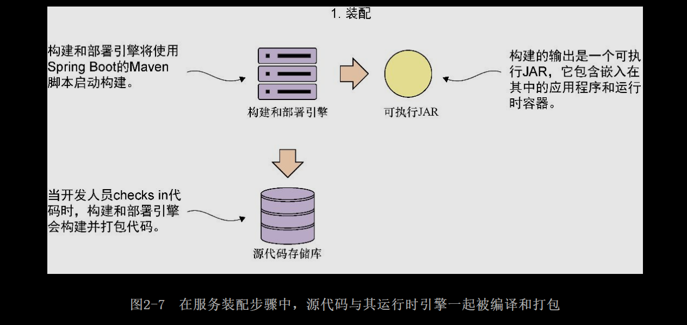

# [README](../README.md "回到 README")

# 第2章 使用Spring Boot构建微服务

本章主要内容
* 学习微服务的关键特征
* 了解微服务是如何适应云架构的
* 将业务领域分解成一组微服务
* 使用Spring Boot实现简单的微服务
* 掌握基于微服务架构构建应用程序的视角
* 学习什么时候不应该使用微服务

软件开发的历史充斥着大型开发项目崩溃的故事，这些项目可能投资了数百万美元、集中了行业里众多的顶尖人才、消耗了开发人员成千上万的工时，但从未给客户交付任何有价值的东西，最终由于其复杂性和负担而轰然倒塌。

这些庞大的项目倾向于遵循大型传统的瀑布开发方法，坚持在项目开始时界定应用的所有需求和设计。这些项目的开发人员非常重视软件说明书的“正确性”，却很少能够满足新的业务需求，也很少能够重构并从开发初期的错误中重新思考和学习。

但现实情况是，软件开发并不是一个由定义和执行所组成的线性过程，而是一个演化过程，在开发团队真正明白手头的问题前，需要经历与客户沟通、向客户学习和向客户交付的数次迭代。

使用**传统的瀑布方法所面临的挑战在于**，许多时候，这些项目交付的软件制品的粒度具有以下特点。
* 紧耦合的——业务逻辑的调用发生在编程语言层面，而不是通过实现中立的协议（如SOPA和REST）。这大大增加了即使对应用程序组件进行小的修改也可能打破应用程序的其他部分并引入新漏洞的机会。
* 有漏洞的——大多数大型软件应用程序都在管理着不同类型的数据。例如，客户关系管理（CRM）应用程序可能会管理客户、销售和产品信息。在传统的模型里，这些数据位于相同的数据模型中并在同一个数据存储中保存。即使数据之间存在明显的界限，在绝大多数的情况下，来自一个领域的团队也很容易之间访问属于另一个团队的数据。这种对数据的轻松访问引入了隐藏的依赖关系，并让组件的内部数据结构的实现细节泄露到整个应用程序中。即使对单个数据库表的更改也可能需要在整个应用程序中进行大量的代码更改和回归测试。
* 单体的——由于传统应用程序的大多数组件都存在多个团队共享的单个代码库中，任何时候更改代码，整个应用程序都必须重新编译、重新运行并且需要通过一个完整的测试周期并重新部署。无论是新客户的需求还是修复错误，应用程序代码库的微小变化都将变得昂贵和耗时，并且几乎不可能及时实现大规模的变化。

基于微服务的架构采用不同的方法来交付功能。具体来说，基于微服务的架构具有以下特点。
* 有约束的——微服务具有范围有限的单一职责集。微服务遵循UNIX的理念，即应用程序是服务的机会，每个服务只做一件事，并只做好一件事。
* 松耦合的——基于微服务的应用程序是小型服务的集合，服务之间使用非专属调用协议（如HTTP何REST）通过非特定实现的接口彼此交互。与传统的应用程序架构相比，只要服务的接口没有改变，微服务的所有者可以更加自由地对服务进行修改。
* 抽象的——微服务完全拥有自己的数据结构和数据源。微服务所拥有的数据只能由该服务修改。可以锁定微服务数据的数据库访问控制，仅允许该服务访问它。
* 独立的——微服务应用程序中的每个微服务可以独立于应用程序中使用的其他服务进行编译和部署。这意味着，与依赖更重的单体应用程序相比，这样对变化进行隔离和测试更容易。

为什么这些微服务架构属性对基于云的开发很重要？基于云的应用程序通常有以下特点。
* 拥有庞大而多样化的用户群——不同的客户需要不同的功能，他们不想在开始使用这些功能之前等待漫长的应用程序发布期。微服务允许功能快速交付，因为每个服务的范围很小，并通过一个定义明确的接口进行访问。
* 极高的运行时间要求——由于微服务的分散性，基于微服务的应用程序可以更容易地将故障和问题隔离到应用程序的特定部分之中，而不会使整个应用程序崩溃。这可以减少应用程序的整体宕机时间，并使它们对问题更有抵御能力。
* 不均匀的容量需求——在企业数据中心内部部署的传统应用程序通常具有一致的使用模式，这些使用模式会随着时间的推移而定期出现，这使这种类型的应用程序的容量规划变得更简单。但是一个基于云的应用中，Twitter上的一条简单推文或Slashdot上的一篇文章就能够极大带动对基于云计算的应用的需求。
* 因为微服务应用程序被分解成可以彼此独立部署的小组件，所以能够更容易将重点放在正处于高负载的组件上，并将这些组件在云中的多个服务器上进行水平伸缩。

本章的内容会包含在业务问题中构建和识别微服务的基础知识，构建微服务的骨架，然后理解在生产环境中成功部署和管理微服务的运维属性。

要想成功设计和构建微服务，开发人员需要像警察向目击证人询问犯罪活动一样着手处理微服务。即使每个证人看到同一事件发生，它们对犯罪活动的解释也是根据他们的背景、它们所看重的东西（例如，给予它们动机的东西），以及在那个时刻目睹这个事件所带来的环境压力塑造出来的。每个参与者都有他们自己认为重要的视角（和偏见）。

就像一名成功的警察试图探寻真相一样，构建一个成功的微服务架构的过程需要结合软件开发组织内多个人的视角。尽管交付整个应用程序需要的不仅仅是技术人员，但我相信，成功的微服务开发的基础是从以下3个关键角色的视角开始的。
* 架构师——架构师的工作是看到大局，了解应用程序如何分解为单个微服务，以及微服务如何交互以交付解决方案。
* 软件开发人员——软件开发人员编写代码并详细了解如何将编程语言和语言的开发框架用于交付微服务。
* DevOps工程师——DevOps工程师不仅为生产环境而且为所有非生产环境提供服务部署和管理的智慧。**DevOps工程师的口号是：保障每个环境中的一致性和可重复性**。

本章将演示如何从这些角色的视角使用Spring Boot和Java设计和构建一组微服务。到本章结束时，读者将有一个可以打包并部署到云的服务。

## 2.1 架构师的故事：设计微服务架构

架构师在软件项目中的**作用是提供待解决问题的工作模型**。架构师的工作是提供脚手架，开发人员将根据这些脚手架构建他们的代码，使应用程序所有部件都组合在一起。

在构建微服务架构时，项目的架构师主要关注以下3个关键任务：
（1）分解业务问题；
（2）建立服务粒度；
（3）定义服务接口。

### 2.1.2 分解业务问题

面对复杂性，大多数人视图将他们正在处理的问题分解成可管理的块。因为这样他们就不必努力把问题的所有细节都考虑进来。他们将问题抽象地分解成几个关键部分，然后寻找这些部分直接存在的关系。

在微服务架构中，架构师**将业务问题分解成代表离散活动领域的块**。这些块封装了与业务域特定部分相关联的业务规则和数据逻辑。

虽然我们希望微服务封装执行单个事务的所有业务规则，但这并不总是行得通。我们经常会遇到需要跨业务领域不同部分的一组微服务来完成整个事务的情况。架构师通过查看数据域中那些不适合放到一起的地方来**划分一组微服务的服务边界**。
    
例如，架构师可能会看到代码执行的业务流程，并意识到它们同时需要客户和产品信息。存在两个离散的数据域时，通常就意味着需要使用多个微服务。业务事务的两个不同部分如何交互通常成为微服务的服务接口。

分离事务领域是一门艺术，而不是非黑即白的科学。读者可以使用以下指导方针将业务问题识别和分解为备选的微服务。

（1）描述业务问题，并聆听用来描述问题的名词。在描述问题时，反复使用的同一个名词通常意味着它们是核心业务领域并且适合创建微服务。第1章中EagleEye域的目标名词可能会是合同、许可证和资产。

（2）注意动词。动词突出了动作，通常代表问题域的自然轮廓。如果发现自己说出“事务X需要从事务A和事务B获取数据”这样的话，通常表明多个服务正在起作用。如果把注意动词的方法应用到EagleEye上，那么就可能会查找像“来自桌面服务的Mike安装新PC时,他会查找软件X可用的许可证数量，如果有许可证，就安装软件。然后他更新了跟踪电子表格中使用的许可证的数量”这样的陈述句。这里的关键动词是查找和更新。

（3）寻找数据内聚。将业务问题分解成离散的部分时，要寻找彼此高度相关的数据。如果在会话过程中，突然读取或更新与迄今为止所讨论的内容完全不同的数据，那么就可能还存在其他候选服务。微服务应完全拥有自己的数据。
    
让我们将这些指导方针应用到现实世界的问题中。第1章介绍了一种名为EagleEye的现有软件产品，该软件产品用于管理软件资产，如软件许可证和安全套接字层（SSL）证书。这些软件资产被部署到组织中的各种服务器上。

EagleEye是一个传统的单体Web应用程序，部署在位于客户数据中心内的J2EE应用程序服务器。我们的目标是将现有的单体应用程序梳理成一组服务。

首先，我们要采访EagleEye应用程序的所有用户，并讨论他们是如何交互和使用EagleEye的。图2-1描述了与不同业务客户进行的对话的总结。通过查看EagleEys的用户是如何与应用程序进行交互的，以及如何将应用程序的数据模型分解出来，可以将EagleEye问题域分解为以下备选微服务。

图2-1强调了与**业务用户对话时出现的一些名词和动词**。因为这是现有的应用程序，所以可以查看应用程序并将主要名词映射到物理数据模型的表。现有应用程序可能有数百张表，但每张表通常会映射回一组逻辑实体。

图2-2展示了基于与EagleEye客户对话的简化数据模型。基于业务对话和数据模型，备选微服务是组织、许可证、合同和资产服务。

### 2.1.2 建立服务粒度

拥有了简化的数据模型，就可以开始定义在应用程序中需要哪些微服务。根据图2-2中的数据模型，可以看到潜在的4个微服务基于以下元素：
* 资产；
* 许可证；
* 合同；
* 组织。

我们的目标是将这些主要的功能部件提取到完全独立的单元中，这些单元可以独立构建和部署。但是，**从数据模型中提取服务需要的不只是将代码重新打包到单独的项目中，还涉及梳理出服务访问的实际数据库表**，并且只允许每个单独的服务访问其特定域中的表。图2-3展示了应用程序代码和数据模型如何被“分块”到各个部分。

将问题域分解成不同的部分后，开发人员通常会发现自己不确定是否为服务划分了适当的粒度级别。一个太粗的粒度或太细粒度的微服务将具有很多特征，我们将在稍后讨论。

构建微服务架构时，粒度的问题很重要，可以采用以下思想来确定正确的解决方案。

（1）开始的时候可以让微服务设计的范围更广泛一些，然后将其重构到更小的服务——在开始微服务旅程之处，容易出现的一个极端情况就是将所有的事情都变成微服务。但是将问题域分解为小型的服务通常会导致过早的复杂性，因为微服务变成了细粒度的数据服务。

（2）重点关注服务如何相互交互——这有助于建立问题域的粗粒度接口。从粗粒度重构到细粒度是比较容易的。

（3）随着对问题域的理解不断增长，服务的职责将随着时间的推移而改变——通常来说，当需要新的应用功能时，微服务就会承担起职责。最初的微服务可能会发展为多个服务，原始的微服务则充当这些新服务的编排层，负责将应用的其他部分的功能封装起来。

应该通过演化思维的过程来开发一个微服务架构，在这个过程中，你知道不会第一次就得到正确的设计。这就是最好从一组粗粒度的服务而不是一组细粒度的服务开始的原因。通用重要的是，不要对设计带有教条主义。**我们可能会面临两个单独的服务之间交互过于频繁，或者服务的域之间不存在明确的边界这样的物理约束，当面临这样的约束时，需要创建一个聚合服务来将数据连接在一起**。

最后，采取务实的做法并进行交付，而不是浪费时间试图让设计变得完美，最终导致没有东西可以展现你的努力。

### 2.1.3 互相交流：定义服务接口

架构师需要关心的最后一部分，是应用程序中的微服务该如何彼此交流。**使用微服务构建业务逻辑时，服务的接口应该是直观的，开发人员应该通过学习应用程序中的一两个服务来获得应用程序中所有服务的工作节奏**。

一般来说，可使用以下指导方针思考服务接口设计。

（1）拥抱REST的理念——REST对服务的处理方式是将HTTP作为服务的调用协议并使用标准HTTP动词（GET、PUT、POST和DELETE）。围绕这些HTTP动词对基本行为进行建模。

（2）使用URI来传达意图——用作服务端点的URI应描述问题域的不同资源，并为问题域内的资源的关系提供一种基本机制。

（3）请求和响应使用JSON——JavaScript对象表示法（JavaScript Object Notation，JSON）是一个非常轻量级的数据序列化协议，并且比XML更容易使用。

（4）使用HTTP状态码来传达结果——HTTP协议具有丰富的标准响应代码，以指示服务的成功或失败。学习这些状态码，并且最重要的是在所有服务中始终如一地使用它们。

所有这些指导方针都是为了完成一件事，那就是**使服务接口易于理解和使用**。我们希望开发人员坐下来查看一下服务接口就能开始使用它们。如果微服务不容易使用，开发人员就会另辟道路，破坏架构的意图。

## 2.2 何时不应该使用微服务

本书用这一章来谈论为什么微服务是构建应用程序的强大架构模式。但是，本书还没有提及什么时候不应该使用微服务来构建应用程序。接下来，让我们了解一下其中的考量因素：

（1）构建分布式系统的复杂性；

（2）虚拟服务器/容器散乱；

（3）应用程序的类型；

（4）数据事务和一致性。

### 2.2.1 构建分布式系统的复杂性

因为微服务是分布式和细粒度（小）的，所以它们在应用程序中引入了一层复杂性，而在单体应用程序中就不会出现这样的情况。微服务架构需要高度的运维成熟度。除非组织愿意投入高分布式应用程序获得成功所需的**自动化和运维工作（监控、伸缩）**，否则不要考虑使用微服务。

### 2.2.2 服务器散乱

微服务最常用的部署模式之一就是在一个服务器上部署一个微服务实例。在基于微服务的大型应用程序中，最终可能需要50~100台服务器或容器（通常是虚拟的），这些服务器或容器必须单独搭建和维护。即使在云中运行这些服务的成本较低，管理和监控这些服务器的操作复杂性也是巨大的。

### 2.2.3 应用程序的类型

**微服务面向可复用性，并且对构建需要高度弹性和可伸缩性的大型应用程序非常有用**。这就是这么多云计算公司采用微服务的原因之一。如果读者正在构建小型的、部门级的应用程序或具有较小用户群的应用程序，那么搭建一个分布式模型（如微服务）的复杂性可能太昂贵了，不值得。

### 2.2.4 数据事务和一致性

开始关注微服务时，需要考虑服务的数据使用模式以及服务消费者如何使用它们。微服务包装并抽象出少量的表，作为执行“操作型”任务的机制，如创建、添加和执行针对存储的简单（非复杂的）查询，其工作效果很好。
    
**如果应用程序需要跨多个数据源进行复杂的数据聚合或转换，那么微服务的分布式性质会让这项工作变得很困难**。这样的微服务总是承担太多的职责，也可能变得容易受到性能问题的影响。

还要记住，在微服务间执行事务没有标准。如果需要事务管理，那就需要自己构建逻辑。另外，如第7章所述，微服务可以通过使用消息进行通信。**消息传递在数据更新中引入了延迟。应用程序需要处理最终的一致性，数据的更新可能不会立即出现**。

## 2.3 开发人员的故事：用Spring Boot和Java构建微服务

在构建微服务时，从概念到实现，需要视角的转换。具体来说，开发人员需要建立一个实现应用程序中每个微服务的基本模式。虽然每项服务都是独一无二的，但我们希望确保使用的是一个移除样板代码的框架，并且微服务的每个部分都采用相同的布局。
    
在本节中，我们将探讨开发人员从EagleEye域模型构建许可证微服务的优先事项。许可证服务将使用Spring Boot编写。**Spring Boot是标准Spring库之上的一个抽象层，它允许开发人员快速构建基于Groovy和Java的Web应用程序和微服务，比成熟的Spring应用程序能够节省大量的配置**。

对于许可证服务示例，这里将使用**Java作为核心编程语言并使用Apache Maven作为构建工具**。

在接下来的几节中，我们将要完成以下几项工作。

（1）构建微服务的基本框架并构建应用程序的Maven脚本。

（2）实现一个Spring引导类，它将启动用于微服务的Spring容器，并启动类的所有初始化工作。

（3）实现映射端点的Spring Boot控制器类，以公开服务的端点。

2.3.1 从骨架项目开始

首先，要为许可证服务创建一个骨架项目。读者可以从本章的GitHub存储库拉取源代码，也可以创建具有以下目录结构的许可证服务项目目录：
* licensing-sevice
* src/main/java/com/thoughtmechanix/licenses
* controllers
* model
* services
* resources

一旦拉取或创建了这个目录结构，就可以开始为项目编写Maven脚本。这就是位于项目根目录下的pom.xml文件。代码清单2-1展示了许可证服务的Maven POM文件。

这里不会详细讨论整个脚本，但是在开始的时候要注意几个关键的地方。Spring Boot被分解成许多个独立的项目。其理念是，如果不需要在应用程序中使用Spring Boot的各个部分，那么就不应该“拉取整个世界”。这也使不同的Spring Boot项目能够独立地发布新版本的代码。为了简化开发人员的开发工作，Spring Boot团队将相关的依赖项目收集到各种“起步”（starter）工具包中。Maven POM的第一部分告诉Maven需要拉取Spring Boot框架的1.4.4版本。
    
Maven文件的第二部分和第三部分确定了要拉取Spring Web和Spring Actuator起步工具包。这两个项目几乎是所有基于Spring Boot REST服务的核心。读者会发现，服务中构建功能越多，这些依赖项目的列表就会变得越长。

此外，Spring Source还提供了Maven插件，可简化Spring Boot应用程序的构建和部署。第四部分**高速Maven构建脚本安装最新的Spring Boot Maven插件。此插件包含许多附加任务（如spring-boot:run），可以简化Maven和Spring Boot之间的交互**。

最后，读者必将看到一条注释，说明Maven文件的那些部分已经被删除。为了简化，本书没有在代码清单2-1中包含Spotify Docker插件。

### 2.3.2 引导Spring Boot应用程序：编写引导类

我们的目标是在Spring Boot中运行一个简单的微服务，然后重复这个步骤以提供功能。为此，我们需要在许可证服务微服务中创建以下两个类。
* 一个Spring引导类，可以被Spring Boot用于启动和初始化应用程序。
* 一个Spring控制器类，用来公开可以被微服务调用的HTTP端点。

如刚才所见，Spring Boot使用注解来简化设置和配置服务。在代码清单2-2中查看引导类时，这一点就变得显然易见。这个引导类位于src/main/java/com/thoughtmechanix/licenses/Application.java文件。

在这段代码中需要注意的第一件事是@SpringBootApplication的用法。Spring Boot使用这个注解来告诉Spring容器，这个类是Spring中使用的bean定义的源。在Spring Boot应用程序中，可以通过以下方法定义Spring Bean。
* 用@Component、@Server或@Repository注解标签来标注一个Java类。
* 用@Configuration注解标签来标注一个类，然后为每个我们想要构建的Spring Bean定义一个构造器方法并为方法添加上@Bean标签。
    
在幕后，@SpringBootApplication注解将代码清单2-2中的Application类标记为配置类，然后开始自动扫描Java类路径上所有的类以形成其他的Spring Bean。

第二件需要注意的事是Application类的main()方法。在main()方法中，Spring Application.run(Application.class,args)调用启动了Spring容器，然后返回一个Spring ApplicationContext对象（这里没有使用ApplicationContext做任何事情，因此它没有在代码中展示。）。

关于**@SpringBootApplication注解及其对应的Application类，最容易记住的是，它是整个微服务的引导类。服务的核心初始化逻辑应该放在这个类中**。

### 2.3.3 构建微服务的入口：Spring Boot控制器

现在已经有了构建脚本，并实现了一个简单的Spring Boot引导类，接下来就可以开始编写第一个代码来做一些事情。这个代码就是控制器类。在Spring Boot应用程序中，控制器类公开了服务端点，并将数据从传入的HTTP请求映射到将处理该方法的Java方法。

> 遵循REST
> 
>本书中所有微服务都遵循REST方法来构建。对REST的深入讨论超出了本书的范围，但对于本书，我们构建的所有服务都将具有以下特点。
>
>使用HTTP作为服务的调用协议——服务将通过HTTP端点公开，并使用HTTP协议传输进出服务的数据。
>
>将服务的行为映射到标准的HTTP动词——**REST强调将服务的行为映射到POST、GET、PUT和DELETE这样的HTTP动词上**。这些动词映射到大多数服务中的CRUD功能。

>使用JSON作为进出服务的所有数据的序列化格式——对基于REST的微服务来说，这不是一个硬性原则，但是JSON已经成为通过微服务提交和返回数据的通用语言。当然也可以使用XML，但是许多基于REST的应用程序大量使用JavaScript和JSON。**JSON是基于JavaScript的Web前端和服务对数据进行序列化和反序列化的原生格式**。

>使用HTTP状态码来传达服务调用的状态——HTTP协议开发了一组丰富的状态码，以指示服务的成功或失败。基于REST的服务利用这些HTTP状态码和其他基于Web的基础设施，如反向代理和缓冲，可以相对容易地与微服务集成。

>HTTP是Web的语言，使用HTTP作为构建服务的哲学是构建云服务的关键。

第一个控制器类LiscenseSerriceController位于src/main/java/com/thoughtmechanix/licenses/controllers/LicenseServiceController. java 中。这个类将公开4个HTTP端点，这些端点将映射到POST、GET、PUT和DELETE动词。

让我们看一下控制器类，看看Spring Boot如何提供一组注解，以保证花最少的努力公开服务端点，使开发人员能够集中精力构建服务的业务逻辑。我们将从没有任何类方法的基本控制器类定义开始。代码清单2-3展示了为许可证服务构建的控制器类。

我们通过查看@RESTController注解来开始探索。**@RestController是一个类级别Java注解，它告诉Spring容器这个Java类将用于基于REST的服务**。**此注解自动处理以JSON或XML方式传递到服务中的数据的序列化（在默认情况下，@RestController类将返回的数据序列化为JSON）**。与传统的Spring @Controller注解不同，@RestController注解并不需要开发者从控制器类返回ResponseBody类。这一切都由@RestConstroller注解进行处理，它包含了@ResponseBody注解。

>为什么是JSON
>
>在基于HTTP的服务之间发送数据时，其实有多种可选的协议。由于以下几个原因，JSON已经成为事实上的标准。
>
>首先，与其他协议（如基于XML的SOP（Simple Object Access Protocol，简单对象访问协议））相比，它非常轻量级，可以在没有太多文本开销的情况下传递数据。
>
> 其次，JSON易于人们阅读和消费。这在选择序列化协议时往往被低估。当出现问题时，开发人员可以快速查看一大堆JSON，直观地处理其中的内容。JSON协议的简单性让这件事非常容易做到。
>
> 最后，JSON是JavaScript使用的默认序列化协议。由于JavaScript作为编程语言的急剧增长以及依赖于JavaScript的单页互联网应用程序（Single Page Internet Application,APIA）的同样快速增长，JSON已经天然适用于构建基于REST的应用程序，因为前端Web客户端用它来调用服务。
>
>其他机制和协议能够比JSON更有效地在服务之间进行通信。**Apache Thrift框架允许构建使用二进制协议相互通信的多语言服务。Apache Avro协议是一种数据序列化协议，可在客户端和服务器调用之间将数据转换为二进制格式**。
> 
> 如果读者需要最小化通过线路发送的数据的大小，我建议查看这些协议。但是根据我的经验，在微服务中使用直接的JSON就可以有效地工作，并且不会在服务消费者和服务客户端间插入另一层通信来进行调试。

代码清单2-3中展示的第二个注解是@RequestMapping。可以使用**@RequestMapping作为类级注解和方法级注解。@RequestMapping注解用于告诉Spring容器该服务将要公开的HTTP端点**。使用类级的@RequestMapping注解时，将为该控制器公开的所有其他端点建立URL的根。

在代码清单2-3中，@RequestMapping(value="/v1/organizations/{organizationId}/licenses")使用value属性为控制器类中公开的所有端点建立URL的根。在此控制器中公开的所有服务端点将以/v1/organizations/{organizationId}/licenses作为其端点的根。{organizationId}是一个占位符，表明如何使用在每个调用中传递的organizationId来参数化URL。在URL中使用organizationId可以区分使用服务的不同客户。

现在将添加控制器的第一个方法。这个方法将实现REST调用中的GET动词，并返回单个License类实例，如代码清单2-4所示（为了便于讨论，将实例化一个名为License的Java类）。

这一代码清单中完成的第一件事是，使用方法级的@RequestMapping注解来标记getLicenses()方法，将两个参数传递给注解，即value和method。通过方法级的@Request Mapping注解，再结合类顶部指定的根级注解，我们将所有传入该控制器的HTTP请求与端点/v1/organizations/{organizationId}/licences/{licensedId}匹配起来。该注解的第二个参数method指定该方法将匹配的HTTP动词。在前面的例子中，以RequestMethod.GET枚举的形式匹配GET方法。

关于代码清单2-4，需要注意的第二件事是getLicenses()方法的参数体中使用了@PathVariable注解。**@PathVariable注解用于将在传入的URL中传递的参数值（由{parameterName}语法表示）映射为方法的参数**。在代码清单2-4所示的示例代码中，将两个参数organizationId和licenseId映射到方法中的两个参数级变量：

> 端点命名问题
>
> 在编写微服务之前，要确保（以及组织中的其他可能的团队）为服务公开的端点建立标准。应该使用微服务的URL（Uniform Resource Locator，统一资源定位器）来明确传达服务的意图、服务管理的资源以及服务内服务内管理的资源之间存在的关系。以下指导方针有助于命名服务端点。
> * 使用明确的URL名称来确立服务所代表的资源——使用规范的格式定义URL将有助于API更直观，更易于使用。要在命名约定中保持一致。
> * 使用URL来确立资源之间的关系——通常，在微服务中会存在一种父子关系，在这些资源中，子项不会存在于父项的上下文之外（因此可能没有针对该子项的单独的微服务）。使用URL来表达这些关系。但是，如果发现URL嵌套过长，可能意味着微服务尝试做的事情太多了。
> * 尽早建立URL的版本控制方案——URL及其对应的端点代表了服务的所有者和服务的消费者之间的契约。一种常见的模式是使用版本号作为前缀添加到所有端点上。尽早建立版本控制方案，并坚持下去。在几个消费者使用它们之后，对URL进行版本更新是非常困难的。

现在，可以将我们刚刚创建的东西称为服务。在命令行窗口中，转到下载示例代码的项目目录，然后执行以下Maven命令：

一旦按下回车键，应该会看到Spring Boot启动一个嵌入式Tomcat服务器，并开始监听8080端口。

服务启动后就可以直接访问公开的端点了。因为公开的第一个方法是GET调用，可以使用多种方法来调用这一服务。我的首选方法时使用基于Chrome的工具，如POSTMAN或CURL来调用该服务。图2-5展示了在http://localhost:8080/v1/organizations/e254f8c-c442-4ebe-a82a-e2fc1d1ff78a/licenses/f3831f8c-c338-4ebe-a82a-e2fc1d1ff78a 端点上完成的一个GET请求。

现在我们已经有了一个服务的运行骨架。但从开发的角度来看，这个服务还不完整。良好的微服务设计不可避免地将服务分成定义明确的业务逻辑和数据访问层。在后面几章中，我们将继续对此服务进行迭代，并进一步深入了解如何构建该服务。

我们来看看最后一个视角——探索DevOps工程师如何实施服务并将其打包以部署到云中。

## 2.4 DevOps工程师的故事：构建运行时的严谨性

对于DevOps工程师来说，微服务的设计关乎在投入生产后如何管理服务。编写代码通常是很简单的，而保持代码运行却是困难的。

虽然DevOps是一个丰富而新兴的IT领域，在本书后面，读者将基于4个原则开始微服务开发工作并根据这些原则去构建。这些原则具体如下。
* 微服务应该是独立的和可独立部署的，多个服务实例可以使用单个软件制品进行启动和拆卸。
* 微服务应该是可配置的。当服务实例启动时，它应该从中央位置读取需要配置其自身的数据，或者让它的配置信息作为环境变量传递。配置服务无需人为干预。
* 微服务实例需要对客户端是透明的。客户端不应该知道服务的确切位置。相反，微服务客户端应该与服务发现代理通信，该代理允许应用程序定位微服务的实例，而不必知道微服务的物理位置。
* 微服务应该传达它的健康信息，这是云架构的关键部分。一旦微服务实例无法正常运行，客户端需要绕过不良服务实例。

这4条原则揭示了存在于微服务开发中的悖论。微服务在规模和范围上更小，但使用微服务会在应用程序中引入更多的活动部件，特别是因为微服务在它自己的分布式容器中彼此独立分布和运行，引入了高度协调性的同时也容易为应用程序带来故障点。

从DevOps的角度来看，必须解决微服务的运维需求，并将这4条原则转换为每次构建和部署微服务到环境中时发生的一系列生命周期事件，这4条原则可以映射到以下运维生命周期步骤。
* 服务装配——如何打包和部署服务以保证可重复性和一致性，以便相同的服务代码和运行时被完全相同地部署？
* 服务引导——如何将应用程序和环境特定的配置代码与运行时代码分开，以便可以在任何环境中快速启动和部署微服务实例，而无需对配置微服务进行人为干预？
* 服务注册/发现——部署一个新的微服务实例时，如何让新的服务实例可以被其他应用程序客户端发现。
* 服务监控——在微服务环境中，由于高可用性需求，同一个服务运行多个实例非常常见。从DevOps的角度来看，需要监控微服务实例，并确保绕过微服务中的任何故障，而且状况不佳的服务实例会被拆卸。

图2-6展示了这4个步骤是如何配合在一起的。

    

> 构建12-Factor微服务应用程序
>
>本书最大的希望之一就是读者能意识到成功的微服务架构需要强大的应用程序开发和DevOps实践。这些做法中最简明扼要的摘要可以在Heroku的12-Factor应用程序宣言中找到。此文档提供了12种最佳实践，在构建微服务的时候应该始终将它们记在脑海中。在阅读本书时，读者将看到这些实践相互交织成例子。我将其总结如下。
>
>代码库——所有应用程序代码和服务器供应信息都应该处于版本控制中。每个微服务都应在源代码控制系统内有自己独立的代码存储库。
>
>依赖——通过构建工具，如Maven（Java），明确地声明应用程序使用的依赖项。应该使用其特定版本号声明第三方JAR依赖项，这样能够保证微服务始终使用相同版本的库来构建。
>
>配置——将应用程序配置（特别是特定于环境的配置）与代码分开存储。应用程序配置不应与源代码在同一个存储库中。
>
>后端服务——微服务通常通过网络与数据库或消息系统进行通信。如果这样做，应该确保随时可以将数据库的实施从内部管理的服务换成第三方服务。第10章将演示如何将服务从本地管理Postgres数据库移动由亚马逊管理的数据库。
>
>构建、发布和运行——保持部署的应用程序的构建、发布和运行完全分开。一旦代码被构建，开发人员就不应该在运行时对代码进行更改。任何更改都需要回退到构建过程并重新部署。一个已构建服务时不可变的并且是不能被改变的。
>
>进程——微服务应该始终是无状态的。他们可以在任何超时时被杀死和替换，而不用担心一个服务实例的丢失会导致数据丢失。
>
>端口绑定——微服务在打包的时候应该是完全独立的，可运行的微服务中要包含一个运行时引擎。运行微服务时不需要单独的Web或应用程序服务器。服务应该在命令行上自行启动，并通过公开的HTTP端口立即访问。
>
>并发——需求扩大时，不要依赖单个服务中的线程模型。相反，要启动更多的微服务实例并水平伸缩。这并不妨碍在微服务中使用线程，但不要将其作为伸缩的唯一机制。横向扩展而不是纵向扩展。
>
>可任意处置——微服务是可任意处置的，可以根据需要启动和停止。应该最小化启动时间，当从操作系统收到kill信号时，进程应该正常关闭。
>
>开发环境与生产环境等同——最小化服务运行的所有环境（包括开发人员的台式机）之间存在的差距。开发人员应该在本地开发时使用与微服务运行相同的基础设施。这也意味着服务在环境之间部署的时间应该是数小时，而不是数周。代码被提交后，应该被测试，然后尽快从测试环境一直提升到生产环境。
>
>日志——日志是一个事件流。当日志被写出时，它们应该可以流式传输到诸如Splunk或Fluentd这样的工具，这些工具将整理日志并将它们写入中央位置。微服务不应该关心这种情况发生的机制，开发人员应该在它们被写出来的时候通过标准输出直观地查看日志。
>
>管理进程——开发人员通常不得不针对它们的服务执行管理任务（数据移植或转换）。这些任务不应该是临时指定的，而应该通过源代码存储库管理和维护的脚本来完成的。这些脚本应该是可重复的，并且在每个运行的环境中都是不可变的（脚本代码不会针对每个环境进行修改）。

### 2.4.1 服务装配：打包和部署微服务

从DevOps的角度来看，微服务架构背后的一个关键概念是可以快速部署微服务的多个实例，以应对变化的应用程序环境（如用户请求的突然涌入、基础设施内部的问题等）。

为了实现这一点，微服务需要作为带有所有依赖项的单个制品进行打包和安装，然后可以将这个制品部署到安装了Java JDK的任何服务器上。这些依赖还包括承载微服务的运行时引擎（如HTTP服务器或应用程序容器）。

这种持续构建、打包和部署的过程就是服务装配（图2-6中的步骤1）。图2-7展示了有关服务装配步骤的其他详细信息。

幸运的是，几乎所有的Java微服务框架都包含可以使用代码进行打包和部署的运行时引擎。例如，在图2-7中的Spring Boot示例中，可以使用Maven和Spring Boot构建一个可执行的Java JAR文件，该文件具有嵌入式的Tomcat引擎内置于其中。以下命令行示例将构建许可证服务作为可执行JAR，然后从命令行启动JAR文件：

对某些运维团队来说，将运行时环境嵌入JAR文件中的理念是他们在部署应用程序时的重大转变。在传统的J2EE企业组织中，应用程序是被部署到应用程序服务器的。该模型意味着应用程序服务器本身是一个实体，并且通常由一个系统管理员团队进行管理，这些管理员管理服务器的配置，而与被部署的应用程序无关。

在部署过程中，应用程序服务器的配置与应用程序之间的分离可能会引入故障点，因为在许多组织中，应用程序服务器的配置不受源控制，并且通过用户界面和本地管理脚本组合的方式进行管理。这非常容易在应用程序服务器环境中发送**配置漂移**，并突然导致表面上看起来是随机中断的情况。

**将运行时引擎嵌入可执行部署制品中的做法消除了许多配置漂移的可能性。它还允许将整个制品置于源代码控制之下，并允许应用程序团队更好地思考他们的应用程序是如何构建和部署的**。

### 2.4.2 服务引导：管理微服务的配置

服务引导（图2-6中的步骤2）发生在微服务首次启动并需要加载其应用程序配置信息的时候。图2-8为引导处理提供了更多的上下文。

任何应用程序开发人员都知道，有时需要使应用程序的运行时行为可配置。通常这涉及从应用程序部署的属性文件读取应用程序的配置数据，或从数据存储区（如关系数据库）读取数据。

微服务通常会遇到相同类型的配置需求。不同之处在于，在云上运行的微服务应用程序中，可能会运行数百甚至数千个微服务实例。更为复杂的是，这些服务可能分散在全球。由于存在大量的地里位置分散的服务，重新部署服务以获取新的配置数据变得难以实施。

将数据存储在服务器外部的数据存储中解决了这个问题，但云上的微服务提出了一系列独特的挑战。
* 配置数据的结构往往是简单的，通常读取频繁但不经常写入。在这种情况下，使用关系数据库就是“杀鸡用牛刀”，因为关系数据库旨在管理比一组简单的键值对更复杂的数据模型。
* 因为数据是定期访问的，但是很少更改，所以数据必须具有低延迟的可读性。
* 数据存储必须具有高可用性，并且靠近读取数据的服务。配置数据存储不能完全关闭，否则它将成为应用程序的单点故障。

在第3章中，将介绍如何使用简单的键值数据存储之类的工具来管理微服务应用程序配置数据。

### 2.4.3 服务注册和发现：客户端如何与微服务通信

从微服务消费者的角度来看，微服务应该是位置透明的，因为在基于云的环境中，服务器是短暂的。短暂意味着承载服务的服务器通常比企业数据中心运行的服务的寿命更短。可以通过分配给运行服务的服务器的全新IP地址来快速启动和拆除基于云的服务。

通过坚持将服务视为短暂的可自由处理的对象，微服务架构可以通过运行多个服务实例实现高度的可伸缩性和可用性。服务需求和弹性可以在需要的情况下尽快进行管理。每个服务都有一个分配给它的唯一和非永久的IP地址。短暂服务的缺点是，随着服务的不断出现和消失，手动或手工管理大量的短暂服务容易造成运行中断。

**微服务实例需要向第三方代理注册**。此注册过程称为服务发现（见图2-6中的步骤3，以及图2-9中有关此过程的详细信息）。当微服务实例使用服务发现代理进行注册时，微服务实例将告诉代理两件事情：服务实例的物理IP地址或域名地址，以及应用程序可以用来查找服务的逻辑名称。某些服务发现代理还要求能访问到注册服务的URL，服务发现代理可以使用此URL来执行健康检查。

然后，服务客户端与发现代理进行通信以查找服务的位置。

2.4.4 传达微服务的“健康状况”

服务发现代理不只是扮演了一名引导客户端到服务位置的交通警察的角色。在基于云的微服务应用程序中，通常会有多个服务实例运行，其中某些服务实例迟早会出现一些问题。服务发现代理健康其注册的每个服务实例的健康状况，并从其路由表中移除问题的服务实例，以确保客户端不会访问已经发生故障的服务实例。

在发现微服务后，服务发现代理将继续监视和ping健康检查接口，以确保该服务可用。这是图2-6中的步骤4。图2-10提供了此步骤的上下文。

通过构建一致的健康检查接口，我们可以使用基于云的监控工具来检测问题并对其进行适当的响应。

如果服务发现代理发现服务实例存在问题，则可以采取纠正措施，如关闭出现故障的实例或启动另外的服务实例。

在使用REST的微服务环境中，构建健康检查接口的最简单的方法是公开可以返回JSON净荷和HTTP状态码的HTTP端口。在基于非Spring Boot的微服务中，开发人员通常需要编写一个返回服务健康状态的端点。

在Spring Boot中，公开一个端点是很简单的，只涉及修改Maven的构建文件以包含Spring Actuator模块。Spring Actuator提供了开箱即用的运维端点，可帮助用户了解和管理服务的健康状况。要使用Spring Actuator，需要确保在Maven构建文件中包含以下依赖项：

如果访问许可证服务上的http://localhost:8080/health端点，则应该会看到返回的健康状态数据。图2-11提供了返回数据的示例。

如图2-11所示，健康状态检查不仅仅是微服务是否在运行的指示器，它还可以提供有关运行微服务实例的服务器状态的信息，这样可以获得更丰富的健康监控体验。

## 2.5 将视角综合起来

云中的微服务看起来很简单，但要想成功，却需要有一个综合的视角，将架构师、开发人员和DevOps工程师的视角融合到一起，形成一个紧密结合的视角。每个视角的关键结论概括如下。
* 架构师——专注于业务问题的自然轮廓。描述业务问题域，并听取别人所讲述的故事，按照这种方式，筛选出目标备选服务。还要记住，最好从“粗粒度”的微服务开始，并重构到较小的服务，而不是从一大批小型服务开始。微服务架构像大多数优秀的架构一样，是按需调整的，而不是预先计划好的。
* 软件工程师——尽管服务很小，但并不意味着就应该把良好的设计原则抛于脑后。专注于构建分层服务，服务中的每一层都有离散的职责。避免在代码中构建框架的诱惑，并尝试使每个微服务完全独立。过早的框架设计和采用架构可能会在应用程序生命周期的后期产生巨大的维护成本。
* DevOps工程师——服务不存在于真空中。尽早建立服务的生命周期。DevOps视角不仅要关注如何自动化服务的构建和部署，还要关注如何监控服务的健康状况，并在出现问题时做出反应。实施服务通常需要比编写业务逻辑更多的工作，也更需要深谋远虑。

## 2.6 小结

* 想要通过微服务获得成功，需要综合架构师、软件开发人员和DevOps的视角。
* 微服务是一种强大的架构范型，它有优点和缺点。并非所有应用程序都应该是微服务应用程序。
* 从架构师的角度来看，微服务是小型的、独立的和分布式的。微服务应该具有狭窄的边界，并管理一小组数据。
* 从开发人员的角度来看，微服务通常使用REST风格的设计构建，JSON作为服务发送和接收数据的净荷。
* Spring Boot是构建微服务的理想框架，因为它允许开发人员使用几个简单的注解即可构建基于REST的JSON服务。
* 从DevOps的角度来看，微服务如何打包、部署和监控至关重要。
* 开箱即用。Spring Boot允许用户用单个可执行JAR文件交付服务，JAR文件中的嵌入式Tomcat服务器承载该服务。
* Spring Boot框架附带的Spring Actuator会公开有关服务运行健康状况的信息以及有关服务运行时的信息。

# [README](../README.md "回到 README")