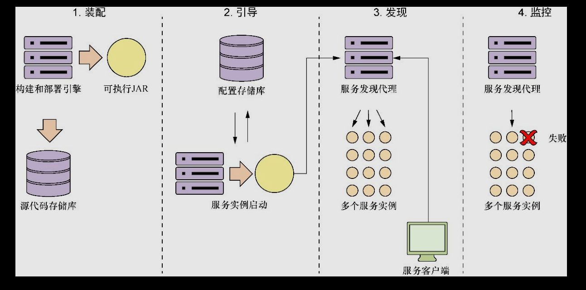

# [README](../README.md "回到 README")

# 略
# 第3章 使用Spring Cloud配置服务器控制配置

本章主要内容
* 将服务配置与服务代码分开
* 配置Spring Cloud配置服务器
* 集成Spring Boot微服务
* 加密敏感属性

应用程序配置数据：
    * 需要跟踪和版本控制。

* 微服务配置管理的加载发生在微服务的引导阶段。

微服务生命周期：

* 实施选择:
    * Etcd：Go开发的开源项目。raft协议作为分布式计算模型。
    * Eureka：Nrtflix开发。分布式键值存储。
    * Consul：Hashicorp开发，分布式计算模型使用算法SWIM协议。可直接与DNS集成。
    * ZooKeeper：提供分布式锁定功能的Apache项目。
    * Spring Cloud Config：可以将Git、Eureka和Coonsul作为后端进行整合。

* Spring Cloud配置服务器：
    * 基于REST的应用程序，建立在SpringBoot之上。
    * 不是独立服务器。可以嵌入现有的Spring Boot应用，也可以嵌入它的服务器中启动新的Spring Boot项目。
    * 配置存储：文件系统、Git、关系库
    * 使用：
        * 建立名为confsvr的新项目目录。
        * confsvr中创建新的Maven文件。
        * 创建文件confsvr/src/main/resources/application.yml。
        * 创建引导类，告诉启动的服务将要启动那种类型的Spring Cloud的Spring CLoud注解。

Spring Cloud Config与Spring Boot客户端集成：
    * 配置profile和Spring Cloud COnfig访问地址。
    * 添加依赖spring-cloud-config-client。
    
* 使用Spring Cloud配置服务器刷新属性：
    * Spring Cloud配置服务器始终提供最新版本的属性。
    * 添加@RefreshScope注解，允许访问/refresh端点刷新，只会重新加载应用程序配置的自定义Spring属性。Spring Data使用的数据库配置不会被@RefreshScope注解重新加载，可访问http://<youreserver>:8080/refresh端点。
        * Spring Cloud Bus的“推送”机制，需要Spring Cloud配置中间件RabbitMQ。（仅Consul服务器支持）。

* Spring Cloud 保护配置信息：
    * 下载Oracle JCE jar；
    * 创建加密密钥；
    * 加密和解密属性；
    配置微服务以在客户端使用加密。

# [README](../README.md "回到 README")