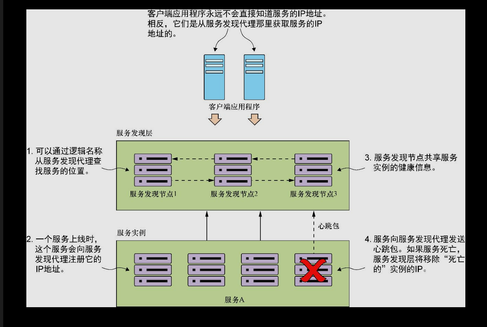

# [README](../README.md "回到 README")

# 略
# 第4章 服务发现
* 意义：
    * 可快速对服务实例数量进行水平伸缩。抽象服务物理位置。
    * 有助于提高应用程序的弹性。在服务路由时绕过不可用服务。
    
* 域名服务DNS和负载均衡不适用的原因：
    * 单点故障。
    * 有限水平可伸缩性。冗余模型和许可证成本。
    * 静态管理。集中式存储规则路由。
    * 复杂。
    * 不能有效伸缩，成本效益也不高。
    

* Spring Cloud和Eureka服务发现引擎，实现服务发现。
    * 客户端负载均衡使用Spring Cloud 和Ribbon库。
    * 引jar、添加配置。
    * 每次注册需要30s才能显示在Eureka服务中，因为Eureka需要从服务接收3次连续心跳包ping，每次ping间隔10s。
    * 启动类添加@EnableEurekaServer

* 通过Spring Eureka注册服务：
    * 添加jar：spring-cloud-starter-eureka
    * 添加配置：告知Spring Cloud使用Eureka注册服务

* 使用服务发现来查找服务：
    * 使用Spring/Netflix客户端库，服务消费者和Ribbon进行交互。
        * Spring DiscoveryClient；
        * 启用RestTemplate的Spring DiscoveryClient；
        * Netflix Feign客户端。

# [README](../README.md "回到 README")