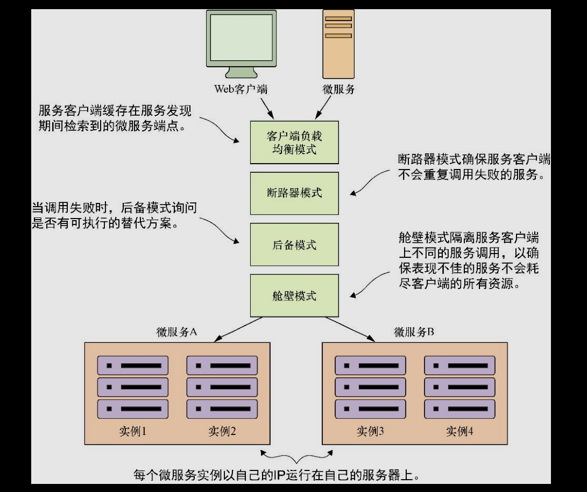

# [README](../README.md "回到 README")

# 使用Spring Cloud和Netflix Hystrix的客户端弹性模式

主要内容
* 实现断路器模式、后备模式和舱壁模式
* 使用断路器模式来保护微服务客户端资源
* 当远程服务失败时使用Hystrix
* 实施Hystrix的舱壁模式来隔离远程资源调用
* 调节Hystrix的断路器和舱壁的实现
* 定制Hystrix的并发策略

* 什么是客户端弹性模式：
    * 客户端负载均衡模式；
    * 断路器模式；
    * 后备模式；
    * 舱壁模式。
    
图展示了如何将这些模式用于微服务消费者和微服务之间。

* Hystrix
-- 5.3进入Hystrix

# [README](../README.md "回到 README")