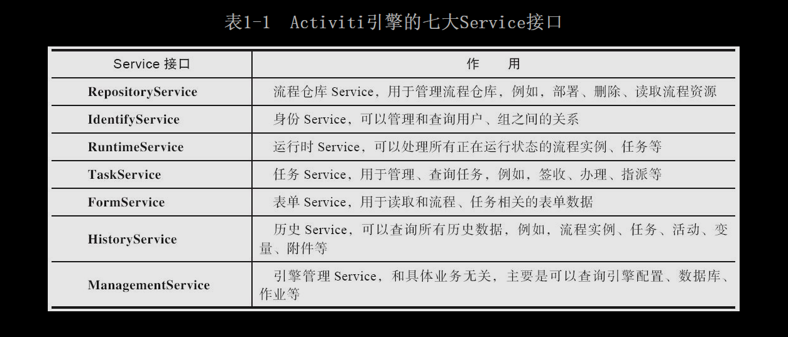
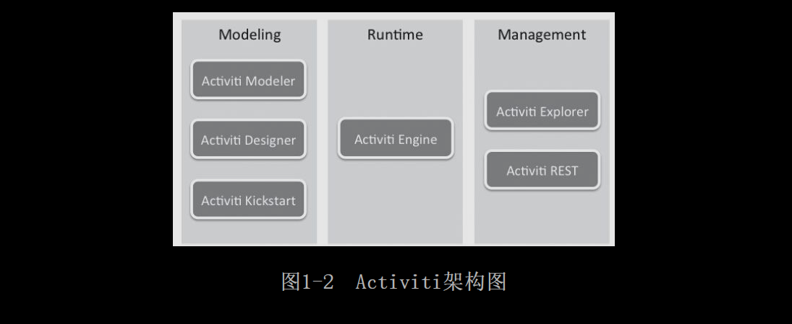
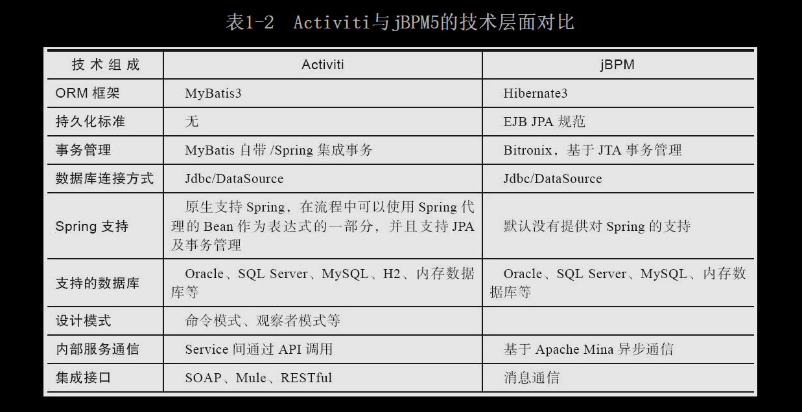
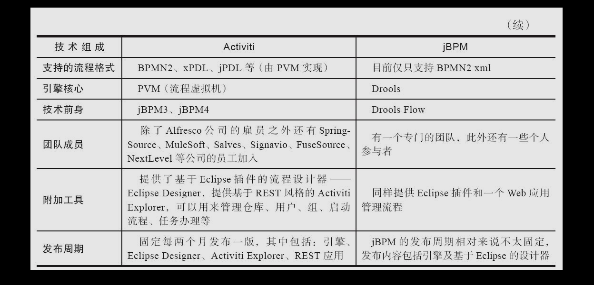

* 工作流（Work Flow）引擎：
    * 目的： 规范业务流程，约束业务规范化处理和运转。
    * 执行：由需求、开发共同制定符合BPMN 2.0规范的流程定义，之后部署到工作流引擎中，由它自动驱动业务流程运行。
    
# 第1章 认识Activiti
* 概论：工作流总是以任务（Tssk）的形式驱动人处理业务或处理业务系统自动完成作业。只需要关心系统提醒当前有多少待办任务需要处理。

## 1.2 工作流基础

### 1.2.1 什么是BPM
BPM：业务流程管理。包含两个不同方面>管理规范和软件工程。

### 1.2.2 工作流生命周期

### 1.2.3 什么是BPMN

BPMN：业务流程建模标注，由BPMN标注组织发布。
    使用：定义了业务流程图。包括活动和定义操作顺序的流控制。
    意味着：基于BPMN 2.0的流程建模不仅在流程设计器上可以通用，还可以在任何符合BPMN 2.0规范的流程引擎上执行。
    
## 1.3 Activiti的特点
* 数据持久化：
    * 使用MyBatis：可通过最优SQL语句执行Command。
* 引擎Service接口：提供七大Service接口，均通过ProcessEngine获取，支持链式API编程风格。

* 流程设计器：
    * Eclipse插件来设计jPDL。
    * Eclipse Designer。
    * 基于Web的Activiti Modeler流程设计器。
* 原生支持Spring：可轻松进行Spring集成、方便管理事务和解析表达式（Expression）。
* 分离运行时和历史数据：Activiti继承自jBPM4。

## 1.4 Activiti的应用
* 在系统集成方面应用：
    * 与ESB（企业服务总线）整合。
    * 与规则引擎整合。
    * 嵌入已有系统平台。
* 在其他产品中应用：
    * Alfresco。

## 1.5 Activiti架构与组件

* Activi Engine：最核心模块，提供针对BPMN 2.0规范的解析、执行、创建、管理（任务、流程实例）、查询历史记录并根据结果生成报表。
* Activiti Modeler：模型设计器，适用于业务人员把需求转换为规范流程定义。
* Activiti Designer：功能与Activiti Modeler类似，同样提供基于BPMN 2.0规范可视化设计功能，还未完全支持BPMN定义。
* Activiti Explorer：可以用来管理仓库、用户、组，启动流程、任务办理等。使用REST风格API。
* Activiti REST：Restful风格服务，允许客户端以JSON的方式与引擎REST API交互。

## 1.6 Activiti与JBPM5比较

## 1.7 本章小结

# 第2章 搭建Activiti开发环境

## 2.1 下载Activiti 
* 下载：http://activiti.org/download.html

### 2.1.1 目录结构

## 2.2 环境配置检查
* 是否已安装JDK、Ant和Maven。
   
### 2.2.1 检查并安装JDK 

### 2.2.2 检查并安装Ant

### 2.2.3 检查并安装Maven

## 2.3 配置文件介绍

### 2.3.1 Activiti配置文件

### 2.3.2 Maven配置文件

## 2.4 Hello World

### 2.4.1 最简单的流程定义

### 2.4.2 创建单元测试类
