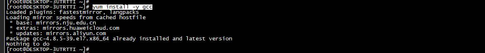
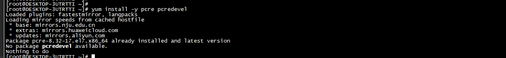
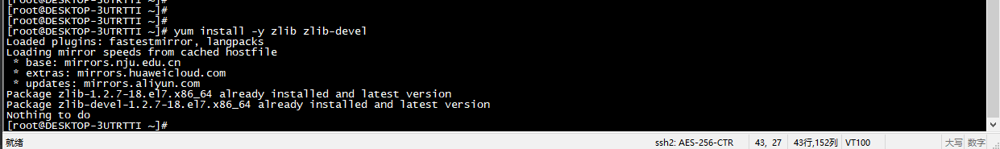
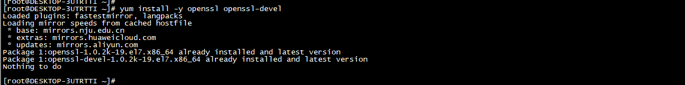
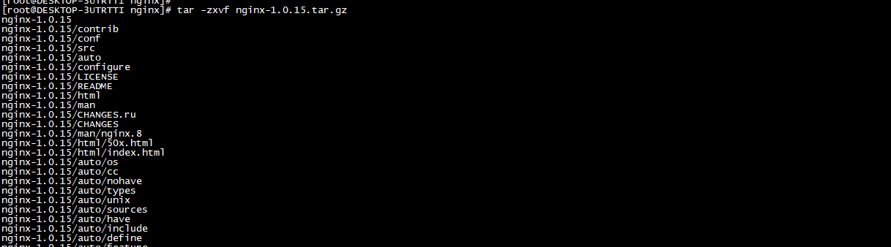
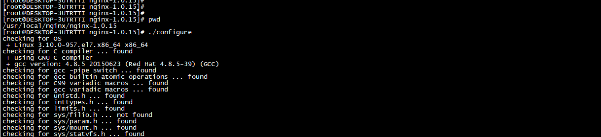
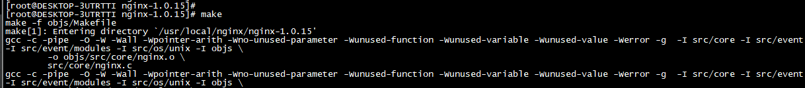
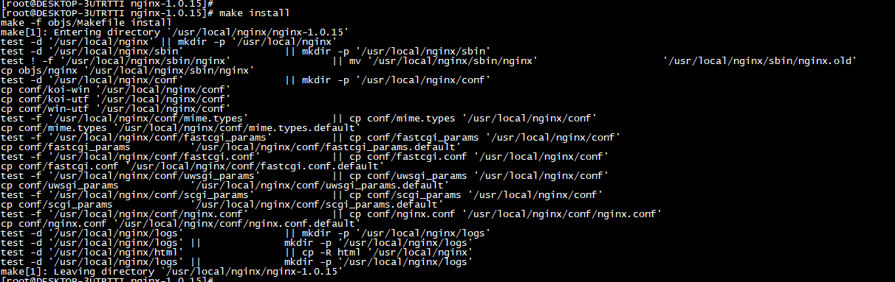
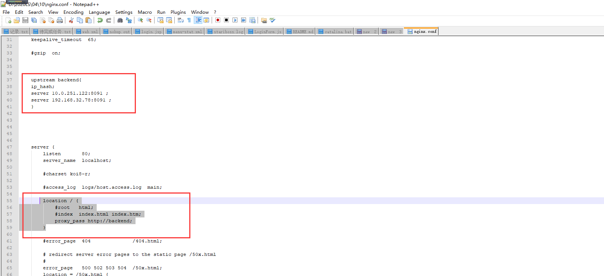

目标系统：CentOS 7

* 1.安装 GCC 编译器 (用来编译C语言程序)。
    * 命令：【yum install -y gcc】。

* 2.安装PCRE库（兼容正则表达式）
    * 原因：配置文件nginx. conf里使用了正则表达式。
    * 命令：【yum install -y pcre pcredevel】。              

* 3.安装zlib库（用于对HTTP包的内容做gzip格式的压缩）
    * 命令：【yum install -y zlib zlib-devel】。

* 4.安装OpenSSL开发库（支持SSL协议上传输 HTTP）
    * 命令：【yum install -y openssl openssl-devel】。

       
* 5.解压
    * 命令【tar -zxvf nginx-1.0.15.tar.gz 】。

* 6.编译安装Nignx
    * 进入【nginx-1.0.15】目录。
    * 执行命令【./configure】。(configure命令做了检测操作系统内核和已经安装软件， 参数 的 解析， 中间目录的生成以及根据各种参数生成一些C源码文件、Makefile文件 等)
    * 执行命令【make】。(make命令根据configure命令生成 的Makefile文件编译Nginx工程，并生成目标文件、最终的二进制 文件)
    * 执行命令【make install】。(命令根据configure执行时的参数将部署到指定的安装目录，包括相关目录的建立和二进制文件、配置文件的复制)

* 7.配置ip_hash(修改配置文件：/usr/local/nginx/conf/nginx.conf)
    * 添加：ip_hash
    > upstream backend{
          ip_hash;
          server 10.0.251.122:8091 ;
          server 192.168.32.78:8091 ; 
      	}
    * 配置：server
    >  location / {
                  #root   html;
                  #index  index.html index.htm;
      			proxy_pass http://backend;
              }
示例：

* 8.检查配置文件nginx.conf的正确性命令：
    * 命令：【./nginx -t】。
  

*  9.Nginx 常用的几个命令:
    * 重新载入配置文件【./nginx -s reload】。
    * 重启 Nginx【./nginx -s reopen】。
    * 停止 Nginx【./nginx -s stop】

* 10. 配置轮询（注：缺省配置就是轮询策略。修改配置文件：/usr/local/nginx/conf/nginx.conf）
    * 添加：轮询配置
    > upstream backend{
          server 10.0.251.122:8091 ;
          server 192.168.32.78:8091 ; 
      	}
    * 配置：server
    >  location / {
                  #root   html;
                  #index  index.html index.htm;
      			proxy_pass http://backend;
              }

