# [README](../README.md "回到 README")

# 第1章 深入Web请求过程

随着Web 2.0时代的到来，互联网的网络架构已经从传统的C/S架构转变为更加方便、快捷的B/S架构，B/S架构大大简化了用户使用网络应用的难度，这种人人都能上网、人人都能使用网络上提供的服务的方法也进一步推动了互联网的繁荣。

B/S架构带来了以下两方面的好处。
* 客户端使用通用的浏览器（Browser）。由于浏览器具有统一性，它不需要特殊的配置和网络连接，有效地**屏蔽了不同服务提供商提供给用户使用服务的差异性**。另外，最重要的一点是，浏览器的交互特性使得用户使用它非常方便，且**用户行为的可继承性非常强**，也就是用户只要学会了上网，不管使用的哪个应用，一旦学会了，在使用其他互联网服务时同样具有了使用经验，因为他们都具有同样的浏览器操作界面。
* 服务端（Server）基于统一的HTTP。和传统的C/S架构使用自定义的应用层协议不同，B/S架构使用的都是统一的HTTP。**使用统一的HTTP也为服务提供商简化了开发模式**，使得服务器开发者可以采用相对规范的开发模式，这样可以大大节省开发成本。由于使用统一的HTTP，所以基于HTTP的服务器就有很多，如**Apache、IIS、Nginx、Tomcat、JBoss等**，这些服务器可以直接拿来使用，不需要服务器开发者单独来开发。不仅如此，连开发服务的通用框架都不需要单独开发，服务开发者只需要关注提供服务的应用逻辑，其他一切平台和框架都可以直接拿来使用，所以B/S框架同样简化了服务器提供者的开发，从而出现了越来越多的互联网服务。

B/S网络结构不管对普通用户的使用还是对服务的开发都带来了好处，为互联网的主要参与者、服务使用者和服务开发者降低了学习成本。但是作为互联网应用的开发者，我们还是要清楚，从用户在浏览器里单击某个链接开始，到我们的服务返回结果给浏览器为止，在这个过程中到底发生了什么、这其中还需要哪些技术来配合。

所以本章将为你描述这一过程的工作原理，它**将涉及浏览器的基本行为和HTTP的解析过程、DNS如何解析到对应的IP地址、CDN又是如何工作和设计的，以及浏览器如何渲染出返回的结果等**。

## 1.1 B/S网络架构概述

B/S网络架构从前端到后端都得到了简化，都基于统一的应用层协议HTTP来交互数据，**与大多数传统C/S互联网应用程序采用的长连接的交互模式不同，HTTP采用无状态的短链接的通信方式**，通常情况下，一次请求就完成了一次数据交互，通常也对应一个业务逻辑，然后这次通信连接就断开了。采用这种方式是为了能够同时服务更多的用户，因为当前互联网应用每天都会处理上亿的用户请求，不可能每个用户访问一次后就一直保持这个连接。
    
基于HTTP本身的特点，目前B/S网络架构大多采用如图1-1所示的架构设计，既要满足海量用户的访问请求，又要保持用户请求的快速响应，所以现在的网络架构也越来越复杂。

当一个用户在浏览器里输入www.taobao.com这个URL时，将会发生很多操作。首先**它会请求DNS把这个域名解析成对应的IP地址，然后根据这个IP地址在互联网上找到对应的服务器，向这个服务器发起一个get请求，由这个服务器决定返回默认的数据资源给访问的用户。在服务器端实际上还有很复杂的业务逻辑：服务器可能有很多台，到底指定哪台服务器来处理请求，这需要一个负载均衡设备来平均分配所有用户的请求；还有请求的数据是存储在分布式缓存里还是一个静态文件中，或是在数据库里；当数据返回浏览器时，浏览器解析数据发现还有一些静态资源（如CSS、JS或者图片）时又会发起另外的HTTP请求，而这些请求很可能会在CDN上，那么CDN服务器又会处理这个用户的请求，大体上一个用户请求会涉及这么多的操作**。每一个细节都会影响这个请求最终是否会成功。

不管网络结构如何变化，始终有一些固定不变的原则需要遵守。
* **互联网上所有资源都要用一个URL来表示**。URL就是统一资源定位符，如果你要发布一个服务或者一个资源到互联网上，让别人能够访问到，那么你首先必须要有一个在世界上独一无二的URL。不要小看这个URL，它几乎包含了整个互联网的架构精髓。
* 必须**基于HTTP与服务端交互**。不管你要访问的是国内的还是国外的数据，是文本数据还是流媒体，都必须按照套路出牌，也就是都得采用统一打招呼的方式，这样人家才会明白你要的是什么。
* **数据展示必须在浏览器中进行**。当你获取到数据资源后，必须在浏览器上才能恢复它的容貌。

只要满足上面的几点，一个互联网应用基本上就能正确地运转起来，当然这里面还有好多细节，这些细节在后面将分别进行详细讲解。

## 1.2 如何发起一个请求

如何发起一个HTTP请求？这个问题似乎既简单又复杂，简单是指当你在浏览器里输入一个URL时，按回车键后这个HTTP请求就发起了，很快你就会看到这个请求的返回结果。复杂是指能否不借助浏览器也能发起请求，这里的“不借助”有两层含义，一是指能不能自己组装一个符合HTTP的数据包，二是除了浏览器还有哪些方式也能简单地发起一个HTTP请求。下面就按照这两层含义来解释如何发起一个HTTP请求。

**如何发起一个HTTP请求和如何建立一个Socket连接区别不大，只不过outputStream.write写的二进制数据格式要符合HTTP**。浏览器在建立Socket连接之前，必须根据地址栏里输入的URL的域名DNS解析出IP地址，再根据这个IP地址和默认的80端口与远程服务器建立Socket连接，然后浏览器根据这个URL组装成一个get类型的HTTP请求头，通过outputStream.write发送到目标服务器，服务器等待inputStream.read返回数据，最后断开这个连接。

当然，不同浏览器在如何使用这个已经建立好的连接以及根据什么规则来管理连接上，有各种不同的实现方法。一句话，发起一个HTTP请求的过程就是建立一个Socket通信的过程。
    
既然发起一个HTTP连接的本质上就是建立一个Socket连接，那么我们完全可以模拟浏览器来发起HTTP请求，这很好实现，也有很多方法实现，如HttpClient就是一个开源的通过程序实现的处理HTTP请求的工具包。当然如果你对HTTP的数据结构非常熟悉，你完全可以自己再实现另外一个HTTPClient，甚至可以自己写个简单的浏览器。

下面是一个基本的HttpClient的调用示例：

处理Java中使用非常普遍的HttpClient还有很多类似的工具，如Linux中的curl命令，通过curl + URL就可以简单地发起一个HTTP请求，非常方便。
    
例如，curl "http://item.taobao.com/item.html?id=1264"可以返回这个页面的HTML数据，如图1-2所示。

也可以查看这次访问的HTTP头的信息，加上-I选项，如图1-3所示。

还可以在访问这个URL时增加HTTP头，通过-HI选项实现，如图1-4所示。

因为缺少Cookie信息，所以上面的访问返回302状态码，必须增加Cookie才能正确访问该链接，如下所示：

## 1.3 HTTP解析

B/S网络结构的核心是HTTP，掌握HTTP对一个从事互联网工作的程序员来说非常重要，也许你已经非常熟悉HTTP，这里除了简单介绍HTTP的基本知识外，还将侧重介绍实际使用的一些心得，后面以实际使用的场景为例进行介绍。

要理解HTTP，最重要的就是要熟悉HTTP中的HTTP Header，**HTTP Header控制着互联网上成千上万的用户的数据的传输。最关键的是，它控制着用户浏览器的渲染行为和服务器的执行逻辑**。例如，当服务器没有用户请求的数据时就会返回一个404状态码，告诉浏览器没有要请求的数据，通常浏览器就会展示一个非常不愿意看到的该页面不存在的错误信息。

常见的HTTP请求头和响应头分别如表1-1和表1-2所示，常见的HTTP状态码如表1-3所示。

要看一个HTTP请求的请求头和响应头，可以通过很多浏览器插件来看，在Firefox中有Firebug和HttpFox，Chrome自带的开发工具也可以看到每个请求的请求头信息（可用F12快捷键打开），IE自带的调试工具也有类似的功能。

### 1.3.1 查看HTTP信息的工具

有时候我们需要知道一个HTTP请求到底返回什么数据，或者没有返回数据时想知道是什么原因造成的，这时我们就需要借助一些工具来查询这次请求的详细信息。

在Windows下现在主流的浏览器都有很多工具来查看当前请求的详细HTTP信息，如Firefox浏览器下，使用最多的是Firebug，如图1-5所示。

还有一个HttpFox工具提供的信息更全，如图1-6所示，所有HTTP相关信息都可以一目了然。

Chrome浏览器下也有一些类似的工具，如Google自带的调试工具，同样可以查看到这次请求的相关信息，如图1-7所示。

Chrome下也有类似的Firebug工具，但是还不够完善。
    
IE从7.0版本开始也提供了类似的HTTP调试工具，如自带的开发人员工具可以通过F12键打开，HttpFox插件也有IE版本，读者可以试着安装一下。

### 1.3.2 浏览器缓存机制

浏览器缓存是一个比较复杂但是又比较重要的机制，在我们浏览一个页面时发现有异常的情况下，通常考虑的就是是不是浏览器做了缓存，所以一般的做法是**按Ctrl+F5组合键重新请求一次这个页面，重新请求的页面肯定是最新的页面**。为什么重新请求就一定能够请求到没有缓存的页面呢？首先是在浏览器端，如果是**按Ctrl+F5组合键刷新页面，那么浏览器会直接向目标URL发送请求**，而不会使用浏览器缓存的数据；其次**即使请求发送到服务端，也有可能访问到的是缓存的数据，比如，在我们的应用服务器的前端部署一个缓存服务器**，如Varnish代理，那么Varnish也可能直接使用缓存数据。所以为了保证用户能够看到最新的数据，必须通过HTTP来控制。
    
当我们使用Ctrl+F5组合键刷新一个页面时，**在HTTP的请求头中会增加一些请求头，它告诉服务端我们要获取最新的数据而不是缓存**。

如图1-8所示，这次请求没有发送到服务端，使用的是浏览器的缓存数据，按Ctrl+F5组合键刷新后，如图1-9所示。

这次请求时从服务端返回的数据，最重要的是在其请求头中增加了**两个请求项Pragma:no-cache和Cache-Control:no-cache**。为什么增加了这两项配置项，它们有什么作用？

#### 1.Cache-Control/Pragma

这个**HTTP Head字段用于指定所有缓存机制在整个请求/响应链中必须服从的指令**，如果知道该页面是否为缓存，不仅可以控制浏览器，还可以控制和HTTP相关的缓存或代理服务器。HTTP Head字段有一些可选值，这些值及其说明如表1-4所示。

**Cache-Control请求字段被各个浏览器支持的较好，而且它的优先级也比较高，它和其他一些请求字段（如Expires）同时出现时，Cache-Control会覆盖其他字段**。
    
**Pragma字段的作用和Cache-Control有点类似**，它也是在HTTP头中包含一个特殊的指令，使相关的服务遵守该指令，最常用的就是Pragma:no-cache，它和Cache-Control:no-cache的作用是一样的。

#### 2. Expires

Expires通常的使用格式是Expires: Sat, 25 Feb 2012 12:22:17 GMT，后面跟着一个日期和时间，**超过这个时间值后，缓存的内容将失效**，也就是浏览器在发出请求之前检查这个页面的这个字段，看该页面是否已经过期了，过期了就重新向服务器发起请求。

#### 3. Last-Modified/Etag

**Last-Modified字段一般用于表示一个服务器上的资源的最后修改时间，资源可以是静态（静态内容自动加上Last-Modified字段）或者动态的内容（如Servlet提供了一个getLaseModified方法检测某个动态内容是否已经更新）**，通过这个最后修改时间可以判断当前请求的资源是否是最新的。

**一般服务端在响应头中返回一个Last-Modified字段，告诉浏览器这个页面的最后修改时间，如Lase-Modified：Sat,25 Feb 2012 12:55:04 GMT，浏览器再次请求时在请求头中增加一个If-Modified-Since: Sat,25 Feb 2012 12:55:04 GMT字段，询问当前缓存的页面是否是最新的，如果是最新的就返回304状态码，告诉浏览器是最新的，服务器也不会传输新的数据**。

**与Last-Modified字段有类似功能的还有一个Etag字段**，这个字段的作用是让服务器端给每个页面分配一个唯一的编号，然后通过这个编号来区分当前这个页面是否是最新的。这种方式比使用Last-Modified更加灵活，但是在后端的Web服务器有多台时比较难以处理，因为每个Web服务器都要记住网站的所有资源，否则浏览器返回这个编号就没有意义了。

## 1.4 DNS域名解析

我们知道互联网都是通过URL来发布和请求资源的，而URL中的域名需要解析成IP地址才能与远程主机建立连接，如何将域名解析成IP地址属于DNS解析的工作范畴。

可以毫不夸张地说，虽然我们平时上网感觉不到DNS的解析的存在，但是一旦DNS解析出错，可能会导致非常严重的互联网灾难。目前世界上的整个互联网有几个DNS根域名服务器，任何一台根服务器坏掉，后果都非常严重。

### 1.4.1 DNS域名解析过程

图1-10是DNS域名解析的主要请求过程实例图。

如图1-10所示，当一个用户在浏览器中输入www.abc.com时，DNS解析将会有将近10个步骤，这个过程大体描述如下。

当用户在浏览器中输入域名并按下回车键后，第1步，**浏览器会检查缓存中**有没有这个域名对应的解析过的IP地址，如果缓存中有，这个解析过程就将结束。浏览器缓存域名也是有限制的，不仅浏览器缓存大小有限制，而且缓存的时间也有限制，通常情况下为几分钟到几个小时不等，域名被缓存的时间限制可以通过TTL属性来设置。这个缓存时间太长和太短都不好，如果缓存时间太长，一旦域名解析到IP有变化，会导致被客户端缓存的域名无法解析到变化后的IP地址，以致域名不能正常解析，这段时间内有可能会有一部分用户无法访问网站。如果时间设置太短，会导致用户每次访问网站都要重新解析一次域名。

第2步，如果用户的浏览器缓存中没有，**浏览器会查找操作系统缓存中是否有这个域名对应的DNS解析结果**。其实操作系统也会有一个域名解析的过程，在Windows中可以通过C:\Windows\System32\drivers\etc\hosts文件来设置，你可以将任何域名解析到任何能够访问的IP地址。如果你在这里指定了一个域名对应的IP地址，那么浏览器会首先使用这个IP地址。例如，我们在测试时可以将一个域名解析到一台测试服务器上，这样不用修改任何代码就能测试到单独服务器上的代码的业务逻辑是否正确。正是因为有这种本地DNS解析的规则，所以黑客就有可能通过修改你的域名解析器来把特定的域名解析到它指定的IP地址上，导致这些**域名被劫持**。

这导致在早期的Windows版本中出现过很严重的问题，而且对于一般没有太多计算机知识的用户来说，出现问题后很难发现，即使发现也很难自己解决，所以Windows 7中将hosts文件设置成了只读的，防止这个文件被轻易修改。
    
在Linux中这个配置文件是/etc/host，修改这个文件可以达到同样的目的，当解析到这个配置文件中的某个域名时，操作系统会在缓存中缓存这个解析结果，缓存的时间同样是受这个域名的失效时间和缓存的空间大小控制的。

前面这两个步骤都是在本机完成的，所以在图1-10中没有表示出来。到这里还没有涉及真正的域名解析服务器，如果在本机中仍然无法完成域名的解析，就会真正请求域名服务器来解析这个域名了。

第3步，如何、怎么知道域名服务器呢？在我们的网络配置中都会有“DNS服务器地址”这一项，这个地址就用于解决前面所说的如果两个过程无法解析时要怎么办，**操作系统会把这个域名发送给这里设置的LDNS，也就是本地区的域名服务器**。这个DNS通常都提供给你本地互联网接入的一个DNS解析服务，例如你是在学校接入互联网，那么你的DNS服务器肯定在你的学校，如果你是在一个小区接入互联网的，那这个DNS就是提供给你接入互联网的应用提供商，即典型或者联通，也就是通常所说的**SPA**，那么这个DNS通常也会在你所在城市的某个角落，通常不会很远。**在Windows下可以通过ipconfig查询这个地址**，如图1-11所示。

在Linux下可以通过如下方式查询配置的DNS Server，如图1-12所示。

这个专门的域名解析服务器性能都很好，它们一般都会缓存域名解析结果，当然缓存时间是受域名的失效时间控制的，一般缓存空间不是影响域名失效的主要因素。大约80%的域名解析都到这里就已经完成了，所以LDNS主要承担了域名的解析工作。

第4步，如果LDNS仍然没有命中，就**直接到ROOT Server域名服务器请求解析**。
    
第5步，**根域名服务器返回给本地域名服务器一个所查询域的主域名服务器（gTLD Server）地址**。gTLD是国际顶级域名服务器，如.com、.cn、.org等。
    
第6步，本地域名服务器（Local DNS Server）再向上一步返回的gTLD服务器发送请求。

第7步，接受请求的gTLD服务器查找并返回此域名对应的Name Server域名服务器的地址，这个Name Server通常就是你注册的域名服务器，例如你在某个域名服务提供商申请的域名，那么这个**域名解析任务就由这个域名提供商的服务器来完成**。

第8步，Name Server域名服务器会查询存储的域名和IP地址的映射关系表，**在正常情况下都根据域名得到目标IP记录，连同一个TTL值返回给DNS Server域名服务器**。

第9步，返回该域名对应的IP和TTL值，Local DNS Server会缓存这个域名和IP的对应关系，缓存的时间由TTL值控制。

第10步，把解析的结果返回给用户，用户根据TTL值缓存在本地系统缓存中，域名解析过程结束。

在实际的DNS解析过程中，可能还不止这10个步骤，如Name Server也可能有多级，或者有一个GTM来负载均衡控制，这都有可能会影响域名解析的过程。

### 1.4.2 跟踪域名解析过程

在Linux和Windows下都可以用nslookup命令来查询域名的解析结果，如图1-13所示。
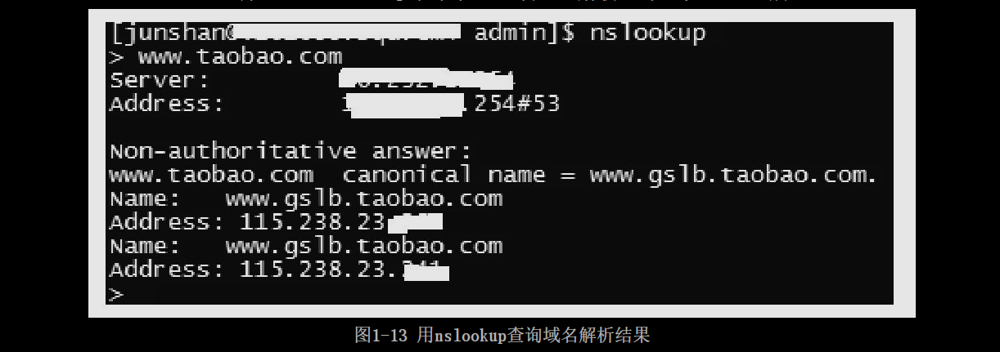

在Linux系统中还可以使用dig命令来查询DNS的解析过程，如下所示：

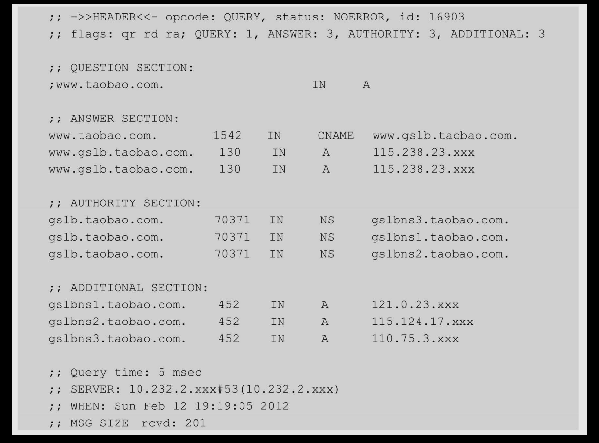

结果的第一行输出了当前Linux的版本号，第2行说明可以增加可选参数printcmd，如果加上printcmd，打印出来的结果如下：
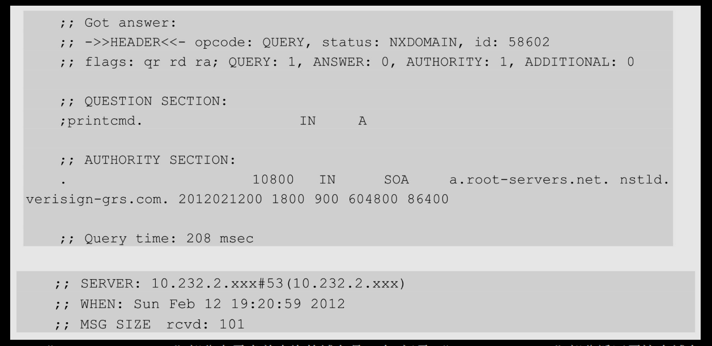

“QUESTION SECTION”部分表示当前查询的域名是一个A记录，“ANSWER SELECTION”部分返回了这个域名由CNAME到www.gslb.taobao.com，返回了这个域名对应的IP地址。

还可通过增加+trace参数跟踪这个域名的解析过程，如下所示：
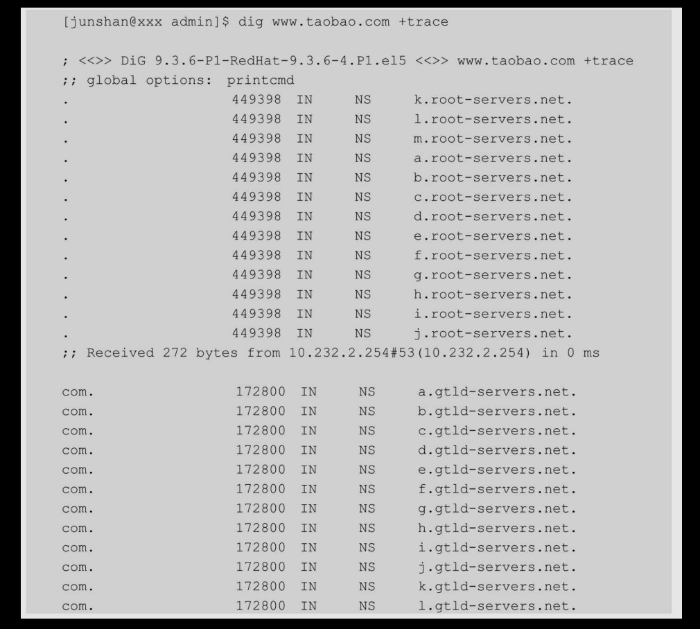
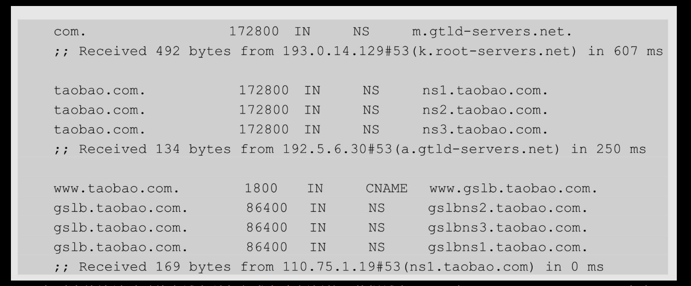

上面清楚地显示了整个域名是如何发起和解析的，从根域名（.）到gTLD Server(.com)，再到Name Server（taobao.com）的整个过程都显示出来了。还可以看出DNS的服务器有多个备份，可以从任何一台查询到解析结果。

### 1.4.3 清除缓存的域名

我们知道DNS域名解析后会缓存解析结果，其中主要在两个地方缓存结果，一个是**Local DNS Server**，另外一个是**用户的本地机器**。这两个缓存都是TTL值和本机缓存大小控制的，但是**最大缓存时间是TTL值，基本上Local DNS Server的缓存时间就是TTL控制的**，很难人工介入，但是我们的本机缓存可以通过如下方式清除。
    
在Windows下可以在命令行模式下执行ipconfig/flushdns命令来刷新缓存，如图1-14所示。

在Linux下可以通过/etc/init.d/nscd restart来清除缓存，如图1-15所示。
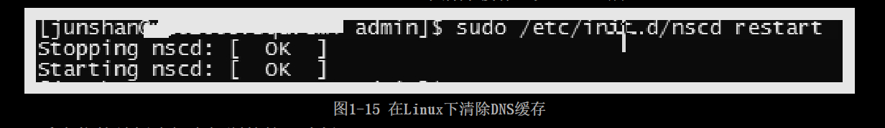

重启依然是解决很多问题的第一选择。

**在Java应用中JVM也会缓存DNS的解析结果，这个缓存是在InetAddress类中完成的**，而且这个缓存时间还比较特殊，它有两种缓存策略：**一种是正确解析结果缓存，另一种是失败的解析结果缓存**。这两个缓存时间由两个配置项控制，配置项是在%JAVA_HOME%\lib\security\java.security文件中配置的。两个配置项分别是networkaddress.cache.ttl和networkaddress.cache.negative.ttl，它们的默认值分别是-1（永不失效）和10（缓存10秒）。

要修改这两个值同样有几种方式，分别是：直接修改java.security文件中的默认值、在Java的启动参数中增加-Dsun.net.inetadde.ttl=xxx来修改默认值、通过InetAddress类动态修改。

在这里还要特别强调一下，如果我们需要用InetAddress类解析域名，必须是单例模式，不然会有严重的性能问题，如果每次都创建InetAddress实例，则每次都要进行一次完整的域名解析，非常耗时，对这一点要特别注意。

### 1.4.4 几种域名解析方式

域名解析记录主要分为A记录、MX记录、CNAME记录、NS记录和TXT记录。
* A记录，A代表的是Address，**用来指定域名对应的IP地址**，如将item.taobao.com指定到115.238.23.xxx，将switch.taobao.com指定到121.14.24.xxx。**A记录可以将多个域名解析到一个IP地址，但不能将一个域名解析到多个IP地址**。
* MX记录，表示的是**Mail Exchange**，就是可以**将某个域名下的邮件服务器指向自己的Mail Server**，如taobao.com域名的A记录IP地址是115.238.25.xxx，如果将MX记录设置为115.238.25.xxx，即xxx@taobao.com的邮件路由，DNS会将邮件发送到115.238.25.xxx所在服务器，而正常通过Web请求的话仍然解析到A记录的IP地址。
* CNAME记录，全称Canonical Name（别名解析）。所谓的**别名解析就是可以为一个域名设置一个或者多个别名**。如将taobao.com解析到xulingbo.net，将srcfan.com也解析到xulingbo.com。其中xulingbo.net分别是taobao.com和srcfan.com的别名。前面的跟踪域名解析中的"www.taobao.com. 1542 IN CHAME www.gslb.taobao.com"就是CNAME解析。
* NS记录，**为某个域名指定DNS解析服务器**，也就是这个域名有指定的IP地址的DNS服务器去解析，前面的“gslb.taobao.com.86400 IN NS  gslbns2.taobao.com.”就是NS解析。
* TXT记录，**为某个注解名或域名设置说明**，如可以为xulingbo.net设置TXT记录为“君山的博客|许令波”这样的说明。

## 1.5 CDN工作机制

**CDN也就是内容分布网络（Content Delivery Network），它是构筑在现有Internet上的一种先进的流量分配网络**。其**目的是通过在现有的Internet中增加一层新的网络架构，将网站的内容发布到最接近用户的网络“边缘”，使用户可以就近取得所需的内容，提高用户访问网站的响应速度**。有别于镜像，它比镜像更智能，可以做这样一个比喻：**CDN = 镜像（Mirror）+ 缓存（Cache）+ 整体负载均衡（GSLB）**。因而，CDN可以明显提供Internet中新兴流动的效率。

**目前CDN都以缓存网站中的静态数据为主，如CSS、JS、图片和静态页面等数据**。用户在从主站服务器请求到动态内容后，再从CDN上下载这些静态数据，从而加速网页数据内容的下载速度，如淘宝有90%以上的数据都是由CDN来提供的。

通常来说CDN要达到以下几个目标。
* 可扩展（Scalability）。性能可扩展性：应对新增的大量数据、用户和事务的扩展能力。成本可扩展性：用低廉的运营成本提供动态的服务能力和高质量的内容分发。
* 安全性（Security）。强调提供物理设备、网络、软件、数据和服务过程的安全性，（趋势）减少因为DDoS攻击或者其他恶意行为造成商业网站的业务中断。
* 可靠性、响应和执行（Reliability、Responsiveness和Performance）。服务可用性指能够处理可能的故障和用户体验下降的问题，通过负载均衡及时提供网络的容错机制。

### 1.5.1 CDN架构

通常的CDN架构如图1-16所示。
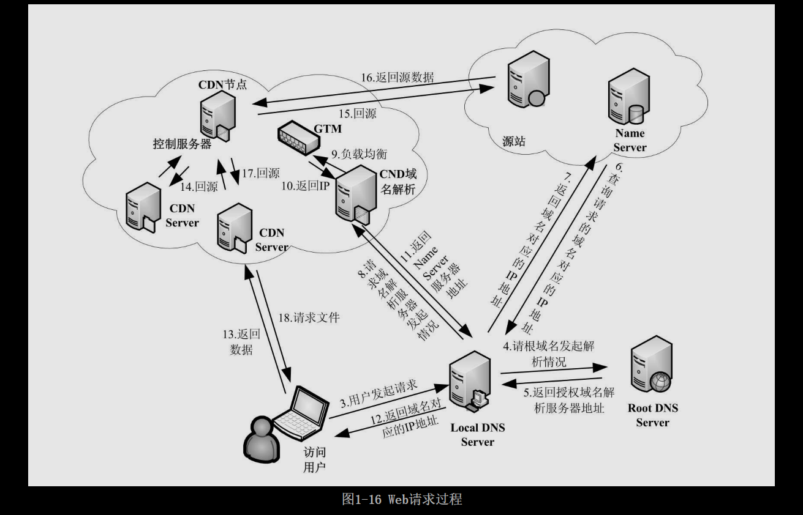
如图1-16所示，**一个用户访问某个静态文件（如CSS文件），这个静态文件的域名假如是cdn.taobao.com，那么首先要向Local DNS服务器发起请求，一般经过迭代分析后回到这个域名的注册服务器去解析，一般每个公司都会有一个DNS解析服务器。这时这个DNS解析服务器通常会把它重新CNAME解析到另外一个域名，而这个域名最终会被执行CDN全局中的DNS负载均衡服务器，再由这个GTM来最终分配是哪个地址的访问用户，返回给离这个用户最近的CDN节点**。

拿到DNS解析结果，用户就直接去这个CDN节点访问这个静态文件了，如果这个节点中所请求的文件不存在，就会回到源站去获取这个文件，然后再返回给用户。

### 1.5.2 负载均衡

**负载均衡（Load Balance）就是对工作任务进行平衡、分摊到多个操作单元上执行**，如图片服务器、应用服务器等，共同完成工作任务。它可以提高服务器响应速度及利用效率，避免软件或者硬件模块出现单点失效，解决网络拥塞问题，实现地理位置无关性，为用户提供较一致的访问质量。

通常有三种负载均衡架构，**分别是链路负载均衡、集群负载均衡和操作系统负载均衡**。所谓的链路负载均衡也就是前面提到的通过DNS解析成不同的IP，然后用户根据这个IP来访问不同的目标服务器，如图1-17所示。
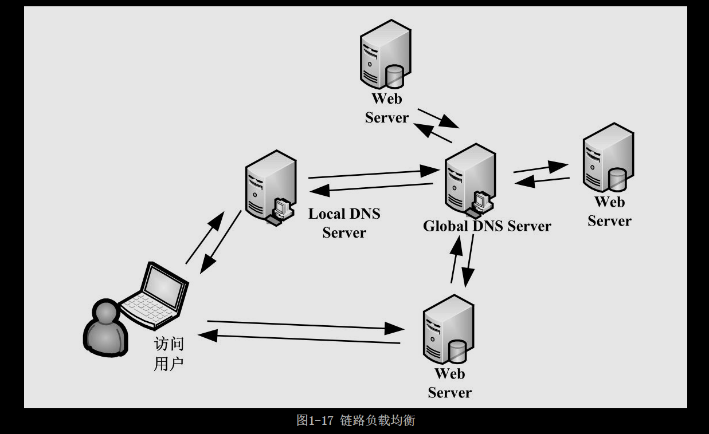

**负载均衡是由DNS的解析来完成的，用户最终访问哪个Web Server是由DNS Server来控制的**，在这里就是由Global DNS Server来动态解析域名服务。这种DNS解析的**优点是用户会直接访问目标服务器，而不需要经过其他的代理服务器，通常访问速度会更快**。但是也有**缺点，由于DNS在用户本地和Local DNS Server都有缓存，一旦某台Web Server挂掉，就很难及时更新用户的域名解析结构**。如果用户的域名没有及时更新，那么用户将无法访问这个域名，带来的后果非常严重。

**集群负载均衡是另外一种常见的负载均衡方式**，它一般分为硬件负载均衡和软件负载均衡。硬件负载均衡一般使用一台专门的硬件设备来转发请求，如图1-18所示。
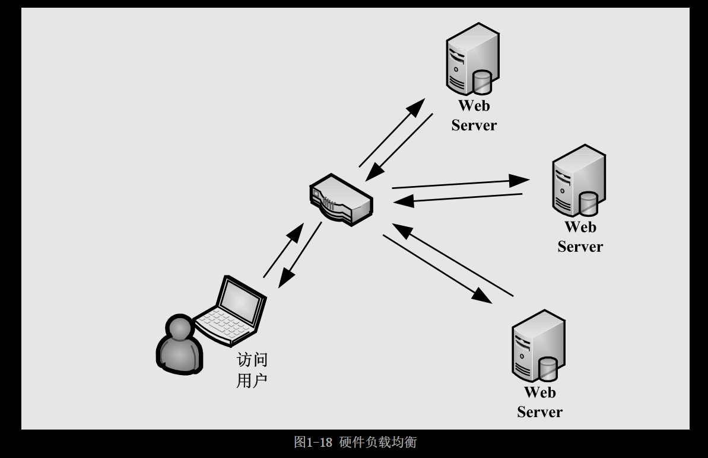
硬件负载均衡的关键就是这台价格非常昂贵的设备，如F5，通常为了安全需要一主一备。它的**优点很显然就是性能非常好，缺点就是非常贵**，一般公司是用不起的，还有就是当访问量徒然增大超出服务极限时，不能进行动态扩容。
    
软件负载均衡是使用非常普遍的一种负载方式，它的特点是使用成本非常低，直接使用廉价的PC就可以搭建。缺点就是一般一次访问请求要经过多次代理服务器，会增加网络延时。它的架构通常如图1-19所示。
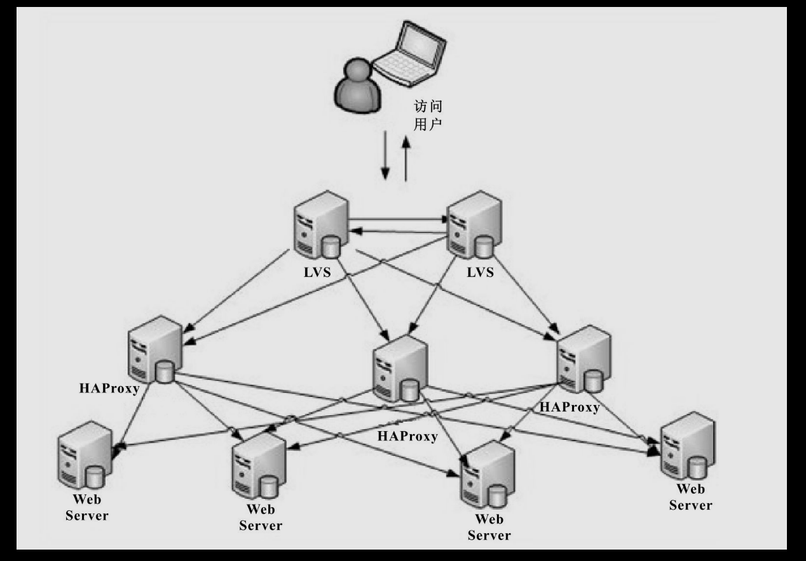

图1-19中上面的两台是LVS，使用四层负载均衡，也就是在网络层利用IP地址进行地址转发。下面的**三台使用HAProxy进行七层负载，也就是可以根据访问用户的HTTP请求头来进行负载均衡**，如可以根据不同的URL来将请求转发到特定机器或者根据用户的Cookie信息来指定访问的机器。

最后一种是**操作系统负载均衡，就是利用操作系统级别的软中断或者硬件中断来达到负载均衡**，如可以设置多队列网卡等来实现。
    
这几种负载均衡不仅在CDN的集群中使用，而且在Web服务或者分布式数据集群中同样也能使用，但是这些地方后两种用的要多一点。

### 1.5.3 CDN动态加速

CDN的动态加速技术也是当前比较流行的一种优化技术，它的**技术原理就是在CDN的DNS解析中通过动态的链路探测来寻找回源最好的一条路径，然后通过DNS的调度将所有请求调度到选定的这条路径上回源，从而加速用户访问的效率**。如图1-20所示。
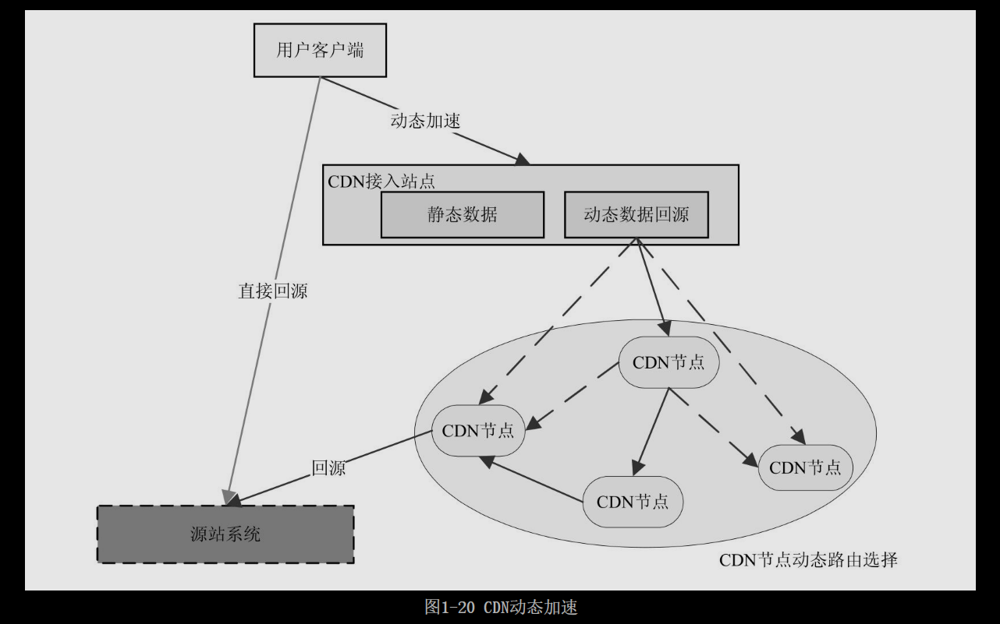

由于CDN节点是遍布全国的，所以用户接入一个CDN节点后，可以选择一条从离用户最近的CDN节点到源站链路最好的路径让用户走。一个简单的原则就是在每个CDN节点上从源站下载一个一定大小的文件，看哪个链路的总耗时最短，这样可以构成一个链路列表，然后绑定到DNS解析上，更新到CDN的Local DNS。当然是否走这个链路并不一定根据耗时这个唯一条件，有时也要考虑网络成本，例如走某个节点虽然可以节省10ms，但是网络带宽的成本却增加了很多，还有其他网络链路的安全等因素也要综合考虑。

## 1.6 总结

本章主要介绍了前端的一些基本知识，包括在用户端发起一个请求时，这个请求都经过了哪些服务单元，进行了哪些处理。本章可以帮助我们对B/S网络架构有个整体的认识。

# [README](../README.md "回到 README")